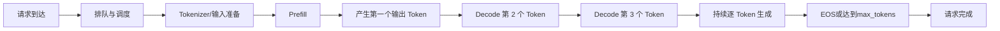
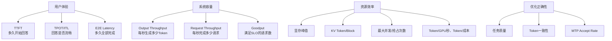
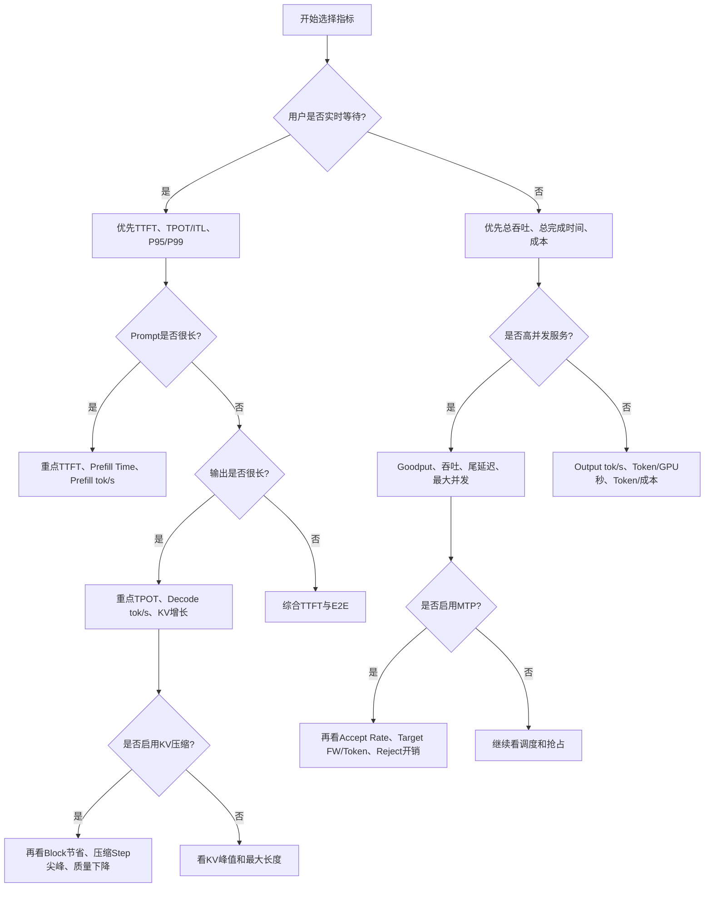

# 大模型推理性能指标定义与场景化分析

> 本文面向正在学习 nano-vLLM、Qwen3.5 Hybrid、KV Cache 压缩和 MTP 投机解码的初学者。
>
> 文档有两个目标：
>
> 1. 系统解释大模型推理中常见指标的定义、公式、测量边界和容易混淆之处；
> 2. 结合真实使用场景，分析不同环境下究竟应该优先关注哪些指标。
>
> 本文同时结合项目中的以下 Benchmark 代码说明实际统计口径：
>
> - 原版 `nano-vllm/bench.py`
> - 压缩版 `nano-kvllm/bench.py`
> - Qwen3.5 固定单请求测试 `nano-vllm-qwen3.6/bench_qwen35_fixed.py`
> - KV Cache 压缩测试 `nano-vllm-qwen3.6/bench_kv_compression.py`
> - KV Cache 冒烟测试 `nano-vllm-qwen3.6/run_kv_compression_smoke.py`
> - MTP 测试 `nano-vllm-qwen3.6/run_mtp_fast_decode.py`
> - MTP Draft 长度扫描 `nano-vllm-qwen3.6/bench_mtp_draft_sweep.py`
>
> 文中的 `TPOT` 有时会被误写为 `TPOP`。大模型推理中通常使用的标准缩写是 **TPOT：Time Per Output Token**。

---

# 一、大模型推理相关指标分别是什么意思

## 1. 先建立完整的推理时间线

理解指标前，先看一条请求经历了什么。



从用户视角看，可以把一条请求的延迟拆成：

```text
端到端延迟
=
排队时间
+ 输入处理时间
+ Prefill 时间
+ 第一个 Token 采样和返回时间
+ 后续 Decode 时间
+ 输出传输与收尾时间
```

在本项目的本地离线 Benchmark 中，通常不会包含真实网络传输、网关排队和 HTTP 序列化；在线服务平台统计的延迟则可能包含这些部分。

因此，看到一个指标时，第一件事不是看数值，而是问：

> 这个指标从什么时候开始计时，到什么时候结束计时？

---

## 2. TTFT：首 Token 延迟

### 2.1 定义

**TTFT，Time To First Token**，表示从请求进入测量区间开始，到模型产生第一个可返回输出 Token 为止的时间。

公式可写为：

```text
TTFT
=
第一个输出 Token 产生时间
-
请求开始时间
```

如果是在线服务，常见测量边界是：

```text
客户端发送请求
→
客户端收到第一个流式 Token
```

如果是项目内核 Benchmark，常见边界是：

```text
进入同步推理循环
→
第一次模型 Step 产生输出 Token
```

### 2.2 TTFT 中通常包含什么

TTFT 主要受以下因素影响：

- 请求排队和调度；
- Tokenizer；
- Prompt 长度；
- Prefill 计算；
- Vision Encoder 等多模态前处理；
- 第一次采样；
- CPU 到 GPU 的输入准备；
- Tensor Parallel 通信；
- CUDA Kernel 启动；
- 服务端到客户端的首包传输。

本项目 `bench_kv_compression.py` 中的 TTFT 口径是：

```python
cumulative += step.elapsed_seconds
if ttft is None and step.output_tokens_produced:
    ttft = cumulative
```

也就是把各个同步模型 Step 的时间不断累加，直到第一次检测到输出 Token。

### 2.3 TTFT 为什么重要

用户输入问题后，最直接的体验是“多久开始回答”。

例如：

```text
系统 A：
3 秒后开始输出，但之后很流畅

系统 B：
0.5 秒后开始输出，但之后每个字都很慢
```

在聊天场景中，用户通常会认为系统 B 的响应更积极；但如果后续输出过慢，整体体验仍可能不好。

### 2.4 TTFT 的主要影响规律

通常：

```text
Prompt 越长
→ Prefill 计算量越大
→ TTFT 越高
```

高并发时：

```text
排队请求越多
→ Scheduler 等待越久
→ TTFT 的 P95/P99 越高
```

### 2.5 容易犯的错误

1. 只比较 TTFT，不固定 Prompt 长度；
2. 一方包含 Tokenizer，另一方不包含；
3. 一方包含模型冷启动，另一方已经 Warmup；
4. 把第一个 Token 产生时间与第一个完整单词显示时间混为一谈；
5. 用单次平均值代替 P95/P99。

---

## 3. TPOT：平均每个后续输出 Token 的时间

### 3.1 定义

**TPOT，Time Per Output Token**，表示首 Token 产生后，生成每个后续 Token 平均需要多少时间。

本项目 `bench_kv_compression.py` 使用：

```text
TPOT
=
(端到端推理循环时间 - TTFT)
÷
(输出 Token 数 - 1)
```

源码对应：

```python
tpot = (
    (latency - ttft) / (output_tokens - 1)
    if output_tokens > 1
    else 0.0
)
```

之所以减去 1，是因为第一个 Token 已经计入 TTFT。

### 3.2 单位

常见单位：

- 秒/Token；
- 毫秒/Token。

例如：

```text
TPOT = 25 ms/token
```

意味着首 Token 之后，平均每 25 ms 产生一个 Token。

它对应的单请求平均生成速度约为：

```text
1 ÷ 0.025 = 40 token/s
```

### 3.3 TPOT 主要反映什么

TPOT 主要反映 Decode 阶段性能，受到以下因素影响：

- 模型参数规模；
- 每一步读取的 KV Cache 长度；
- Attention 带宽开销；
- Batch Size；
- Tensor Parallel 通信；
- CUDA Graph 是否启用；
- KV Cache 压缩是否降低有效上下文；
- 压缩 Step 是否引入延迟尖峰；
- MTP 是否减少目标模型 Forward 次数；
- GPU 计算和显存带宽能力。

### 3.4 为什么 TPOT 对长输出特别重要

假设输出 1000 个 Token：

```text
TTFT = 1 秒
TPOT = 20 ms/token
```

端到端时间近似：

```text
1 + 999 × 0.02
≈ 20.98 秒
```

此时绝大部分时间来自 Decode，而不是 TTFT。

所以对于代码生成、长报告生成、长链式推理：

> TPOT 往往比 TTFT 更决定总完成时间。

---

## 4. ITL：相邻 Token 间延迟

### 4.1 定义

**ITL，Inter-Token Latency**，表示相邻两个输出 Token 之间实际间隔了多久。

例如一条请求的 Token 到达时间为：

```text
T1 = 1.00 s
T2 = 1.02 s
T3 = 1.04 s
T4 = 1.20 s
T5 = 1.22 s
```

对应 ITL：

```text
20 ms, 20 ms, 160 ms, 20 ms
```

### 4.2 ITL 与 TPOT 的区别

TPOT 是整体平均值：

```text
平均 TPOT
=
(20 + 20 + 160 + 20) / 4
=
55 ms
```

ITL 则保留了每一个 Token 间隔，可以进一步统计：

- ITL P50；
- ITL P95；
- ITL P99；
- 最大 ITL；
- 延迟抖动。

因此：

```text
TPOT 告诉你平均生成多快；
ITL 告诉你生成过程是否稳定流畅。
```

### 4.3 为什么 KV Cache 压缩实验必须看 ITL

KV Cache 压缩可能每隔若干 Decode Step 执行一次：

```text
普通 Step：20 ms
普通 Step：20 ms
压缩 Step：180 ms
普通 Step：20 ms
```

平均 TPOT 可能只增加一点，但用户会明显感觉回答“突然卡顿”。

因此压缩机制不能只测平均 TPOT，还应测：

- 普通 Decode Step 延迟；
- 压缩 Step 延迟；
- ITL P95/P99；
- 最大停顿时间。

本项目 `compression_step_time_seconds` 统计的是：

> 产生至少一个压缩事件的完整模型 Step 墙钟时间。

它并不是 SnapKV 或 Compact Kernel 的纯内核时间。

---

## 5. E2E Latency：端到端延迟

### 5.1 定义

**End-to-End Latency** 表示一条请求从开始到完全结束所需的总时间。

常用近似关系：

```text
E2E Latency
≈
TTFT + (输出 Token 数 - 1) × TPOT
```

在线系统中还可能包含：

```text
网络传输
+ 排队
+ Tokenizer
+ Detokenizer
+ 返回结果
```

### 5.2 本项目中的 latency

`bench_kv_compression.py` 中：

```python
latency = sum(step.elapsed_seconds for step in steps)
```

它统计的是模型加载和 Prompt Tokenization 之后，同步推理循环中的总耗时。

这意味着它不包含：

- 模型加载；
- Tokenizer 初始化；
- Prompt Tokenization；
- 真实网络传输。

### 5.3 什么时候 E2E 最重要

- 非流式 API；
- 批量任务必须等待完整答案；
- 文档摘要；
- 代码生成后才能进入后续编译；
- Agent 必须等工具调用参数完整生成；
- 自动化流水线。

---

## 6. Throughput：吞吐量

“吞吐量”是最容易被误用的词，因为它至少有五种不同口径。

---

### 6.1 输出 Token 吞吐量

定义：

```text
Output Throughput
=
所有请求生成的输出 Token 总数
÷
总运行时间
```

单位：

```text
output token/s
```

原版 `nano-vllm/bench.py` 计算：

```python
total_tokens = sum(sp.max_tokens for sp in sampling_params)
throughput = total_tokens / t
```

由于设置了：

```python
ignore_eos=True
```

每条请求都会生成指定的 `max_tokens`，因此这里的 `total_tokens` 就是实际输出 Token 总数。

这是一个典型的：

> 多请求离线输出吞吐量。

---

### 6.2 单请求 Decode 速度

定义：

```text
单请求 Decode 速度
=
单条请求输出 Token 数
÷
Decode 时间
```

单位同样是 `token/s`，但它不等于服务器总吞吐。

`bench_qwen35_fixed.py` 中：

```python
decode_tokens / decode_time
```

在 `max_num_seqs=1` 时，它基本表示单请求 Decode 速度。

注意：

```text
单请求 40 token/s
≠
系统只能达到 40 token/s
```

高并发批处理时，系统可能同时为 16 条请求各生成 1 个 Token，总输出吞吐远高于单请求速度。

---

### 6.3 Prefill 吞吐量

定义：

```text
Prefill Throughput
=
Prefill 处理的输入 Token 数
÷
Prefill 时间
```

单位：

```text
input token/s
```

`bench_qwen35_fixed.py` 使用：

```python
prefill_tokens / prefill_time
```

Prefill 往往是大矩阵计算，Batch 越大越容易充分利用 GPU，因此其 Token/s 通常可能显著高于单请求 Decode Token/s。

但这两个数字不能直接比较，因为：

- Prefill 一次处理很多 Token；
- Decode 每条请求通常一次只处理一个 Token；
- 两个阶段的算子形状和瓶颈不同。

---

### 6.4 总 Token 吞吐量

有些系统定义：

```text
Total Token Throughput
=
输入 Token 数 + 输出 Token 数
÷
总时间
```

它适合衡量 GPU 总工作量，但会产生一个问题：

> 输入 Token 很多的任务，数字会看起来特别高，即使输出服务体验并不好。

因此报告结果时应明确写：

```text
input tok/s
output tok/s
total tok/s
```

不要只写模糊的 `throughput`。

---

### 6.5 请求吞吐量

定义：

```text
Request Throughput
=
完成的请求数
÷
总时间
```

单位：

```text
requests/s 或 QPS/RPS
```

它适合请求长度相对一致的服务。

如果请求长度差异很大，单看 RPS 可能误导：

```text
完成 100 个短请求
与
完成 100 个长请求
```

消耗的 GPU 工作量完全不同。

因此在线服务通常需要同时报告：

- requests/s；
- input tokens/s；
- output tokens/s；
- 请求长度分布。

---

### 6.6 Goodput：满足服务目标的有效吞吐

吞吐量只统计“完成了多少”，不关心完成得是否足够快。

Goodput 可以定义为：

```text
Goodput
=
满足给定 SLO 的请求数
÷
时间
```

例如 SLO：

```text
TTFT ≤ 1 秒
TPOT ≤ 50 ms
E2E ≤ 10 秒
```

如果系统每秒完成 20 个请求，但只有 8 个满足 SLO：

```text
Throughput = 20 req/s
Goodput = 8 req/s
```

在线服务容量评估时，Goodput 往往比最大吞吐量更有意义。

---

## 7. TPOT 与吞吐量为什么不是简单倒数

在单请求、无并发情况下：

```text
单请求 Decode 速度 ≈ 1 / TPOT
```

但高并发下不成立。

假设 Batch 中有 16 条请求，一个 Decode Step 耗时 40 ms，并为每条请求生成一个 Token：

```text
单请求 TPOT ≈ 40 ms
单请求速度 ≈ 25 token/s

系统输出吞吐
=
16 / 0.04
=
400 token/s
```

所以：

```text
TPOT：看单个请求等待多久；
Throughput：看系统单位时间总共做多少工作。
```

提高 Batch Size 往往会：

- 提高系统吞吐量；
- 但可能增加单请求 TPOT；
- 增加排队和 TTFT。

这就是在线推理的核心权衡。

---

## 8. Prefill Time 与 Decode Time

### 8.1 Prefill Time

Prompt 输入阶段的耗时。

主要受：

- Prompt Token 数；
- Batch 中 Prompt 总 Token 数；
- 模型规模；
- Attention 复杂度；
- Chunked Prefill；
- Tensor Parallel；
- 多模态 Vision Encoder；
- Prefix Cache 命中率。

### 8.2 Decode Time

产生首 Token 后，继续逐 Token 生成的累计耗时。

近似：

```text
Decode Time
≈
(输出 Token 数 - 1) × TPOT
```

### 8.3 为什么必须分开测

两个阶段的性能特点不同：

| 阶段 | 每条序列一次处理 Token 数 | 常见瓶颈 |
|---|---:|---|
| Prefill | 多个 | 大矩阵计算、Attention、算力 |
| Decode | 通常 1 个 | KV Cache 读取、显存带宽、Kernel Launch、通信 |

只看总时间无法判断优化到底作用在哪个阶段。

---

## 9. P50、P90、P95、P99 与平均值

### 9.1 含义

以 P95 TTFT 为例：

```text
95% 的请求 TTFT 不超过该值；
最慢的 5% 请求超过该值。
```

常见分位数：

- P50：中位数，代表典型请求；
- P90/P95：较慢请求；
- P99：尾延迟；
- Max：最坏观测值。

### 9.2 为什么不能只看平均值

例如 100 个请求：

```text
99 个请求：TTFT = 0.5 秒
1 个请求：TTFT = 30 秒
```

平均值：

```text
约 0.795 秒
```

平均值看起来不错，但那个 30 秒请求体验极差。

高并发调度、压缩 Step、抢占、CUDA Graph 回退、请求长度差异，都可能制造尾延迟。

### 9.3 推荐报告方式

至少报告：

```text
TTFT：P50 / P95 / P99
TPOT或ITL：P50 / P95 / P99
E2E：P50 / P95 / P99
```

---

## 10. 并发数与 Batch Size

### 10.1 并发数

系统中同时存在的活跃请求数量。

### 10.2 Batch Size

一次模型 Forward 实际处理的序列数量或 Token 数。

在 Continuous Batching 中：

```text
并发数不一定等于每一步 Batch Size
```

因为请求会不断：

- 加入；
- 完成；
- 被抢占；
- 进入 Prefill；
- 进入 Decode；
- 因 Token Budget 暂时不被调度。

### 10.3 为什么一定要报告并发

同一个模型：

```text
并发 1：单请求 TPOT 最低，但总吞吐较低
并发 32：总吞吐更高，但 TTFT、TPOT 和尾延迟可能变差
```

不注明并发数的吞吐结果基本无法复现和公平比较。

---

## 11. GPU 利用率、显存利用率与带宽利用率

### 11.1 GPU Compute Utilization

表示 GPU 在采样时间内有多少比例处于执行 Kernel 的忙碌状态。

但注意：

```text
GPU Utilization 高
≠
程序一定高效
```

低效 Kernel 也可能让 GPU 长时间保持忙碌。

### 11.2 显存占用

常见指标：

- 模型权重显存；
- KV Cache Pool 总显存；
- 激活值；
- CUDA Graph 私有内存池；
- 临时工作空间；
- 峰值显存；
- 可用显存。

### 11.3 显存带宽利用率

Decode 常常需要大量读取历史 KV，因此长上下文时可能更受显存带宽限制，而不是算力限制。

### 11.4 为什么 `nvidia-smi` 不足以评价 KV Cache 压缩

本项目会预分配全局 KV Cache Pool。

压缩后：

```text
Pool Tensor 仍然存在
```

所以 `nvidia-smi` 中进程占用可能几乎不变。

真正变化的是 Pool 内部：

```text
used_block_ids 减少
free_block_ids 增加
```

因此 KV Cache 压缩实验更应观察：

- 活跃物理 KV Token 数；
- 活跃 KV Block 数；
- 峰值已用 Block；
- 释放 Block 数；
- 最大可容纳请求数；
- 抢占次数。

---

## 12. KV Cache Token 与 KV Cache Block 指标

### 12.1 Logical Tokens

完整文本历史中的 Token 数。

压缩后仍然可能继续增长。

### 12.2 Physical KV Tokens

当前真正保存在 Attention KV Cache 中、可被模型读取的 KV 位置数量。

压缩后会减少。

项目 `bench_kv_compression.py` 统计：

- `physical_kv_tokens_min`
- `physical_kv_tokens_max`
- `physical_kv_tokens_final_observed`

### 12.3 Physical KV Blocks

Paged KV Cache 实际占用的 Block 数。

计算近似为：

```text
物理 Block 数
=
ceil(物理 KV Token 数 / block_size)
```

### 12.4 Peak Used KV Blocks

全局 Block Pool 在测试期间达到的最大已用 Block 数。

项目字段：

```text
peak_used_kv_blocks
```

它比单条请求的最终 Block 数更能反映系统峰值容量压力。

### 12.5 为什么 Token 压缩率不等于 Block 节省率

假设：

```text
block_size = 256
窗口从 1024 Token 压缩到 513 Token
```

Token 减少：

```text
511 / 1024 ≈ 49.9%
```

但窗口 Block：

```text
压缩前：4 Block
压缩后：ceil(513 / 256) = 3 Block
```

Block 只减少：

```text
1 / 4 = 25%
```

推理系统真正能重新分配的是 Block，因此必须同时报告 Token 和 Block 两个口径。

---

## 13. KV Cache 压缩率与节省率

### 13.1 Token 保留率

```text
KV Token 保留率
=
压缩后 KV Token 数
÷
压缩前 KV Token 数
```

### 13.2 Token 删除率

```text
KV Token 删除率
=
1 - KV Token 保留率
```

### 13.3 Block 节省率

```text
Block 节省率
=
(压缩前 Block 数 - 压缩后 Block 数)
÷
压缩前 Block 数
```

### 13.4 峰值 KV 降低比例

更适合系统实验：

```text
峰值 KV Block 降低比例
=
(Baseline 峰值 Block - Compression 峰值 Block)
÷
Baseline 峰值 Block
```

### 13.5 最大并发提升比例

```text
最大并发提升
=
(压缩后最大并发 - Baseline 最大并发)
÷
Baseline 最大并发
```

---

## 14. Compression Event 与 Compression Step

### 14.1 Compression Event Count

执行侧完成一次请求压缩后，会产生一个压缩事件。

如果一个模型 Step 同时压缩 4 条请求：

```text
compression_event_count = 4
compression_step_count = 1
```

### 14.2 Compression Step Count

发生过至少一次压缩事件的模型 Step 数量。

### 14.3 Compression Step Time

本项目定义：

```text
发生压缩事件的完整模型 Step 墙钟时间之和
```

它包含：

- 当前 Token 的正常模型 Forward；
- SnapKV 打分；
- Top-K；
- KV Gather/Compact；
- 相关同步；
- Attention；
- 事件生成和控制面处理。

它不是：

```text
单独压缩 Kernel 的纯执行时间
```

若要进一步定位，需要使用：

- CUDA Event；
- PyTorch Profiler；
- Nsight Systems；
- Nsight Compute；
- NVTX 标记。

### 14.4 压缩平均开销

可定义：

```text
平均压缩 Step 时间
=
compression_step_time_seconds
÷
compression_step_count
```

还可以与普通 Decode Step 比较：

```text
压缩额外开销
=
平均压缩 Step 时间
-
平均普通 Decode Step 时间
```

---

## 15. Prefix Cache 命中率

### 15.1 定义

多个请求拥有相同 Prompt 前缀时，可以复用已经计算好的 KV Cache。

常见指标：

```text
Prefix Cache Hit Tokens
Prefix Cache Hit Rate
节省的 Prefill Token 数
```

### 15.2 作用

Prefix Cache 主要改善：

- 重复系统提示词；
- 多请求共享长前缀；
- 多轮对话固定模板；
- RAG 中重复文档前缀。

它主要降低：

- Prefill 时间；
- TTFT；
- 重复计算。

它与 KV Cache 压缩目标不同：

```text
Prefix Cache：避免重复计算已有 KV
KV 压缩：减少长期保存的 KV
```

---

## 16. 抢占、重计算与排队指标

显存不足时，请求可能被抢占并重新 Prefill。

重要指标包括：

- preemption count；
- recompute count；
- waiting time；
- queue length；
- running requests；
- swapped/preempted requests；
- 每请求被抢占次数。

压缩如果能减少 KV Block 压力，可能降低抢占次数，即使平均 TPOT 改善不大，也可能显著改善高并发 P99 延迟。

---

## 17. 模型加载与冷启动指标

包括：

- Tokenizer 加载时间；
- Checkpoint 读取时间；
- FP8 反量化时间；
- TP 权重切分时间；
- CUDA Graph Capture 时间；
- Warmup 时间；
- Engine Initialization Time；
- 首次请求延迟。

项目 `bench_kv_compression.py` 单独记录：

```text
engine_initialization_seconds
```

但不会把它并入 TTFT 和推理循环延迟。

离线长时间运行服务中，模型只加载一次，冷启动可能不重要；Serverless 或频繁扩缩容场景中则非常重要。

---

## 18. 质量指标

性能优化不能只看速度。

KV Cache 压缩、量化、MTP、近似 Kernel 都可能影响结果质量。

常见质量指标：

- Perplexity；
- LongBench；
- Needle-in-a-Haystack；
- 任务 Accuracy；
- Exact Match；
- F1；
- 代码 Pass@k；
- 数学题正确率；
- 对话一致性；
- System Prompt 遵循率；
- 压缩前后 Token 序列一致率。

### 18.1 Quality Delta

```text
质量下降
=
Baseline 质量
-
优化后质量
```

KV Cache 压缩应展示：

```text
显存/吞吐收益
↔
质量下降
```

而不能只给出节省比例。

---

## 19. MTP 投机解码专用指标

### 19.1 Draft Length

一次尝试草拟多少个 Token。

Draft 越长：

- 理论上可能一次接受更多 Token；
- 但错误概率增大；
- Verify 和回滚成本也可能增大。

### 19.2 Accept Rate

项目中近似定义：

```text
Accept Rate
=
被目标模型接受的 Draft Token 数
÷
参与比较的 Draft Token 数
```

高接受率通常意味着 Draft 模型预测更接近目标模型。

### 19.3 Accepted Tokens Per Round

```text
平均每轮接受长度
=
总接受 Token 数
÷
Draft Round 数
```

它比 Accept Rate 更直接反映一次投机循环能推进多少 Token。

### 19.4 Target Forwards Per Token

项目 `run_mtp_fast_decode.py` 统计：

```text
target_forwards_per_token
=
目标模型 Forward 次数
÷
最终生成 Token 数
```

理想投机解码希望：

```text
每生成一个最终 Token 所需的目标模型工作减少
```

但当前项目 Verify 路径内部仍可能执行顺序 Decode，因此即使接受率较高，也未必真正加速。

### 19.5 MTP Forwards Per Token

衡量辅助 MTP 层为每个最终 Token 付出了多少额外 Forward。

### 19.6 Reject Reruns

Reject 后需要恢复状态并重新执行可信路径。

指标：

- `reject_reruns`
- `reject_rerun_input_tokens`
- `rerun_call_seconds`

Reject 太多会抵消投机收益。

### 19.7 Greedy Match

项目用：

```text
MTP 输出 Token IDs
是否与普通 Greedy Baseline 完全一致
```

验证投机过程是否保持正确性。

注意：

> Greedy Match 是正确性指标，不是自然语言任务质量的全部。

---

## 20. 成本与效率指标

生产系统还会关注：

### 20.1 Tokens per GPU-second

```text
输出 Token 数
÷
GPU 数
÷
运行秒数
```

用于公平比较单卡与多卡。

### 20.2 Tokens per Dollar

```text
输出 Token 数
÷
总成本
```

云 GPU 租赁时非常重要。

### 20.3 Requests per Dollar

适合固定请求模板的业务。

### 20.4 Energy per Token

```text
总能耗
÷
输出 Token 数
```

适合能效和数据中心评估。

### 20.5 显存效率

```text
输出吞吐量
÷
占用显存
```

或者：

```text
最大并发请求数
÷
GPU 显存容量
```

KV Cache 压缩项目尤其应关注容量效率，而不只是速度。

---

## 21. 项目中已有指标及其准确口径总结

| 项目脚本 | 指标 | 实际含义 |
|---|---|---|
| `nano-vllm/bench.py` | Throughput | 所有固定输出 Token 总数 ÷ 整体生成时间 |
| `nano-kvllm/bench.py` | Throughput | 与原版相同，尚未细分 Prefill/Decode |
| `bench_qwen35_fixed.py` | Prefill tok/s | Prefill 调度 Token 数 ÷ Prefill Step 时间 |
| `bench_qwen35_fixed.py` | Decode tok/s | Decode 处理 Token 数 ÷ Decode Step 时间 |
| `bench_qwen35_fixed.py` | Total out tok/s | 输出 Token 数 ÷ Prefill+Decode 总时间 |
| `bench_kv_compression.py` | Latency | 同步推理循环内所有 Step 时间之和 |
| `bench_kv_compression.py` | TTFT | 首次产生输出 Token前的累计 Step 时间 |
| `bench_kv_compression.py` | TPOT | `(Latency-TTFT)/(output_tokens-1)` |
| `bench_kv_compression.py` | Throughput | 单请求输出 Token 数 ÷ Latency |
| `bench_kv_compression.py` | Compression Step Time | 发生压缩事件的完整 Step 时间，不是纯 Kernel 时间 |
| `bench_kv_compression.py` | Physical KV Tokens | 实际有效 KV 长度，不是完整逻辑历史长度 |
| `bench_kv_compression.py` | Physical KV Blocks | 有效 KV 所需 Paged Blocks |
| `bench_kv_compression.py` | Peak Used KV Blocks | 测试期间全局 Block Pool 最大已用数量 |
| `run_mtp_fast_decode.py` | Decode tok/s | 最终 Token 数 ÷ 统计到的模型调用时间 |
| `run_mtp_fast_decode.py` | Accept Rate | 接受 Draft Token 数 ÷ 已比较 Token 数 |
| `run_mtp_fast_decode.py` | Target FW/Token | 目标模型 Forward 数 ÷ 最终 Token 数 |
| `bench_mtp_draft_sweep.py` | Greedy Match | MTP 输出是否与 Greedy Token 序列完全一致 |

---

## 22. 一组完整的数值例子

假设一条请求：

```text
Prompt：1000 Token
输出：201 Token
TTFT：1.2 秒
总延迟：5.2 秒
```

则：

```text
TPOT
=
(5.2 - 1.2) / (201 - 1)
=
4.0 / 200
=
0.02 秒/Token
=
20 ms/Token
```

单请求输出吞吐：

```text
201 / 5.2
≈ 38.65 output token/s
```

首 Token 后的平均 Decode 速度：

```text
1 / 0.02
=
50 token/s
```

为什么两个 Token/s 不同？

因为：

```text
38.65 output token/s
```

把 TTFT 也计入总时间；

而：

```text
50 token/s
```

只反映首 Token 后的平均生成速度。

假设 16 条相同请求并发，总耗时仍约 5.2 秒：

```text
系统输出吞吐
=
16 × 201 / 5.2
≈ 618.46 token/s
```

所以报告时必须明确是：

- 单请求生成速度；
- 单请求端到端输出吞吐；
- 还是系统总输出吞吐。

---

## 23. 一张图记住核心指标关系



---

# 二、不同环境和实际场景下哪些指标最重要

## 1. 不存在所有场景统一的“最重要指标”

推理优化经常出现以下情况：

```text
吞吐量提高了，但 TTFT 变差；
显存下降了，但质量下降；
平均 TPOT 变好，但 P99 卡顿更严重；
MTP 接受率很高，但 Verify 开销让整体更慢。
```

因此评估指标必须从业务目标反推。

最基本的决策问题是：

1. 用户是否在实时等待？
2. 请求是否流式返回？
3. Prompt 长还是输出长？
4. 并发高不高？
5. 是否受显存容量限制？
6. 是否允许有损优化？
7. 成本比延迟更重要吗？
8. 是否有明确的 SLA/SLO？

---

## 2. 单用户本地聊天

### 2.1 场景

- 一次通常只有一个请求；
- 用户实时等待；
- 输出流式展示；
- 并发吞吐不重要。

### 2.2 最重要指标

优先级：

```text
1. TTFT
2. TPOT / ITL
3. E2E Latency
4. 显存是否足够
5. 输出质量
```

### 2.3 原因

用户首先关心：

```text
点下发送后多久开始回答
```

然后关心：

```text
回答是否流畅，有没有一顿一顿
```

系统总吞吐即使从 1000 tok/s 提高到 1500 tok/s，如果单条请求仍只有 20 tok/s，用户并不会直接感受到那 500 tok/s 的提升。

### 2.4 推荐测试

固定：

- 同一 Prompt；
- 同一输出长度；
- `concurrency=1`；
- 同一采样策略；
- 同一 Eager/Graph 模式。

报告：

- TTFT；
- 平均 TPOT；
- ITL P95/P99；
- 单请求 Decode tok/s；
- 峰值显存；
- 输出文本。

---

## 3. 在线聊天服务和高并发 API

### 3.1 场景

- 多用户同时发请求；
- Continuous Batching；
- 请求长度动态变化；
- 有服务等级目标。

### 3.2 最重要指标

优先级：

```text
1. Goodput
2. TTFT P95/P99
3. TPOT或ITL P95/P99
4. 系统输出吞吐量
5. 请求吞吐量
6. 最大稳定并发
7. 抢占和排队时间
8. 单位成本
```

### 3.3 为什么不能只追求最大吞吐

不断提高并发通常可以提高总吞吐，但也会：

- 拉长队列；
- 增大 TTFT；
- 增大 Decode Batch；
- 增大 TPOT；
- 增大尾延迟。

所以正确目标不是：

```text
GPU 跑到最高 tokens/s
```

而是：

```text
在 TTFT和TPOT SLO 内，能够完成多少请求
```

这就是 Goodput。

### 3.4 实际例子

服务要求：

```text
TTFT P95 < 1.5 秒
TPOT P95 < 50 ms
```

测试结果：

| 并发 | 输出吞吐 | TTFT P95 | TPOT P95 | 是否满足 |
|---:|---:|---:|---:|---|
| 8 | 500 tok/s | 0.8 s | 30 ms | 是 |
| 16 | 850 tok/s | 1.2 s | 42 ms | 是 |
| 32 | 1100 tok/s | 3.5 s | 75 ms | 否 |

虽然并发 32 吞吐最高，但并发 16 才可能是实际可部署点。

---

## 4. 离线批量推理

### 4.1 场景

- 用户不实时等待；
- 一批数据必须尽快跑完；
- 常用于数据生成、评测、蒸馏、合成语料。

### 4.2 最重要指标

优先级：

```text
1. 系统输出吞吐量
2. 总任务完成时间
3. Token/GPU秒
4. Token/成本
5. GPU利用率
6. OOM和稳定性
7. 输出质量
```

TTFT 通常不重要，因为用户不会逐条等待首 Token。

### 4.3 实际例子

需要生成 1 亿个 Token：

```text
方案 A：TTFT 0.3 秒，吞吐 2000 tok/s
方案 B：TTFT 1.0 秒，吞吐 3500 tok/s
```

对批处理而言，方案 B 明显更有价值。

### 4.4 原版 `bench.py` 的适用性

原版 nano-vLLM Benchmark：

- 256 条请求；
- 输入和输出长度随机；
- `ignore_eos=True`；
- 统计总输出 Token/s。

它更接近：

> 离线批处理吞吐测试。

它不适合单独评价在线聊天体验，因为没有记录：

- 每条请求 TTFT；
- TPOT；
- P95/P99；
- 排队时间。

---

## 5. 长 Prompt 的 RAG、文档问答和摘要

### 5.1 场景

- Prompt 可能有 8K、32K 甚至更长；
- 输出可能只有几十到几百 Token；
- Prefill 占主要时间。

### 5.2 最重要指标

优先级：

```text
1. TTFT
2. Prefill Time
3. Prefill Throughput
4. 最大上下文长度
5. 峰值显存
6. Prefix Cache命中收益
7. 检索与回答准确率
8. Decode TPOT
```

### 5.3 原因

当：

```text
Prompt = 32000 Token
Output = 100 Token
```

大部分初始工作来自处理 32000 个输入 Token。

即使 TPOT 从 25 ms 降到 20 ms，只节省：

```text
99 × 5 ms ≈ 0.5 秒
```

但 Prefill 若从 10 秒降到 6 秒，则 TTFT 直接改善 4 秒。

### 5.4 推荐实验

输入长度：

```text
1K / 4K / 8K / 16K / 32K
```

固定输出 128 Token，报告：

- TTFT；
- Prefill tok/s；
- Prefill 时间；
- 峰值显存；
- Prefix Cache 命中前后；
- 长上下文任务准确率。

---

## 6. 长输出、代码生成和推理任务

### 6.1 场景

- Prompt 可能不长；
- 输出可能达到数千 Token；
- Decode 占总时间大部分。

### 6.2 最重要指标

优先级：

```text
1. TPOT
2. ITL P95/P99
3. Decode Throughput
4. E2E Latency
5. KV Cache增长
6. 最大可持续生成长度
7. 输出正确率
```

### 6.3 实际例子

输出 4000 Token：

```text
方案 A：
TTFT 0.5 秒，TPOT 30 ms

方案 B：
TTFT 1.0 秒，TPOT 20 ms
```

总时间近似：

```text
A ≈ 0.5 + 3999×0.03 ≈ 120.47 秒
B ≈ 1.0 + 3999×0.02 ≈ 80.98 秒
```

虽然 B 的 TTFT 更差，但长输出总时间明显更好。

---

## 7. KV Cache 压缩项目

### 7.1 该项目真正想解决什么

KV Cache 压缩的主要目标不一定是立即降低 `nvidia-smi` 数字，而是：

- 降低请求占用的物理 KV Token；
- 释放 Paged KV Blocks；
- 提高最大并发；
- 减少抢占；
- 缩短长期 Decode Attention 读取范围；
- 在可接受质量损失下提高容量或吞吐。

### 7.2 最重要指标

应分成四组。

#### 第一组：资源收益

```text
1. peak_used_kv_blocks
2. physical_kv_tokens_max
3. physical_kv_blocks_max
4. 每次 released_kv_blocks
5. 最大稳定并发
6. 抢占次数
```

#### 第二组：性能代价或收益

```text
1. TPOT
2. ITL P95/P99
3. compression_step_time
4. 普通Step与压缩Step延迟差
5. Decode Throughput
6. E2E Latency
```

#### 第三组：质量

```text
1. LongBench
2. Needle-in-a-Haystack
3. 任务 Accuracy
4. Token一致性或困惑度
5. 多轮对话早期信息保持
```

#### 第四组：压缩行为正确性

```text
1. compression_event_count
2. compression_step_count
3. 压缩前后KV Token数
4. 压缩前后Block数
5. 是否真正释放Block
6. 多次压缩后状态是否一致
```

### 7.3 最核心的实验结论形式

不能只说：

```text
KV Cache 降低 50%
```

应该写成：

```text
在模型、GPU、输入/输出长度、并发和压缩参数固定的条件下：

- 峰值活跃 KV Block 降低 X%；
- 最大稳定并发提升 Y%；
- 输出吞吐变化 Z%；
- TPOT P95 变化 A%；
- 压缩 Step P99 为 B ms；
- LongBench/Needle 准确率下降 Δ；
- 未出现Block泄漏、状态错乱和输出异常。
```

### 7.4 你的简历实验最值得保留的组合

如果只能展示最关键结果，建议优先：

```text
资源容量收益：
峰值 KV Block / 最大并发

性能和质量代价：
TPOT或吞吐 + LongBench/Needle质量下降
```

因为这正好回答：

```text
压缩是否真的省资源？
省资源是否付出了不可接受的速度或质量代价？
```

---

## 8. CUDA Graph 与 Eager 对比实验

### 8.1 场景

CUDA Graph 主要减少 Decode 热路径中的 CPU 发射和 Kernel Launch 开销。

### 8.2 最重要指标

```text
1. TPOT
2. Decode tok/s
3. ITL P95/P99
4. CPU利用率
5. CUDA Kernel Launch间隙
6. Graph Capture额外显存
7. Graph回退次数
```

### 8.3 为什么 TTFT 不一定改善

本项目通常主要对 Decode 使用 CUDA Graph，Prefill 仍走 Eager。

所以：

```text
CUDA Graph 对 TPOT/Decode Throughput 的影响
通常比对 TTFT 更直接。
```

### 8.4 必须控制的变量

Eager 与 Graph 对比时保持：

- 相同模型；
- 相同 TP；
- 相同 Prompt；
- 相同输出 Token 数；
- 相同 Batch/并发；
- 相同采样；
- 相同 KV Cache 配置；
- 相同压缩开关；
- 相同 Warmup；
- 不把 Graph Capture 时间混入稳定态 Decode。

---

## 9. Qwen3.5 Hybrid 的 GDN State 场景

### 9.1 与普通 KV Cache 的区别

Qwen3.5 Hybrid 同时包含：

- Full Attention 的 KV Cache；
- Gated DeltaNet 的 Conv State；
- Gated DeltaNet 的 Recurrent State。

因此只监控 KV Blocks 不足以判断完整状态容量。

### 9.2 最重要指标

```text
1. KV Block占用
2. GDN State Slot占用
3. 最大活跃请求数
4. State分配/释放正确性
5. Prefill与Decode延迟
6. 抢占和状态重算
7. CUDA Graph下状态地址稳定性
```

### 9.3 实际意义

一个请求即使通过 KV 压缩减少了 Full Attention Block，也仍然需要占用 GDN State Slot。

所以最终最大并发可能受：

```text
min(KV容量允许的请求数, GDN State Slot允许的请求数)
```

限制。

---

## 10. MTP 投机解码实验

### 10.1 最容易犯的错误

只看 Accept Rate。

高接受率不保证加速，因为还存在：

- Draft Forward；
- Verify；
- 状态快照；
- 状态恢复；
- Reject Rerun；
- Python和Kernel Launch开销。

### 10.2 最重要指标

优先级：

```text
1. 最终 Decode tok/s 或 TPOT
2. 与Greedy输出是否一致
3. Target Forwards per Token
4. 平均接受长度
5. Accept Rate
6. Verify Time
7. Reject Rerun次数和时间
8. Draft/MTP Forwards per Token
```

### 10.3 实际例子

方案 A：

```text
Accept Rate = 90%
但每次 Verify 仍顺序执行4次目标模型Decode
```

方案 B：

```text
Accept Rate = 75%
但Verify由真正的并行融合Kernel一次完成
```

方案 B 可能反而更快。

因此最终判断标准必须是：

```text
同等正确性下的实际 TPOT / tok/s
```

而不是单独的 Accept Rate。

---

## 11. 多模态推理

### 11.1 场景

输入包含图片或视频。

时间线变为：

```text
图片读取
→ 图像预处理
→ Vision Encoder
→ 特征注入
→ 文本模型Prefill
→ Decode
```

### 11.2 最重要指标

```text
1. 多模态TTFT
2. Vision Encoder时间
3. 图像预处理时间
4. Prefill时间
5. 峰值显存
6. 图像尺寸/数量扩展性
7. 任务质量
8. Decode TPOT
```

若只记录文本模型 Forward 时间，会低估用户真实等待时间。

---

## 12. 实时语音、同声字幕和低延迟 Agent

### 12.1 场景

系统输出需要立刻驱动后续动作。

### 12.2 最重要指标

```text
1. TTFT P99
2. ITL P99
3. 最大停顿
4. 稳定性
5. Goodput
6. E2E动作完成时间
```

Agent 中，模型生成的完整工具调用参数可能只有完成后才能执行，因此还要看：

```text
从用户输入到工具开始执行的时间
```

此时单纯 TTFT 并不等于实际可用延迟。

---

## 13. 云端部署和成本敏感场景

### 13.1 场景

按 GPU 小时付费，需要最大化经济效率。

### 13.2 最重要指标

```text
1. Output Tokens per Dollar
2. Requests per Dollar
3. Goodput per Dollar
4. GPU利用率
5. 最大稳定并发
6. 峰值显存
7. 服务SLO
8. 能耗
```

### 13.3 为什么不能只看单卡速度

例如：

```text
4卡系统吞吐是单卡的3倍
但成本是4倍
```

则其 Token/成本反而下降。

Tensor Parallel 实验应至少报告：

```text
加速比
=
多卡性能 / 单卡性能

并行效率
=
加速比 / GPU数量
```

---

## 14. 模型开发与正确性调试

### 14.1 场景

新适配 Qwen3.5、GDN、FP8 或 MTP，首先需要确认能正确运行。

### 14.2 最重要指标

```text
1. 输出正确性
2. Token一致性
3. 数值误差
4. 状态分配与回收
5. Block泄漏
6. Eager与Graph输出一致
7. 单卡与TP输出一致
8. 长时间稳定运行
```

此阶段不应该过早追求吞吐。

正确顺序：

```text
先正确
→ 再稳定
→ 再测性能
→ 最后优化
```

---

## 15. 不同岗位或研究目标下的指标重点

| 目标 | 最重要指标 |
|---|---|
| 模型结构适配 | 输出正确性、形状、状态一致性、显存是否可运行 |
| CUDA Kernel 优化 | Kernel时间、TFLOPS、带宽、Occupancy、端到端收益 |
| 推理框架调度 | Goodput、TTFT P99、吞吐、最大并发、抢占 |
| KV Cache 压缩 | KV Block、最大并发、TPOT尖峰、质量下降 |
| MTP | 实际TPOT/tok/s、Greedy Match、Target FW/Token、接受长度 |
| 多模态推理 | Vision时间、多模态TTFT、显存、任务质量 |
| 离线生成 | 总输出吞吐、总完成时间、Token/成本 |
| 在线聊天 | TTFT、TPOT/ITL、P95/P99、Goodput |
| Serverless | 冷启动、模型加载、TTFT、成本 |
| 长上下文 | Prefill、TTFT、KV容量、长上下文准确率 |

---

## 16. 为本项目建议的一套完整指标体系

### 16.1 基础运行信息

每次实验必须记录：

```text
GPU型号和数量
模型名称和精度
TP大小
Eager或CUDA Graph
Prompt长度
输出长度
并发数
max_model_len
max_num_batched_tokens
max_num_seqs
gpu_memory_utilization
采样参数
KV压缩参数
MTP参数
软件版本
```

### 16.2 延迟指标

```text
TTFT：P50/P95/P99
TPOT：P50/P95/P99
ITL：P50/P95/P99/Max
E2E：P50/P95/P99
Prefill Time
Decode Time
Compression Step Time
```

### 16.3 吞吐指标

```text
Input tok/s
Output tok/s
Request/s
Goodput
Token/GPU秒
```

### 16.4 资源指标

```text
GPU峰值显存
Peak Used KV Blocks
Physical KV Tokens
Physical KV Blocks
Free Blocks
GDN State Slot占用
最大稳定并发
抢占次数
```

### 16.5 质量与正确性指标

```text
LongBench
Needle
任务准确率
Token一致性
Eager/Graph一致性
单卡/TP一致性
压缩前后质量差
MTP Greedy Match
```

### 16.6 优化专用指标

KV 压缩：

```text
压缩事件数
压缩Step数
每次删除KV Token数
每次释放Block数
压缩额外延迟
```

MTP：

```text
Accept Rate
平均接受长度
Target FW/Token
MTP FW/Token
Verify时间
Reject Rerun
```

---

## 17. 推荐的场景化测试矩阵

| 维度 | 建议取值 |
|---|---|
| 输入长度 | 128 / 1K / 4K / 8K / 16K |
| 输出长度 | 128 / 512 / 2K / 4K |
| 并发 | 1 / 4 / 8 / 16 / 32 |
| 执行模式 | Eager / CUDA Graph |
| KV压缩 | Off / On |
| 压缩保留率 | 25% / 50% / 75% |
| TP | 1 / 2 / 4，按模型可运行条件 |
| MTP Draft Len | 1 / 2 / 3 / 4 |
| 任务 | 普通聊天 / 长上下文检索 / 代码或数学 |

不一定要跑完整笛卡尔积，可以根据实验目标选取代表点。

---

## 18. 测量时必须遵守的公平性原则

### 18.1 固定工作负载

保持：

- 相同 Prompt Token IDs；
- 相同输出 Token 数；
- 相同 Batch；
- 相同采样结果或 Greedy；
- 相同并发到达模式。

### 18.2 先 Warmup

排除：

- 首次 Kernel 编译；
- CUDA Context 初始化；
- CUDA Graph Capture；
- PyTorch 缓存建立；
- 文件系统缓存影响。

### 18.3 CUDA 同步

GPU 异步执行，计时前后需要：

```python
torch.cuda.synchronize()
```

否则测到的可能只是 CPU 发射时间。

### 18.4 多次重复

至少报告：

- Mean；
- Standard Deviation；
- P50/P95/P99；
- 重复次数。

### 18.5 保证输出可比

性能优化前后必须确认：

- 输出长度相同；
- Greedy Token 相同，或任务质量相近；
- 没有因提前 EOS 少生成 Token 而虚假变快。

### 18.6 区分冷启动和稳定态

分别报告：

```text
模型加载/Graph Capture
稳定态推理
```

不要混成一个数字。

---

## 19. 常见错误结论及纠正

### 错误一

```text
吞吐提升10%，所以所有用户体验都提升10%。
```

纠正：

> 吞吐是系统总工作量，用户体验还取决于 TTFT、TPOT 和尾延迟。

### 错误二

```text
TPOT降低，所以TTFT也一定降低。
```

纠正：

> TPOT主要对应Decode，TTFT主要受排队和Prefill影响。

### 错误三

```text
nvidia-smi不变，所以KV压缩没有省显存。
```

纠正：

> 预分配Pool不会消失，应检查活跃Block和最大并发。

### 错误四

```text
窗口Token压缩50%，所以KV显存一定下降50%。
```

纠正：

> Block对齐、受保护前缀、GDN State和预分配Pool都会影响实际收益。

### 错误五

```text
MTP接受率高，所以一定加速。
```

纠正：

> 必须减去Draft、Verify、回滚和状态管理开销，看最终TPOT或tok/s。

### 错误六

```text
平均延迟很好，所以线上服务稳定。
```

纠正：

> 线上更应看P95/P99和最大停顿。

### 错误七

```text
两个系统都写1000 tok/s，可以直接比较。
```

纠正：

> 必须确认是输入吞吐、输出吞吐、总吞吐、单请求速度还是系统吞吐。

---

## 20. 最终选择指标的简易决策树



---

## 21. 面试时如何概括这些指标

可以用下面这段话回答：

> 大模型推理指标大致分为用户延迟、系统吞吐、资源容量和输出质量四类。TTFT 表示请求多久开始返回，主要受排队和 Prefill 影响；TPOT 表示首 Token 后每生成一个 Token 的平均时间，主要反映 Decode 性能；ITL 用来观察逐 Token 延迟抖动；端到端延迟表示完整请求完成时间。吞吐量必须说明口径，可能是输入 Token、输出 Token 或请求数每秒。线上服务不能只追求最大吞吐，还要看满足 TTFT 和 TPOT SLO 的 Goodput 以及 P95/P99 尾延迟。对于我的 KV Cache 压缩项目，还要重点看物理 KV Token、Block 峰值、最大并发、压缩 Step 延迟和长上下文质量；对于 MTP，则要同时看实际 Decode 速度、接受率、每 Token 的目标模型 Forward 数以及 Reject 回滚开销。

---

## 22. 最终总结

记住下面八点即可建立完整框架：

1. **TTFT 决定用户多久看到系统开始回答。**
2. **TPOT 决定首 Token 后平均生成速度。**
3. **ITL P95/P99 决定流式输出是否会突然卡顿。**
4. **E2E Latency 决定完整任务多久完成。**
5. **Throughput 必须注明输入、输出、请求还是总 Token 口径。**
6. **在线服务重点看 Goodput 和尾延迟，离线任务重点看吞吐和成本。**
7. **KV Cache 压缩重点看活跃 Block、最大并发、压缩尖峰和质量代价，而不是只看 `nvidia-smi`。**
8. **任何优化最终都必须在相同工作负载和相同正确性下，比较真实端到端收益。**


%% 项目关联导航：开始 %%
## 项目关联导航

- 所属模块：[[outputs/项目整理/模块-nanovllm项目面试准备|模块-nanovllm项目面试准备]]

%% 项目关联导航：结束 %%
