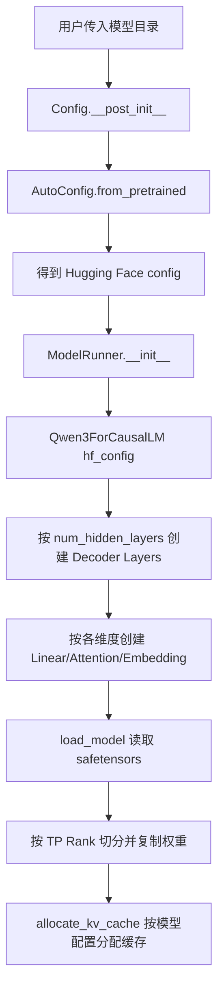
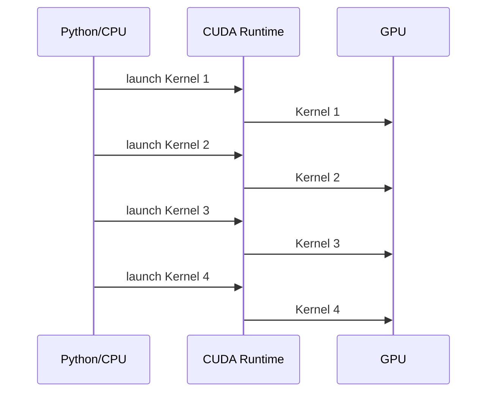
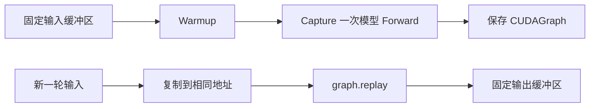
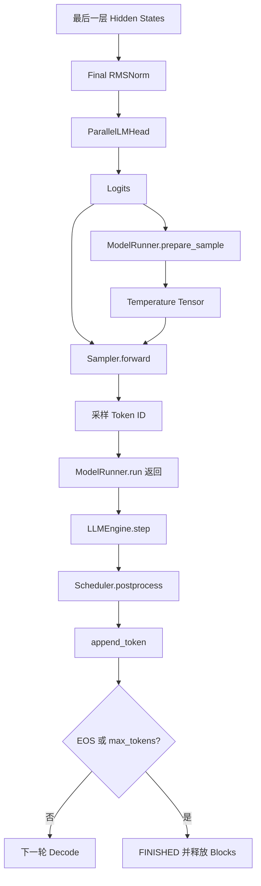
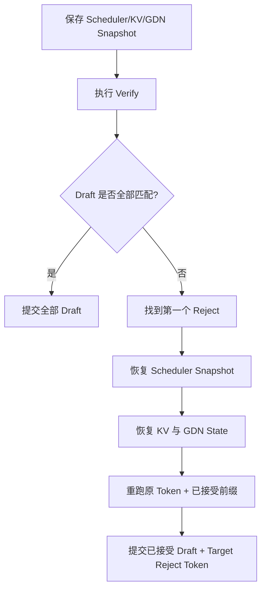

# 一、相同模型架构下，不同参数规模能否直接运行

## 1.1 先给出结论

对于本项目，最准确的回答不是简单的“可以”或“不可以”，而是：

> **同一个模型家族、同一种算子结构、相同的权重命名规则，并且所有张量维度满足当前并行实现约束时，通常可以只更换配置文件和权重，不修改模型主体代码。**

但下面这句话并不严谨：

> “只要模型结构相同，就一定可以直接换权重。”

因为“能够创建模型”只是第一关。真正运行还必须同时通过五关：

1. **模型语义兼容**：是不是同一种 Decoder Layer、Attention、MLP、归一化、位置编码和输出头；
2. **配置形状兼容**：层数、隐藏维度、Head 数等能否驱动代码自动构造正确张量；
3. **权重加载兼容**：检查点中的参数名字、打包方式、量化格式能否被 Loader 识别；
4. **并行切分兼容**：Attention Head、KV Head、词表和中间层维度能否被 TP 数整除；
5. **资源兼容**：模型权重、KV Cache、GDN state、CUDA Graph 私有内存和临时激活能否装入显存。

因此，本章的最终判断是：

- **原版 nano-vLLM：Qwen3-0.6B 换成 Qwen3-8B，在源码层面通常不需要修改 Qwen3 模型代码；但必须重新评估 TP、显存和运行参数。**
- **最终 Qwen3.5 适配版：Qwen3.5-9B 换成 Qwen3.5-27B，在模型类和配置驱动层面具备兼容基础；但 27B 的显存、GDN state、TP 切分和权重格式要求明显更高，不能把“代码可构造”等同于“任意硬件上都能直接跑”。**
- **Qwen3 与 Qwen3.5 之间不能只换权重。**二者不是单纯的参数规模差异，而是标准全注意力架构与 Full Attention + Gated DeltaNet 混合架构的差异，需要不同模型实现。

---

## 1.2 “同一模型架构，不同参数规模”到底是什么意思

以 Qwen3 Dense 为例，0.6B 和 8B 都可以抽象为：

```text
Token Embedding
    ↓
重复 N 层 Decoder Layer
    ├── RMSNorm
    ├── Q/K/V 投影
    ├── RoPE
    ├── GQA Attention
    ├── 输出投影
    ├── RMSNorm
    └── SwiGLU MLP
    ↓
Final RMSNorm
    ↓
LM Head
```

二者的“程序结构”基本一致，主要改变的是循环次数和矩阵尺寸。例如：

- Decoder 层由 28 层增加到 36 层；
- Hidden Size 从 1024 增加到 4096；
- Query Head 数从 16 增加到 32；
- MLP Intermediate Size 从 3072 增加到 12288；
- 权重 Tensor 数量和每个 Tensor 的尺寸增大。

只要代码不是把这些数字写死，而是从 `config.json` 读取，就可以用同一套 Python 类构造不同规模的网络。

可以把它类比为搭积木：

```text
模型类 = 搭建规则
config = 要搭多少层、每块多宽
checkpoint = 每块积木中的实际数值
```

换规模时，通常不变的是“搭建规则”，变化的是“层数、宽度和积木内容”。

---

## 1.3 原版 nano-vLLM 的模型创建链路

核心链路如下：



涉及的关键文件是：

| 文件 | 作用 |
|---|---|
| `nano-vllm/nanovllm/config.py` | 读取 Hugging Face 配置，限制最大上下文长度 |
| `nano-vllm/nanovllm/engine/model_runner.py` | 创建 Qwen3 模型、加载权重、分配 KV Cache、捕获 CUDA Graph |
| `nano-vllm/nanovllm/models/qwen3.py` | 根据配置构造 Qwen3 Attention、MLP 和全部 Decoder Layer |
| `nano-vllm/nanovllm/layers/linear.py` | 实现列并行、行并行、QKV 并行和权重分片 |
| `nano-vllm/nanovllm/layers/embed_head.py` | 实现词表并行 Embedding 和 LM Head |
| `nano-vllm/nanovllm/utils/loader.py` | 从 Safetensors 读取权重，并映射打包参数 |

### 1.3.1 配置不是手工写死的

原版 `Config.__post_init__()` 中执行：

```python
self.hf_config = AutoConfig.from_pretrained(self.model)
self.max_model_len = min(
    self.max_model_len,
    self.hf_config.max_position_embeddings,
)
```

因此，模型目录中的 `config.json` 会提供：

```text
hidden_size
intermediate_size
num_hidden_layers
num_attention_heads
num_key_value_heads
head_dim
vocab_size
rms_norm_eps
rope_theta
max_position_embeddings
...
```

### 1.3.2 层数由配置决定

`Qwen3Model` 中不是固定写 28 层，而是：

```python
self.layers = nn.ModuleList([
    Qwen3DecoderLayer(config)
    for _ in range(config.num_hidden_layers)
])
```

所以：

```text
Qwen3-0.6B config.num_hidden_layers = 28
→ 创建 28 层

Qwen3-8B config.num_hidden_layers = 36
→ 创建 36 层
```

### 1.3.3 Attention 形状由配置决定

`Qwen3DecoderLayer` 向 `Qwen3Attention` 传入：

```python
hidden_size=config.hidden_size
num_heads=config.num_attention_heads
num_kv_heads=config.num_key_value_heads
head_dim=config.head_dim
```

当前 Rank 上的 Head 数为：

```text
local_query_heads = num_attention_heads / TP
local_kv_heads    = num_key_value_heads / TP
```

Q/K/V 投影输出宽度为：

```text
Q width = local_query_heads × head_dim
K width = local_kv_heads × head_dim
V width = local_kv_heads × head_dim
```

### 1.3.4 MLP 形状由配置决定

Qwen3 的 SwiGLU MLP 近似为：

```text
hidden_size
   ↓ gate_proj 和 up_proj
2 × intermediate_size
   ↓ SiLU(gate) × up
intermediate_size
   ↓ down_proj
hidden_size
```

代码通过：

```python
MergedColumnParallelLinear(
    hidden_size,
    [intermediate_size, intermediate_size],
)
RowParallelLinear(intermediate_size, hidden_size)
```

自动适配不同 `hidden_size` 和 `intermediate_size`。

---

## 1.4 Qwen3-0.6B 与 Qwen3-8B 的实际配置对比

以下为官方模型配置中对本项目最关键的字段：

| 配置 | Qwen3-0.6B | Qwen3-8B | 对代码的影响 |
|---|---:|---:|---|
| `num_hidden_layers` | 28 | 36 | Decoder 层数量、KV Cache 层数 |
| `hidden_size` | 1024 | 4096 | Embedding、Attention 输入输出、MLP 输入输出宽度 |
| `intermediate_size` | 3072 | 12288 | MLP 权重和激活宽度 |
| `num_attention_heads` | 16 | 32 | Query Head 数和 TP 切分 |
| `num_key_value_heads` | 8 | 8 | KV Cache 每 Token 宽度和 TP 切分 |
| `head_dim` | 128 | 128 | 每个 Head 的向量长度 |
| `vocab_size` | 151936 | 151936 | Embedding/LM Head 大小 |
| `max_position_embeddings` | 40960 | 40960 | 模型配置允许的最大位置 |
| `tie_word_embeddings` | `true` | `false` | 是否共享 Embedding 与 LM Head 权重 |

这张表说明：

- 8B 不是简单把 0.6B 权重数值换一下；
- 网络层数和矩阵形状都发生了变化；
- 但这些变化都已经是配置字段，原版 Qwen3 类会据此重新创建正确形状。

`Qwen3ForCausalLM` 还会检查：

```python
if config.tie_word_embeddings:
    self.lm_head.weight.data = self.model.embed_tokens.weight.data
```

因此 0.6B 的共享词表权重与 8B 的独立 LM Head，也能由配置自动处理。

### 结论

从模型构造代码看：

> **原版 nano-vLLM 可以合理预期直接加载 Qwen3-8B Dense，而无需修改 Qwen3 模型类。**

但这只说明“架构和形状可适配”，还不代表默认参数下必然能在任意单卡上运行。

---

## 1.5 哪些差异能够自动适配

### 1.5.1 Decoder 层数

配置字段：

```text
num_hidden_layers
```

影响：

- 创建多少个 Decoder Layer；
- 每 Token KV Cache 的层数；
- Forward 循环次数；
- 权重文件中应出现多少层参数。

只要权重命名形如：

```text
model.layers.0...
model.layers.1...
...
model.layers.N-1...
```

Loader 就能按模型参数名加载。

### 1.5.2 Hidden Size

配置字段：

```text
hidden_size
```

自动决定：

- Token Embedding 的列数；
- Attention 投影输入宽度；
- Attention 输出投影宽度；
- MLP 输入输出宽度；
- Final Norm 宽度；
- LM Head 输入宽度；
- CUDA Graph 输出缓冲区形状。

### 1.5.3 Attention Head 与 KV Head 数

配置字段：

```text
num_attention_heads
num_key_value_heads
head_dim
```

自动决定：

- Q/K/V Tensor 形状；
- GQA 分组比；
- 每个 TP Rank 持有多少 Head；
- KV Cache 的最后两个维度。

### 1.5.4 MLP Intermediate Size

配置字段：

```text
intermediate_size
```

自动决定 Gate/Up/Down 权重形状。

### 1.5.5 词表大小

配置字段：

```text
vocab_size
```

自动决定：

- Embedding 权重行数；
- LM Head 输出 Logits 的类别数量；
- TP 下每张卡负责的词表区间。

### 1.5.6 KV Cache 大小

原版 `allocate_kv_cache()` 使用：

```text
每个 Block 字节数
= 2
× num_hidden_layers
× block_size
× local_num_kv_heads
× head_dim
× dtype_bytes
```

其中 `2` 表示 K 和 V。

因此，换模型后 KV Cache 单 Block 大小会自动重算，最终可分配 Block 数也会根据剩余显存重新计算。

---

## 1.6 哪些情况不会自动兼容

### 1.6.1 模型家族名字相似，但算子结构不同

原版 `ModelRunner` 直接写的是：

```python
self.model = Qwen3ForCausalLM(hf_config)
```

它没有根据 `architectures` 自动选择任意模型类。

因此下列情况不能只换权重：

```text
Qwen3 Dense → Qwen3 MoE
Qwen3       → Qwen3.5 Hybrid
Qwen3       → 含视觉编码器的多模态模型
Qwen3       → 不同 Attention Bias / Norm / RoPE 语义的模型
```

即使某些字段名字相同，只要层内部计算图不同，就必须实现新的模型类或新算子。

### 1.6.2 权重命名和打包方式变化

原版 Loader 会将：

```text
q_proj → qkv_proj 的 q 分片
k_proj → qkv_proj 的 k 分片
v_proj → qkv_proj 的 v 分片
gate_proj → gate_up_proj 第 0 片
up_proj   → gate_up_proj 第 1 片
```

如果新模型使用完全不同的参数名、权重前缀或打包方式，`model.get_parameter()` 会找不到参数，或者复制时形状不匹配。

### 1.6.3 量化格式变化

原版 Loader 默认把检查点 Tensor 直接复制到参数：

```python
param.data.copy_(loaded_weight)
```

这不等于支持所有量化模型。

例如 FP8 Block-Quantized Checkpoint 通常还包含：

```text
weight
weight_scale_inv
block shape
quantization config
```

如果没有对应反量化逻辑，不能把 FP8 Checkpoint 当普通 BF16 权重直接加载。

最终 Qwen3.5/Qwen3.6 分支在 `layers/linear.py`、`layers/embed_head.py` 和 `utils/quant.py` 中加入了 Rank-local FP8 反量化逻辑，这才使该检查点格式能够进入现有 BF16 计算路径。

### 1.6.4 当前算子不支持某种结构特性

可能导致不兼容的例子包括：

- Sliding Window Attention；
- MoE Router 和 Expert 并行；
- 不同的 QKV Bias 规则；
- 不同的 Partial RoPE / MRoPE；
- 原生 FP8 GEMM；
- 特殊稀疏 Attention；
- 非标准激活函数；
- 模型需要的自定义 CUDA/Triton Kernel 未实现。

---

## 1.7 Tensor Parallel 的整除约束

本项目的 TP 实现不是任意维度都能切。

`linear.py` 中的核心辅助函数是：

```python
def divide(numerator, denominator):
    assert numerator % denominator == 0
```

### 1.7.1 Attention Head 必须可整除

Qwen3 Attention 要求：

```text
num_attention_heads % TP == 0
num_key_value_heads % TP == 0
```

否则每个 Rank 无法获得整数个 Head。

例如 Qwen3-8B：

```text
Query Heads = 32
KV Heads    = 8
TP = 4

每卡 Query Heads = 8
每卡 KV Heads    = 2
```

可以运行。

但如果 TP=3：

```text
32 % 3 != 0
8 % 3 != 0
```

当前实现会直接断言失败。

### 1.7.2 MLP 维度必须可切分

`ColumnParallelLinear` 将输出维度分片；`RowParallelLinear` 将输入维度分片，因此：

```text
intermediate_size % TP == 0
相关投影输出宽度 % TP == 0
```

### 1.7.3 词表必须可整除

`VocabParallelEmbedding` 明确要求：

```python
assert num_embeddings % tp_size == 0
```

例如：

```text
Qwen3 vocab_size = 151936
151936 / 4 = 37984

Qwen3.5 vocab_size = 248320
248320 / 4 = 62080
```

均可被 TP=4 整除。

### 1.7.4 当前实现不是“自动补齐词表”

生产级框架有时会把词表 Padding 到适合并行的大小，但当前项目直接断言整除，所以不能假设任意词表都能切。

---

## 1.8 Qwen3.5 适配版为什么可以覆盖 9B 和 27B

最终分支在 `ModelRunner._create_model()` 中根据 `model_type` 选择：

```python
if "qwen3_5" in model_type:
    return Qwen3_5ForCausalLM(...)
else:
    return Qwen3ForCausalLM(...)
```

Qwen3.5 模型仍然是配置驱动的：

```python
self.layers = nn.ModuleList([
    Qwen3_5DecoderLayer(config, i)
    for i in range(config.num_hidden_layers)
])
```

每层再读取：

```python
layer_type = config.layer_types[layer_idx]
```

决定执行：

```text
full_attention → Qwen3_5Attention
其他类型       → GatedDeltaNet
```

这意味着 9B 和 27B 只要保持相同的 Hybrid 语义，代码就可以根据配置自动建立不同数量和宽度的层。

### 1.8.1 Qwen3.5-9B 与 Qwen3.5-27B 配置对比

| 配置 | Qwen3.5-9B | Qwen3.5-27B | 影响 |
|---|---:|---:|---|
| `num_hidden_layers` | 32 | 64 | 总层数翻倍 |
| `hidden_size` | 4096 | 5120 | 所有主干矩阵加宽 |
| `intermediate_size` | 12288 | 17408 | MLP 显著增大 |
| `num_attention_heads` | 16 | 24 | Full Attention Query Head 数 |
| `num_key_value_heads` | 4 | 4 | Full Attention KV Head 数 |
| `head_dim` | 256 | 256 | 每 Head 维度 |
| `linear_num_key_heads` | 16 | 16 | GDN Key Head 总数 |
| `linear_num_value_heads` | 32 | 48 | GDN Value Head 总数 |
| `linear_key_head_dim` | 128 | 128 | GDN Key Head 维度 |
| `linear_value_head_dim` | 128 | 128 | GDN Value Head 维度 |
| `linear_conv_kernel_dim` | 4 | 4 | GDN 卷积状态长度 |
| `vocab_size` | 248320 | 248320 | 词表不变 |
| 层模式 | 3 GDN + 1 Full Attention 周期 | 同样模式 | 算子语义相同 |
| Full Attention 层数 | 8 | 16 | 标准 KV Cache 层数 |
| GDN 层数 | 24 | 48 | recurrent/conv state 层数 |

因此 27B 不需要重新发明一种新 Layer，但会产生更多、更宽的权重和状态。

---

## 1.9 Qwen3.5 中 KV Cache 与 GDN state 是两种不同资源

### 1.9.1 Full Attention 层保存普通 KV Cache

最终版 `allocate_kv_cache()` 不再使用全部 `num_hidden_layers`，而是统计真正拥有 `k_cache/v_cache` 的模块：

```python
num_kv_layers = sum(
    1 for m in self.model.modules()
    if hasattr(m, "k_cache") and hasattr(m, "v_cache")
)
```

因此：

```text
Qwen3.5-9B：只为 8 个 Full Attention 层分配 KV Cache
Qwen3.5-27B：只为 16 个 Full Attention 层分配 KV Cache
```

GDN 层不使用标准 K/V，因此不能用 SnapKV 压缩其 recurrent state。

### 1.9.2 GDN 层保存固定槽位状态

每条活跃请求会获得一个 `state_slot_id`。每个 GDN 层在该槽位保存：

```text
conv_state
recurrent_state
```

代码中的单卡、单请求、全部 GDN 层状态字节数近似为：

```text
conv bytes
= num_gdn_layers
× conv_dim
× (kernel_size - 1)
× dtype_bytes

recurrent bytes
= num_gdn_layers
× local_value_heads
× key_head_dim
× value_head_dim
× 4
```

Recurrent State 使用 FP32，所以最后乘 4。

### 1.9.3 以 TP=4 估算 GDN state

**Qwen3.5-9B，TP=4：**

```text
24 个 GDN 层
每卡 local key heads   = 16 / 4 = 4
每卡 local value heads = 32 / 4 = 8

单请求每卡 GDN state ≈ 12.28 MiB
```

**Qwen3.5-27B，TP=4：**

```text
48 个 GDN 层
每卡 local key heads   = 16 / 4 = 4
每卡 local value heads = 48 / 4 = 12

单请求每卡 GDN state ≈ 36.70 MiB
```

这说明 Hybrid 模型的并发容量不能只看 KV Cache。即使 Full Attention KV 较少，GDN state 仍会按活跃请求数增长。

最终代码使用剩余显存的 90% 估算最多可分配的状态槽，并限制：

```text
max_state_slots <= max_num_seqs
```

---

## 1.10 不同模型的 KV Cache 每 Token 占用

BF16 条件下，标准 KV Cache 每 Token 的总字节近似为：

```text
2 × KV层数 × KV Head数 × Head Dim × 2 Byte
```

| 模型 | 标准 KV 层 | KV Heads | Head Dim | 全模型每 Token KV | TP=4 时每卡 |
|---|---:|---:|---:|---:|---:|
| Qwen3-0.6B | 28 | 8 | 128 | 112 KiB | 28 KiB |
| Qwen3-8B | 36 | 8 | 128 | 144 KiB | 36 KiB |
| Qwen3.5-9B | 8 | 4 | 256 | 32 KiB | 8 KiB |
| Qwen3.5-27B | 16 | 4 | 256 | 64 KiB | 16 KiB |

注意：

- Qwen3.5 的标准 KV 更小，不等于总状态一定更小；
- 还要加上每请求固定的 GDN state；
- Paged KV Cache 按 Block 预分配，`nvidia-smi` 不一定直接显示单请求压缩后的下降；
- CUDA Graph 和临时激活也会占显存。

---

## 1.11 单张 RTX 3090 与四张 RTX 3090 的运行判断

RTX 3090 单卡显存为 24 GB。以下都是工程估算，而不是“只根据参数量就能保证”的结论。

### 1.11.1 权重的最低数量级

BF16 权重约为：

```text
参数量 × 2 Byte
```

| 模型 | BF16 权重粗略数量级 | 单卡 3090 判断 |
|---|---:|---|
| Qwen3-0.6B | 约 1.2 GB | 很宽松 |
| Qwen3-8B | 约 16 GB | 可能运行，但余量有限 |
| Qwen3.5-9B | 约 18 GB | 文本模式下可能运行，但非常紧张 |
| Qwen3.5-27B | 约 54 GB | 单卡不可能以 BF16 常驻 |

实际还需加入：

```text
CUDA Context
临时激活
Torch 编译缓存
CUDA Graph 私有内存池
KV Cache Pool
GDN state Pool
通信缓冲区
Vision Encoder（若启用）
MTP 权重（若启用）
```

### 1.11.2 Qwen3-8B 单卡

模型权重约占 16 GB，剩余空间还要放 KV Cache 和 Graph。

所以单卡运行通常需要：

- 减小 `max_model_len`；
- 减小 `max_num_seqs`；
- 减小 `max_num_batched_tokens`；
- 视情况降低 `gpu_memory_utilization`；
- 调试时先用 `enforce_eager=True`，避免 Graph 捕获额外占用；
- 避免一次设置很高并发和长上下文。

“模型能装进去”不代表默认 512 并发、4096 上下文一定可用。

### 1.11.3 Qwen3-8B 使用四卡 TP=4

每卡权重主体约为四分之一，形状满足：

```text
32 Query Heads / 4 = 8
8 KV Heads / 4 = 2
12288 Intermediate / 4 = 3072
151936 Vocab / 4 = 37984
```

资源更宽松，但会引入：

- Row Parallel All-Reduce；
- Embedding All-Reduce；
- 多卡采样通信；
- NCCL 启动和同步开销。

低 Batch 或短输出时，四卡不一定比单卡更快；TP 的首要作用通常是“装下模型和状态”，其次才是吞吐加速。

### 1.11.4 Qwen3.5-9B 单卡

如果：

```text
enable_vision=False
并发较低
max_model_len 较小
max_state_slots 较少
enforce_eager=True 或 Graph 占用可接受
```

理论上可能在 24 GB 卡上运行文本推理，但非常依赖实际权重大小和初始化峰值。

GDN 单请求状态在 TP=1 下约 49.1 MiB。若试图分配大量并发槽位，显存会快速增加。

### 1.11.5 Qwen3.5-9B 使用四卡 TP=4

所有关键维度都可被 4 整除：

```text
16 Attention Heads / 4 = 4
4 KV Heads / 4 = 1
16 GDN Key Heads / 4 = 4
32 GDN Value Heads / 4 = 8
4096 Hidden / 4 可满足相关切分
12288 Intermediate / 4 = 3072
248320 Vocab / 4 = 62080
```

每卡 GDN 单请求状态降到约 12.28 MiB，权重主体也降到约四分之一，因此更适合做长上下文和并发实验。

### 1.11.6 Qwen3.5-27B 使用四卡 TP=4

主体 BF16 权重粗略为：

```text
54 GB / 4 ≈ 13.5 GB/卡
```

维度也满足 TP=4：

```text
24 Attention Heads / 4 = 6
4 KV Heads / 4 = 1
16 GDN Key Heads / 4 = 4
48 GDN Value Heads / 4 = 12
17408 Intermediate / 4 = 4352
248320 Vocab / 4 = 62080
```

因此从**权重分片和张量形状**看，四张 3090 具备运行基础。

但必须保守看待：

- 每卡 GDN 单请求状态约 36.70 MiB；
- 64 层模型激活和 Graph 开销更大；
- FP8 检查点若被反量化为 BF16 常驻，运行时并不会保持 1 Byte/参数；
- 仓库 README 报告验证的是 Qwen3.6-27B-FP8、TP=4、4 张 RTX 4090，而不是 4 张 3090；
- 3090 环境仍需实测启动峰值、NCCL、FlashAttention 和 BF16 支持情况。

更稳妥的启动顺序是：

```text
1. enable_vision=False
2. enable_mtp=False
3. kv_compress_enabled=False
4. enforce_eager=True
5. max_num_seqs=1
6. max_model_len 设置较小
7. 确认可完成一次 Prefill + Decode
8. 再逐步开启 Graph、并发、MTP 或压缩
```

---

## 1.12 “同结构即可直接换权重”的准确表达

建议在面试中这样回答：

> 同一模型家族的不同 Dense 参数规模，通常共享相同的层级算子结构。本项目从 Hugging Face Config 动态读取层数、隐藏维度、Attention/KV Head 数、Head Dim、MLP 中间维度和词表大小，并据此构造模型、TP 分片和 KV Cache，所以 Qwen3-0.6B 换到 Qwen3-8B，一般不需要改 Qwen3 模型代码。Qwen3.5-9B 和 27B 也可以复用同一个 Hybrid 模型实现。但“结构相同就一定能直接换权重”不够准确，还必须保证权重命名和量化格式匹配、所有分片维度能被 TP 数整除、算子语义没有变化，并且权重、KV Cache、GDN state 和 CUDA Graph 能装进显存。代码兼容和硬件可运行是两个不同层次的问题。

---

## 1.13 更换模型前的检查清单

```text
[模型类]
□ model_type 是否会选择正确模型类？
□ 是 Dense、MoE，还是 Hybrid？
□ Attention、Norm、RoPE、MLP 语义是否一致？

[配置]
□ num_hidden_layers
□ hidden_size
□ intermediate_size
□ num_attention_heads
□ num_key_value_heads
□ head_dim
□ vocab_size
□ layer_types
□ quantization_config

[权重]
□ 参数前缀是否匹配？
□ QKV 和 Gate/Up 打包映射是否匹配？
□ 是否包含额外 Scale？
□ 是 BF16、FP16 还是 Block FP8？

[TP]
□ Query Heads % TP == 0
□ KV Heads % TP == 0
□ GDN Key/Value Heads % TP == 0
□ Intermediate Size % TP == 0
□ Vocab Size % TP == 0

[显存]
□ 权重常驻
□ 初始化峰值
□ KV Block Pool
□ GDN State Pool
□ CUDA Graph Pool
□ Vision/MTP 额外权重
```

# 二、CUDA Graph 与 Eager 模式及其在项目中的作用

## 2.1 从零理解 Eager 执行

Eager 的意思是：Python 程序运行到一个 PyTorch CUDA 操作，就立即向 GPU 提交相应 Kernel。

例如一层 Attention 可能产生：

```text
Python 调用 q_proj
→ CPU 准备参数
→ 发射 GEMM Kernel

Python 调用 q_norm
→ CPU 发射 Norm Kernel

Python 调用 RoPE
→ CPU 发射 RoPE Kernel

Python 调用 FlashAttention
→ CPU 发射 Attention Kernel

Python 调用 o_proj
→ CPU 发射 GEMM Kernel
```

GPU Kernel 本身可能很快，但每次发射都需要：

- Python/框架调度；
- CUDA Runtime 调用；
- 参数准备；
- Stream 排队；
- 依赖管理。

### 2.1.1 Eager 的执行图



### 2.1.2 Eager 的优点

- 控制流灵活；
- Tensor 形状可以每轮变化；
- 可以执行 Python `if/for/list`；
- 容易调试和打印；
- 可以动态分配内存；
- 出错栈更直观；
- 适合 Prefill、压缩、变长输入等动态场景。

### 2.1.3 Eager 的缺点

- 每个 Kernel 都有 CPU 发射开销；
- 小 Batch Decode 中 GPU 计算量较少，CPU 开销占比可能很高；
- Python 调度抖动会影响 TPOT 和尾延迟；
- 多卡时 Rank 间发射节奏抖动可能放大同步等待。

---

## 2.2 CUDA Graph 是什么

CUDA Graph 的基本思想是：

> 先把一串固定的 GPU 操作及其依赖关系捕获下来，以后不再由 CPU 一个一个发射，而是通过一次 Graph Replay 启动整串操作。

### 2.2.1 三个阶段

```text
第一阶段：Warmup
确保 Kernel、内存、编译和通信路径已经初始化。

第二阶段：Capture
记录这一轮中执行的 CUDA Kernel、Memcpy 和依赖关系。

第三阶段：Replay
后续只更新固定输入缓冲区中的数值，然后一次 replay 整张图。
```



### 2.2.2 为什么能减少 CPU 开销

Eager：

```text
一次 Decode
= CPU 发射几十到几百个 Kernel
```

Graph：

```text
一次 Decode
= CPU 更新几个输入缓冲区
+ 一次 cudaGraphLaunch
```

它主要减少的是：

- Python 层逐算子调度；
- CUDA Runtime 多次 Launch；
- 多卡 Rank 间因 CPU 发射速度不同造成的间隙。

它不会自动减少模型 FLOPs，也不会让矩阵乘法本身凭空变快。

---

## 2.3 CUDA Graph 的静态约束

Graph Replay 复用捕获时的执行拓扑，所以通常需要：

1. **Kernel 拓扑不变**；
2. **Tensor 地址不变**；
3. **Tensor Shape 不变或落在预先捕获的 Bucket 中**；
4. **动态 Python 控制流不能决定捕获内部是否新增 Kernel**；
5. **Graph 内不能依赖普通 CPU 返回值来改变本轮路径**；
6. **Graph 捕获期间不能随意执行不兼容的动态内存分配或同步操作**。

一个容易误解的点是：

> 地址必须固定，不代表输入数值必须固定。

本项目每轮把新的：

```text
input_ids
positions
slot_mapping
context_lens
block_tables
state_indices
```

复制到同一批预分配 Tensor 中。地址保持不变，但内容可以变化。

---

## 2.4 为什么 Decode 更适合 Graph，Prefill 更适合 Eager

### 2.4.1 Decode 形状相对稳定

普通自回归 Decode 中，每条请求每轮只输入一个 Token：

```text
input_ids shape ≈ [batch_size]
positions shape ≈ [batch_size]
```

变化的主要是：

- Batch Size；
- 每条请求的上下文长度；
- Block Table 内容；
- KV 写入 Slot。

这些都可以放进固定大小的元数据 Tensor 中。

### 2.4.2 Prefill 高度动态

Prefill 可能出现：

```text
请求 A 输入 37 Token
请求 B 输入 1024 Token
请求 C 命中 512 Token Prefix，只计算剩余部分
下一轮又是完全不同长度
```

还包含：

- `cu_seqlens_q/cu_seqlens_k`；
- `max_seqlen_q/max_seqlen_k`；
- Chunked Prefill；
- Prefix Cache；
- 多模态 Image Token 和视觉特征；
- Qwen3.5 的 Continuation Prefill；
- 可能不同数量的 Token 写入 KV/GDN state。

因此三套仓库的主路径都把普通 Prefill 留在 Eager。

---

## 2.5 原版 nano-vLLM 的 Graph 实现

核心文件：

```text
nano-vllm/nanovllm/engine/model_runner.py
```

关键函数：

```text
ModelRunner.__init__
ModelRunner.run_model
ModelRunner.capture_cudagraph
```

### 2.5.1 什么时候捕获

模型初始化顺序为：

```text
创建模型
→ 加载权重
→ Warmup
→ 分配 KV Cache
→ 若 enforce_eager=False，捕获 CUDA Graph
```

### 2.5.2 什么时候回放

`run_model()` 的分支是：

```python
if is_prefill or self.enforce_eager or input_ids.size(0) > 512:
    # Eager
else:
    # CUDA Graph replay
```

也就是说原版中：

| 场景 | 执行方式 |
|---|---|
| Prefill | Eager |
| `enforce_eager=True` | Eager |
| Decode Batch > 512 | Eager |
| 普通 Decode，Batch ≤ 512 | CUDA Graph |

---

## 2.6 Batch Bucket 与填充机制

实际 Batch Size 不可能永远完全相同。如果为 1～512 每个 Batch 都捕获一张图，会占用大量时间和显存。

原版使用 Bucket：

```python
[1, 2, 4, 8] + [16, 32, 48, ..., 512]
```

假设当前真实 Batch Size 是 11：

```text
选择最小的 graph_bs >= 11
→ 使用 Batch 16 的图
```

### 2.6.1 数据如何填入

Graph 的固定缓冲区包括：

```text
input_ids      [max_bs]
positions      [max_bs]
slot_mapping   [max_bs]
context_lens   [max_bs]
block_tables   [max_bs, max_num_blocks]
outputs        [max_bs, hidden_size]
```

回放前：

```python
graph_vars["input_ids"][:bs] = input_ids
graph_vars["positions"][:bs] = positions

graph_vars["slot_mapping"].fill_(-1)
graph_vars["slot_mapping"][:bs] = real_slot_mapping

graph_vars["context_lens"].zero_()
graph_vars["context_lens"][:bs] = real_context_lens
```

然后：

```python
graph.replay()
return outputs[:real_bs]
```

### 2.6.2 “Padding”不等于添加真实请求

多出来的 Bucket 行只是占位：

- `slot_mapping=-1`，避免写入真实 KV Slot；
- `context_lens=0`；
- 最终只取前 `real_bs` 行输出。

因此逻辑上仍然只有 11 条真实请求。

### 2.6.3 Block Table 必须清理

最终分支每次回放前明确：

```python
graph_vars['block_tables'].fill_(-1)
```

再写入当前有效部分。否则上一个 Batch 更长的 Block Table 尾部可能残留，形成脏元数据。

---

## 2.7 Graph 捕获的模型边界

原版捕获的是：

```python
outputs[:bs] = self.model(input_ids[:bs], positions[:bs])
```

之后的：

```text
LM Head / compute_logits
Sampler
Scheduler.postprocess
```

不全部包含在同一张普通 Decode Graph 中。

这点非常重要：

> “项目启用了 CUDA Graph”不代表从 Scheduler 到采样的所有代码都被图捕获。它主要覆盖模型 Forward 热路径。

---

## 2.8 Paged KV Cache 为什么能配合固定地址 Graph

KV Cache 在初始化时已经分配为一个大 Tensor Pool：

```text
[2, num_kv_layers, num_blocks, block_size, local_kv_heads, head_dim]
```

整个大池地址不变。不同请求每轮只是通过：

```text
block_tables
slot_mapping
context_lens
```

告诉 Attention：

```text
当前请求使用哪些物理 Block
当前 Token 写到哪个 Slot
当前有效上下文多长
```

因此：

- 物理大 Tensor 地址固定；
- 元数据 Tensor 地址固定；
- 元数据内容可以每轮更新；
- Graph 内仍能访问不同请求的不同 KV 区域。

这正是 Paged KV Cache 与 CUDA Graph 能结合的原因之一。

---

## 2.9 动态 Continuous Batching 如何与 Graph 共存

Continuous Batching 会导致每轮：

- 有请求结束；
- 新请求进入；
- Batch Size 改变；
- Block Table 改变；
- Context Length 改变。

项目不是捕获“某一组固定请求”，而是捕获固定的**Batch 形状和算子拓扑**。

```text
请求身份是动态的
Graph Bucket 是静态的
请求元数据通过固定 Tensor 动态写入
```

只要本轮仍是“每条请求一个 Decode Token、走相同模型路径”，就可以复用对应 Bucket。

---

## 2.10 KV Cache 压缩为什么使 Graph 变难

普通 Decode 的路径是：

```text
写当前 Token KV
→ FlashAttention 读取缓存
```

压缩 Decode 的路径变成：

```text
写当前 Token KV
→ 判断哪些请求压缩
→ Gather 压缩窗口
→ QK 打分
→ Softmax / 平滑 / Top-K
→ 生成动态 keep_idx
→ Gather K/V
→ Compact 搬移
→ 改写 context_lens
→ 生成 compression_event
→ FlashAttention
```

其中包含：

- 数据相关的 Top-K 索引；
- 动态源/目标 Slot；
- Python List 和事件对象；
- `.item()` / `.tolist()`；
- 请求数量和释放 Block 数变化；
- 本轮是否压缩的控制流变化；
- 最终要把事件返回 CPU Scheduler。

这些都不适合直接混入普通静态 Decode Graph。

### 2.10.1 早期 nano-kvLLM 的判断时机问题

早期压缩版在 `run_model()` 中使用：

```python
need_eager_decode = context.compress_any
```

来决定是否 Eager。

但 `compress_any` 可能要等模型内部压缩逻辑真正执行时才变成 `True`。如果在进入 Forward 前仍为 `False`，就有可能错误进入普通 Graph 路径。

这体现了一个关键原则：

> 是否走 Graph，必须在 Graph Replay 之前由可靠元数据确定，不能等进入模型后才发现本轮有动态分支。

### 2.10.2 最终 Qwen3.5 版的修正

最终版在 Scheduler/Decode Metadata 阶段就建立压缩请求，`prepare_decode()` 把它转换为 `compression_progress`。

`run_model()` 调用：

```python
should_run_eager(
    is_prefill=is_prefill,
    enforce_eager=self.enforce_eager,
    batch_size=input_ids.size(0),
    has_kv_compression=context.has_kv_compression,
)
```

只要本轮存在压缩请求：

```text
has_kv_compression = True
→ 强制 Eager
```

这是比早期版本更可靠的设计。

---

## 2.11 Qwen3.5 的 GDN state 如何进入普通 Decode Graph

GDN 层的 `conv_states` 和 `recurrent_states` 是模型初始化后分配的持久 Tensor Pool，地址固定。

每条请求持有一个动态的：

```text
state_slot_id
```

最终版 Graph 额外预分配：

```python
state_indices = torch.arange(max_bs, dtype=torch.int32)
```

捕获时把固定地址的 `state_indices` 放进 Context。回放前再更新：

```python
graph_vars["state_indices"][:bs] = context.state_indices
```

于是 Graph 内的 GDN Kernel 可以：

```text
根据 state_indices 的值
访问同一个固定 State Pool 中的不同请求槽位
```

### 2.11.1 为什么捕获后要清空 State Slot

Graph Warmup 和 Capture 本身会执行模型，也会修改 GDN state。

因此最终代码在捕获完成后调用：

```python
reset_gdn_state_slots(list(range(max_bs)))
```

否则捕获过程产生的假状态会污染真实推理。

### 2.11.2 GDN state 可以进 Graph，但动态槽位管理不在 Graph 内

Graph 内做的是：

```text
读取和更新已经分配好的状态槽
```

Scheduler 侧的：

```text
申请 state_slot_id
释放 state_slot_id
抢占时重置
```

仍然属于动态控制面，不是模型 Graph 的一部分。

---

## 2.12 Chunked Prefill 和多模态为什么通常走 Eager

Qwen3.5 的 Prefill 还可能包含：

```text
Token positions 为 1D 或 3D MRoPE
Pixel Values
Image Grid THW
Image Token Mask
Vision Encoder
图像特征 Scatter 到语言 Token
GDN Continuation Prefill
```

每张图的 Patch 数、文本长度、Chunk 边界和 `cu_seqlens` 都可能变化，因此普通 Prefill 继续走 Eager 是合理取舍。

这不代表 Prefill 永远不能 Graph 化，而是需要更多 Bucket、静态上限、Padding 和专门 Kernel，工程复杂度远高于单 Token Decode。

---

## 2.13 MTP 为什么又需要专门的 Graph

普通 Decode Graph 的固定语义是：

```text
一次回放处理一个 Decode Step
```

MTP Verify 需要验证长度为 1～N 的 Draft 序列。最终项目为 Verify 长度 1～4 单独捕获 Graph Bucket：

```text
verify_len = 1
verify_len = 2
verify_len = 3
verify_len = 4
```

### 2.13.1 Sequential Verify Graph

`capture_verify_cudagraph()` 中，Graph 内部仍是：

```python
for i in range(verify_len):
    设置第 i 步 Context
    运行一次单 Token 模型 Forward
```

因为这个 Python `for` 在 Capture 阶段展开成固定数量的 Kernel，所以 Replay 时可以一次启动整串步骤。

但它本质上仍是：

```text
Graph 内固定展开的多个顺序 Decode Step
```

不是一个融合后的并行 GDN Verify Kernel。

### 2.13.2 Chunk Verify Graph

项目还捕获长度 1～4 的 Continuation-Prefill Chunk Graph，把一组 Draft Token 当成一个 Chunk 运行。

但 README 和测试脚本都把它标为实验路径：

- Raw Chunk Logits 可能与可信顺序 Decode 路径不同；
- 最终 Accept/Reject 仍需要可信路径校验；
- 主要用于研究语义和开销。

### 2.13.3 MTP 与 KV 压缩当前互斥

最终 `Config` 明确检查：

```python
if kv_compress_enabled and enable_mtp:
    raise ValueError(...)
```

原因之一是二者都要动态改写 Decode 状态：

- 压缩会重排和缩短 KV；
- MTP Verify 会暂时写入多个候选 Token，并在 Reject 时回滚 KV/GDN state；
- 二者同时存在会显著增加状态提交和恢复复杂度。

因此当前项目没有声称支持“压缩 + MTP 同时开启”。

---

## 2.14 Eager 与 CUDA Graph 的优缺点对比

| 维度 | Eager | CUDA Graph |
|---|---|---|
| CPU Kernel 发射 | 每个算子分别发射 | 一次 Replay 启动整图 |
| 动态 Shape | 灵活 | 需要固定或 Bucket |
| 动态控制流 | 支持 | 捕获后拓扑应固定 |
| 动态内存 | 更灵活 | 受捕获约束 |
| 调试 | 容易 | 较困难 |
| 首次启动 | 无需捕获 | 需要 Warmup/Capture |
| 额外显存 | 较少 | Graph Pool 和多 Bucket 有额外占用 |
| 小 Batch Decode | CPU 开销可能明显 | 通常更有价值 |
| Prefill | 更适合 | 较难 |
| KV 压缩 Step | 更适合 | 当前项目强制 Eager |
| 普通 GDN Decode | 可运行 | 通过固定 State Pool + state_indices 支持 |
| MTP Verify | 可运行 | 项目另建 Verify Graph Bucket |

---

## 2.15 为什么性能测试必须同时测 Eager 和 CUDA Graph

如果只测 Graph：

- 无法判断性能提升来自模型适配还是 Graph；
- 无法观察纯算子和 KV 压缩的真实成本；
- Graph 可能掩盖 Python 调度问题；
- 某些动态路径本来就会回退 Eager。

如果只测 Eager：

- 不代表项目正常服务模式的 Decode 性能；
- 会高估 CPU Launch 对 TPOT 的影响；
- 无法验证 Qwen3.5 GDN State 是否可被 Graph 正确更新。

### 2.15.1 公平对比必须控制的变量

Eager 与 Graph 对比时，下列条件必须一致：

```text
同一模型权重
同一 dtype
同一 GPU 与频率状态
同一 TP 数
同一输入 Token IDs
同一输入长度
同一输出长度
同一 SamplingParams
同一 Batch/并发
同一 max_model_len
同一 KV Cache 配置
同一 GDN state 配置
同一压缩开关和压缩参数
同一 Vision/MTP 开关
相同 Warmup 次数
```

不能拿：

```text
Eager + Batch 1
对比
Graph + Batch 32
```

然后把差异全部归因于 Graph。

### 2.15.2 建议实验矩阵

| 组别 | 模式 | 压缩 | MTP | 目的 |
|---|---|---|---|---|
| A | Eager | Off | Off | 基础正确性与纯 Eager 性能 |
| B | Graph | Off | Off | 测普通 Decode Graph 收益 |
| C | Eager | On | Off | 测压缩净效果 |
| D | Graph 配置 | On | Off | 普通步 Graph、压缩步自动 Eager 的混合真实性能 |
| E | Eager | Off | On | MTP 原型基线 |
| F | Verify Graph | Off | On | MTP Verify Graph 是否减少开销 |

### 2.15.3 应观察的指标

**延迟：**

```text
TTFT
平均 TPOT
P50/P95/P99 TPOT
普通 Decode Step 时延
压缩 Decode Step 时延
MTP Draft/Verify/Rerun 时延
```

**吞吐：**

```text
Output Tokens/s
Requests/s
总生成 Token / 总 Decode 时间
```

**CPU/GPU 时间线：**

```text
Kernel Launch 间隙
GPU 空闲气泡
cudaGraphLaunch 次数
NCCL All-Reduce 等待
CPU 利用率
```

**资源：**

```text
Graph Capture 后额外显存
KV Block 数
GDN State Slot 数
峰值显存
压缩后 free_block_ids 增量
```

**正确性：**

```text
Eager 与 Graph 贪心输出是否一致
每步 Logit 最大误差
GDN State 是否一致
压缩事件是否完整
MTP Reject 后输出是否回到目标模型贪心路径
```

### 2.15.4 统计时不要犯的错误

总体吞吐应计算：

```text
总输出 Token 数 / 总墙钟时间
```

不能简单平均每个 Step 的 `tokens/s`，因为：

- Batch Size 每轮变化；
- 压缩 Step 是周期性尖峰；
- MTP 一轮可能提交多个 Token；
- Prefill 和 Decode 的工作量不同。

---

## 2.16 本项目中 CUDA Graph 的一句话总结

> 本项目用 CUDA Graph 优化形状相对稳定的普通 Decode：预先为多个 Batch Bucket 捕获固定地址的模型 Forward，回放前只更新 Token、位置、Paged KV 元数据和 Qwen3.5 GDN state 索引，从而减少 CPU 逐 Kernel 发射开销；Prefill、KV 压缩和其他高度动态路径仍走 Eager，MTP Verify 则使用单独的定长 Graph Bucket。

# 三、Qwen3 与 Qwen3.5 版本的采样策略

## 3.1 先区分三个容易混淆的概念

### 3.1.1 Logits

LM Head 为词表中每个 Token 输出一个未归一化分数：

```text
logits = [z0, z1, z2, ..., zV-1]
```

Logit 越大，模型越偏向该 Token，但 Logit 本身不是概率。

### 3.1.2 采样策略

采样策略决定：

```text
如何把一整行 Logits 变成一个 Token ID
```

可能包括：

- Greedy；
- Temperature Sampling；
- Top-k；
- Top-p；
- Repetition Penalty；
- Beam Search。

### 3.1.3 停止策略

停止策略决定：

```text
采样到 Token 后，请求是否结束
```

例如：

- 采样到 EOS；
- 已生成 `max_tokens`；
- 用户自定义 Stop String。

本项目的采样策略较简单，停止策略也只实现了其中一部分。

---

## 3.2 原版 nano-vLLM 从 Hidden States 到 Token 的完整链路



涉及的核心文件：

| 文件 | 函数/类 | 作用 |
|---|---|---|
| `models/qwen3.py` | `Qwen3ForCausalLM.compute_logits` | 调用 LM Head 产生 Logits |
| `layers/embed_head.py` | `ParallelLMHead.forward` | Hidden States × 词表权重 |
| `engine/model_runner.py` | `prepare_sample` | 为每条请求准备 Temperature |
| `layers/sampler.py` | `Sampler.forward` | 从 Logits 随机选 Token |
| `sampling_params.py` | `SamplingParams` | 保存 Temperature、Max Tokens、Ignore EOS |
| `engine/scheduler.py` | `postprocess` | 追加 Token，并判断 EOS/长度停止 |

---

## 3.3 LM Head 如何产生 Logits

原版 `ParallelLMHead` 先在每个 TP Rank 计算本地词表分片：

```python
local_logits = F.linear(hidden_states, local_vocab_weight)
```

若 TP>1，原版把各 Rank 的本地 Logits Gather 到 Rank 0：

```text
Rank 0: vocab [0, ..., V/TP-1]
Rank 1: vocab [V/TP, ..., 2V/TP-1]
...

Gather + Concat
→ Rank 0 获得完整 [batch, vocab_size] Logits
```

只有 Rank 0 执行最终采样。

### 3.3.1 Prefill 为什么只取每条请求最后一个位置

Prefill 会产生所有输入 Token 的 Hidden States，但下一 Token 只由每条序列的最后一个位置预测。

因此 LM Head 使用：

```python
last_indices = context.cu_seqlens_q[1:] - 1
x = x[last_indices]
```

例如：

```text
请求 A 的 Prefill Token 范围：[0, 10)
请求 B 的 Prefill Token 范围：[10, 17)

只取索引 9 和 16 的 Hidden State
```

Decode 本来每条请求就只有一个当前位置，不需要再筛最后位置。

---

## 3.4 原版 SamplingParams 实际支持什么

原版定义：

```python
@dataclass
class SamplingParams:
    temperature: float = 1.0
    max_tokens: int = 64
    ignore_eos: bool = False
```

并且：

```python
assert temperature > 1e-10,
       "greedy sampling is not permitted"
```

### 3.4.1 支持矩阵

| 策略/参数 | 原版是否支持 | 默认值或行为 |
|---|---|---|
| Temperature Sampling | 支持 | `temperature=1.0` |
| Greedy (`temperature=0`) | **不支持** | 构造参数时断言失败 |
| Top-k Sampling | 不支持 | 无参数、无过滤代码 |
| Top-p / Nucleus | 不支持 | 无参数、无排序累积概率 |
| Min-p | 不支持 | 无实现 |
| Repetition Penalty | 不支持 | 无历史 Token 惩罚 |
| Presence/Frequency Penalty | 不支持 | 无实现 |
| Beam Search | 不支持 | 无 Beam 状态 |
| Logit Bias | 不支持 | 无实现 |
| Seed 参数 | 不支持 | 未暴露 |
| `max_tokens` | 支持 | 默认 64 个 Completion Token |
| EOS 停止 | 支持 | 默认遇到 EOS 停止 |
| `ignore_eos` | 支持 | 默认 `False` |
| Stop String | 不支持 | 无字符串匹配逻辑 |

注意：项目中出现的其他 `topk` 不等于生成采样 Top-k：

- `kv_compress_topk`：每个压缩周期最多压缩多少条请求；
- SnapKV Top-K：保留哪些历史 KV；
- MTP 的 `top_k` Probe：打印/分析 Logits 前 K 名；
- 它们都不是普通生成采样的 Top-k 截断。

---

## 3.5 Temperature 的数学意义

给定 Logits：

```text
z = [z0, z1, ..., zV-1]
```

Temperature Sampling 使用：

```text
p_i = exp(z_i / T) / Σ_j exp(z_j / T)
```

### 3.5.1 T=1

保持模型原始相对分布。

### 3.5.2 0<T<1

Logit 差异被放大，分布更尖锐，更偏向高分 Token。

### 3.5.3 T>1

Logit 差异被缩小，分布更平坦，低分 Token 获得更多概率。

### 3.5.4 T→0

理论上趋向 Greedy：始终选择最大 Logit。

但原版代码禁止 T=0，因为它只有随机采样路径，直接除以 0 会出错。

---

## 3.6 一个具体概率例子

假设词表中只剩三个候选 Token：

```text
A 的 Logit = 2
B 的 Logit = 1
C 的 Logit = 0
```

### T=1

```text
P(A) ≈ 0.665
P(B) ≈ 0.245
P(C) ≈ 0.090
```

### T=0.5

先除以 0.5：

```text
[4, 2, 0]
```

概率约为：

```text
P(A) ≈ 0.867
P(B) ≈ 0.117
P(C) ≈ 0.016
```

模型更保守。

### T=2

先除以 2：

```text
[1, 0.5, 0]
```

概率约为：

```text
P(A) ≈ 0.506
P(B) ≈ 0.307
P(C) ≈ 0.186
```

模型更随机。

### Greedy

```text
argmax([2,1,0]) = A
```

每次都选 A，不进行概率抽样。

---

## 3.7 原版为什么没有直接调用 multinomial

原版 `Sampler` 的代码逻辑是：

```python
logits = logits / temperature
probs = softmax(logits)
noise = Exp(1)
token = argmax(probs / noise)
```

其中每个候选 Token 采一个独立的指数随机变量：

```text
E_i ~ Exp(1)
```

然后选择：

```text
argmax(p_i / E_i)
```

这是 Exponential Race 的一种实现，结果服从类别分布 `p`。

直观理解：

- 概率大的 Token，分子更大；
- 随机噪声让它不是百分之百胜出；
- 长期统计频率仍符合 Softmax 概率。

使用这种写法的一个工程原因是它容易表达为 Tensor 运算，并可由 `torch.compile` 编译。

---

## 3.8 Top-k、Top-p 和重复惩罚如果存在，本应做什么

本项目普通采样**没有实现**这些策略，但初学者需要知道它们本应位于哪里。

### 3.8.1 Top-k

假设概率排序为：

```text
A 0.40
B 0.25
C 0.15
D 0.10
E 0.10
```

Top-k=3 会：

```text
只保留 A/B/C
将 D/E 设为不可能
对 A/B/C 重新归一化后采样
```

伪代码：

```python
logits = logits / temperature
threshold = 第 k 大 Logit
logits[logits < threshold] = -inf
sample(softmax(logits))
```

当前 `SamplingParams` 没有 `top_k`，`Sampler` 也没有这段过滤。

### 3.8.2 Top-p

Top-p=0.8 会从高到低累加概率，取最小集合，使累计概率达到 0.8。

上例：

```text
A+B+C = 0.80
→ 只从 A/B/C 中采样
```

当前代码没有排序、累计概率和 Mask。

### 3.8.3 重复惩罚

常见做法是在 Softmax 前，根据已生成历史调整出现过的 Token Logit。

当前 Sampler 只接收：

```text
logits
temperatures
```

没有接收历史 Token IDs，因此无法实现重复惩罚。

---

## 3.9 EOS 与最大生成长度怎样停止请求

Sampler 只负责产生 Token ID，不负责结束请求。

Scheduler 在 `postprocess()` 中：

```text
1. 将新 Token append 到 Sequence
2. 判断是否命中 EOS
3. 判断 completion Token 数是否达到 max_tokens
4. 若结束，释放 KV Blocks
```

近似伪代码：

```python
seq.append_token(token_id)

if not seq.ignore_eos and token_id == eos_token_id:
    finish(seq)
elif seq.num_completion_tokens == seq.max_tokens:
    finish(seq)
```

### 3.9.1 `max_tokens` 不是总上下文长度

例如：

```text
Prompt = 1000 Token
max_tokens = 64
```

最多再生成 64 个 Completion Token，总逻辑长度最多约 1064。

模型能否容纳还受到：

```text
max_model_len
max_position_embeddings
KV Block 可用量
```

限制。

### 3.9.2 `ignore_eos=True`

即使采样出 EOS，也继续生成，直到 `max_tokens`。

这通常用于 Benchmark 固定输出长度，但生成文本中可能包含 EOS 对应 Token。

### 3.9.3 EOS 是怎样知道的

`LLMEngine` 从 Tokenizer/模型配置取得 EOS Token ID，写入全局 Config，Scheduler 再用整数 ID 比较。

模型不是提前知道“第几步一定生成 EOS”，而是在每一步把 EOS 当成词表中的普通候选之一；当它被采样出来时，Scheduler 才结束请求。

---

## 3.10 Qwen3.5 普通解码的采样逻辑有没有改变

模型结构变为 Hybrid，并不会自动改变采样数学。

无论 Qwen3 还是 Qwen3.5，普通路径最后都是：

```text
最终 Hidden State
→ LM Head
→ Logits
→ Sampler
→ Token ID
```

真正变化来自项目对 Sampler 和 TP Logits 的工程重构。

### 3.10.1 最终版支持 Greedy

最终 `SamplingParams` 改为：

```python
assert temperature >= 0
```

`ModelRunner.run()` 判断：

```python
greedy = all(seq.temperature <= 1e-10 for seq in seqs)
```

若整个 Batch 都是零温度：

```python
argmax(logits)
```

否则走随机采样。

### 3.10.2 最终随机采样公式

最终版不先显式 Softmax，而是：

```python
scores = logits / temperature
noise = log(Exp(1))
scores = scores - noise
token = argmax(scores)
```

也就是：

```text
argmax(z_i/T - log(E_i))
```

它与先 Softmax 再做指数竞争在选择分布上等价，因为 Softmax 的公共归一化常数不会改变 Argmax。

### 3.10.3 最终版的 TP 采样不再 Gather 全词表 Logits

最终 `ParallelLMHead` 只返回本 Rank 的本地词表 Logits。

每个 Rank：

```text
在自己的词表分片中找一个候选 Token 和候选 Score
```

然后：

```text
All-Gather 每个 Rank 的最佳 Score 和 Token ID
Rank 0 在 Rank 候选中选全局最高者
```

#### Greedy 情况

每个分片先找本地最大值，再在所有本地最大值中找全局最大值，结果等价于完整词表 Argmax。

#### 随机情况

每个词表 Token 都独立加入指数噪声。每个 Rank 只需要上报本地最高的“加噪 Score”，再做全局最高选择，仍可得到全词表竞争的赢家，而不必传输完整 `[batch, vocab_size]` Logits。

这减少了 TP 下 Logits 通信量。

---

## 3.11 最终版混合 Temperature Batch 的边界问题

当前判断是：

```python
greedy = all(seq.temperature <= 1e-10 for seq in seqs)
```

这意味着：

- 全 Batch 都是 0：走 Greedy，正确；
- 全 Batch 都大于 0：走随机采样，正确；
- 一部分是 0，一部分大于 0：整个 Batch 会走随机路径。

随机路径会执行：

```python
logits / temperatures
```

因此 Temperature=0 的那一行会发生除零，属于当前实现需要规避或修复的边界。

实际使用应：

- 不要在同一 Decode Batch 混合 `temperature=0` 和 `temperature>0`；或
- Scheduler 按采样类型分组；或
- Sampler 对每行分别建立 Greedy Mask 和 Sampling Mask。

这是阅读源码后得到的实际限制，而不是 Qwen3.5 模型本身的限制。

---

## 3.12 Qwen3 与 Qwen3.5 普通采样对比

| 项目 | 原版 Qwen3 | 最终 Qwen3.5 适配版 |
|---|---|---|
| 默认 Temperature | 1.0 | 1.0 |
| Temperature=0 | 禁止 | 支持全 Batch Greedy |
| 随机算法 | Softmax + Exponential Race | Logit/T - log Exp Noise |
| Top-k | 不支持 | 普通生成仍不支持 |
| Top-p | 不支持 | 不支持 |
| 重复惩罚 | 不支持 | 不支持 |
| Max Tokens | 支持，默认 64 | 支持，默认 64 |
| EOS | 支持 | 支持 |
| TP Logits | Gather 完整 Logits 到 Rank 0 | 每 Rank 本地候选，再 All-Gather 候选 |
| 模型架构影响 | Qwen3 Hidden State | Qwen3.5 Hybrid Hidden State |
| 最终 Token 决策 | Sampler | 同一 Sampler 体系 |

---

## 3.13 普通 Decode 的伪代码

### 原版 Qwen3

```python
while not finished:
    seqs, is_prefill = scheduler.schedule()

    input_ids, positions = prepare_inputs(seqs)
    hidden_states = qwen3_model(input_ids, positions)
    logits = lm_head(hidden_states)

    temperatures = tensor([seq.temperature for seq in seqs])
    probs = softmax(logits / temperatures)
    token_ids = exponential_race_sample(probs)

    for seq, token in zip(seqs, token_ids):
        seq.append_token(token)
        if token == eos or generated == max_tokens:
            finish_and_release(seq)
```

### 最终 Qwen3.5

```python
while not finished:
    seqs, is_prefill = scheduler.schedule()

    hidden_states = qwen35_hybrid_model(...)
    local_logits = local_vocab_lm_head(hidden_states)

    if all(seq.temperature == 0 for seq in seqs):
        local_token, local_score = local_argmax(local_logits)
    else:
        local_token, local_score = gumbel_sample_local_shard(
            local_logits,
            temperatures,
        )

    token = choose_best_candidate_across_tp_ranks(
        local_token,
        local_score,
    )

    scheduler.postprocess(token)
```

---

## 3.14 MTP 投机解码不是普通 Sampling 的简单替代

MTP 原型涉及两个预测来源：

1. **主模型 Target Path**：完整 Qwen3.5/Qwen3.6 主干，结果可信；
2. **MTP Draft Path**：额外 MTP 模块，用较小代价预测后续候选 Token。

目的不是让 Draft Token 直接成为最终输出，而是：

> 先便宜地猜多个 Token，再让主模型批量验证；猜对的连续前缀可以一次提交，从而减少主模型逐 Token 调用次数。

当前项目的 MTP 原型主要使用 Greedy 对齐，不是完整的随机投机采样校正算法。

---

## 3.15 Draft 阶段做什么

`_run_mtp_draft()` 的主要过程是：

```text
主模型先完成一次正常 Forward
→ 主模型 Greedy 产生 main_token
→ 使用当前 Hidden State 和 main_token Embedding
→ MTP 模块预测 draft_1
→ 再把 draft_1 作为下一次 MTP 输入
→ 预测 draft_2
→ 重复到 draft_len
```

伪代码：

```python
main_hidden = target_model(current_token)
main_token = argmax(lm_head(main_hidden))

drafts = []
current_hidden = main_hidden
current_token = main_token

for _ in range(draft_len):
    token_embed = embed(current_token)
    mtp_hidden = mtp(current_position, current_hidden, token_embed)
    next_draft = argmax(lm_head(mtp_hidden))
    drafts.append(next_draft)
    current_hidden = mtp_hidden
    current_token = next_draft
```

这里的 `top_k` Probe 只是用来输出候选排名和分数进行分析，最终 Draft Token 仍由 Greedy 选出。

---

## 3.16 Verify 阶段做什么

假设 MTP 生成：

```text
Draft = [d1, d2, d3, d4]
```

Target Model 要计算：

```text
在正确历史下，第 1 个位置最想生成什么？
假设 d1 被接受，第 2 个位置最想生成什么？
假设 d1,d2 被接受，第 3 个位置最想生成什么？
...
```

测试脚本构造 Verify 输入：

```text
[current_last_token, d1, d2, d3]
```

主模型输出对应的 Target Token：

```text
Target = [t1, t2, t3, t4]
```

然后从左到右比较：

```text
d1 == t1 ?
d2 == t2 ?
d3 == t3 ?
d4 == t4 ?
```

只接受从开头开始连续相同的部分。

---

## 3.17 Accept/Reject 的具体规则

### 3.17.1 全部接受

```text
Draft  = [A, B, C, D]
Target = [A, B, C, D]
```

则：

```text
accept_len = 4
一次提交 A、B、C、D
```

### 3.17.2 中间第一次不一致

```text
Draft  = [A, B, X, Y]
Target = [A, B, C, Z]
```

比较：

```text
位置 0：A == A，接受
位置 1：B == B，接受
位置 2：X != C，第一次 Reject
```

最终只能提交：

```text
[A, B, C]
```

其中：

- A、B 来自被接受的 Draft 前缀；
- C 来自主模型在第一个不一致位置的可信结果；
- X、Y 被丢弃；
- 后面的 Z 不能直接提交，因为它是在错误 Draft 前缀 X 的假设下得到的。

---

## 3.18 为什么 Reject 时必须回滚状态

Verify 过程中，主模型已经按照候选 Draft 执行了多步，可能改写：

```text
KV Cache Slot
GDN conv_state
GDN recurrent_state
Sequence 长度
Block Table 容量
```

若第 3 个 Draft 被拒绝，不能只在 CPU Token List 中删掉 X/Y，因为 GPU 状态已经被污染。

项目在 Verify 前保存：

```text
Scheduler Snapshot
KV Cache 指定 Slot Range
所有 GDN 层对应 State Slot
```

发生 Reject 后：

```text
恢复 Scheduler 状态
→ restore_decode_state
→ 恢复 KV Cache
→ 恢复 conv/recurrent state
→ 用 [原 last_token + 已接受 Draft 前缀] 重新跑可信路径
→ 提交主模型在 Reject 点的 Token
```



---

## 3.19 项目中的 MTP 是 Greedy 对齐原型

普通随机投机采样通常需要根据 Draft 分布 `q(x)` 和 Target 分布 `p(x)` 做接受概率和残差分布校正，以保证最终分布仍严格等于 Target Model。

当前测试脚本的核心规则是：

```python
if draft_token_id == target_token_id:
    accept
else:
    reject
```

并且 Draft 与 Target Verify 都调用：

```python
sample(..., greedy=True)
```

所以它实现的是：

> **保持 Target Model Greedy 输出一致的 MTP Draft/Verify 原型。**

它不是：

- Temperature>0 下的严格分布保持投机采样；
- Top-p/Top-k 投机采样；
- 已集成 Scheduler 的生产级多请求 MTP Serving；
- 已证明必然加速的最终方案。

仓库 README 也明确说明当前 MTP 主要用于权重加载、单步探测、接受率和状态回滚研究，尚未提供确定的 Decode Speedup。

---

## 3.20 MTP 一轮完整例子

假设当前文本最后 Token 是 `S`。

### 步骤一：主模型先产生一个确定 Token

```text
Target Main：S → M
```

`M` 立即通过普通 Scheduler 路径提交。

### 步骤二：MTP 连续猜测四个 Token

```text
Draft：[A, B, X, Y]
```

### 步骤三：保存状态

```text
保存 M 提交后、验证开始前的 KV/GDN/Scheduler 状态
```

### 步骤四：Target 批量验证

```text
Target：[A, B, C, D]
```

### 步骤五：比较

```text
A == A → 接受
B == B → 接受
X != C → Reject
```

### 步骤六：恢复并重跑

恢复到 `M` 后的状态，重跑：

```text
输入 M、A、B
```

确认 Target 的第三个输出是 C。

### 步骤七：最终提交

这一轮总共提交：

```text
主模型普通 Token：M
投机阶段：A、B、C
```

丢弃：

```text
X、Y
```

如果四个 Draft 全部正确，则一轮可以在主模型验证后提交四个 Draft；接受率越高，越可能抵消 Draft 和 Verify 的额外开销。

---

## 3.21 MTP 与普通 Decode 的本质区别

| 维度 | 普通 Decode | MTP 原型 |
|---|---|---|
| 每轮候选来源 | 主模型 | 主模型 + MTP Draft |
| 最终可信来源 | 主模型 | 仍然是主模型 |
| 一轮提交 Token 数 | 通常 1 | 1 个 Main + 0～N 个验证结果 |
| 是否需要 Verify | 否 | 是 |
| 是否需要 Accept/Reject | 否 | 是 |
| 是否需要状态快照 | 否 | Reject 路径需要 |
| KV/GDN 写入 | 一步一提交 | Verify 可能临时写入后回滚 |
| 当前采样 | 可 Greedy 或 Temperature | 原型强制 Greedy 对齐 |
| Graph | 普通 Decode Bucket | 另有 Verify Length Bucket |

---

## 3.22 最终采样支持情况总表

| 能力 | 原始 nano-vLLM Qwen3 | nano-kvLLM | 最终 Qwen3.5 适配版 |
|---|---|---|---|
| Temperature | 支持 | 基本沿用原版 | 支持 |
| Greedy | 不支持 | 原压缩主线仍沿用旧采样 | 支持全 Batch Greedy |
| Top-k 普通采样 | 不支持 | 不支持 | 不支持 |
| Top-p | 不支持 | 不支持 | 不支持 |
| Repetition Penalty | 不支持 | 不支持 | 不支持 |
| EOS | 支持 | 支持 | 支持 |
| Max Completion Tokens | 支持 | 支持 | 支持 |
| Ignore EOS | 支持 | 支持 | 支持 |
| TP 分布式采样 | Gather 全 Logits | 主要沿用旧实现 | 本地候选 + All-Gather Score |
| MTP Draft | 无 | 无 | 实验支持 |
| MTP Verify | 无 | 无 | Eager/Graph/Chunk 原型 |
| Accept/Reject | 无 | 无 | Greedy Token 相等判定 |
| Reject 状态回滚 | 无 | 无 | 保存并恢复 KV + GDN + Scheduler |
| Compression + MTP | 不适用 | 无 MTP | 当前明确互斥 |

---

## 3.23 面试时如何完整回答采样策略

> 原版 nano-vLLM 在 `models/qwen3.py` 的 LM Head 得到 Logits 后，由 `engine/model_runner.py` 准备每条请求的 Temperature，再调用 `layers/sampler.py`。原版只支持 Temperature Random Sampling，默认 Temperature 为 1、最大生成 64 Token、默认遇到 EOS 停止；它明确禁止 Temperature=0，所以没有 Greedy，也没有实现普通生成中的 Top-k、Top-p 或重复惩罚。随机采样使用 Softmax 后的指数竞争方法，统计上等价于按类别概率抽样。Scheduler 在 Token 追加后判断 EOS 和 Max Tokens。
>
> 适配 Qwen3.5 后，模型前面的 Full Attention/GDN Hybrid 只改变 Hidden State 的计算，不改变“LM Head → Logits → Token”的基本链路。最终版新增了全 Batch Temperature=0 的 Greedy，并把 TP 采样改成各 Rank 在本地词表分片找候选，再 All-Gather 候选分数，避免 Gather 完整 Logits。MTP 则额外用 MTP Head 生成 Draft，由主模型 Verify；连续相同的 Draft 被接受，第一次不同处 Reject，并恢复 KV Cache、GDN state 和 Scheduler 状态，再提交主模型的可信 Token。当前 MTP 是保持 Greedy 输出一致的研究原型，不是完整的随机投机采样，也尚未与 KV 压缩同时启用。

---

## 3.24 源码与资料依据说明

本文的仓库结论来自以下三套源码的直接对照：

```text
nano-vllm/
nano-kvllm/
nano-vllm-qwen3.6/
```

重点核查文件包括：

```text
config.py
engine/model_runner.py
engine/scheduler.py
engine/sequence.py
models/qwen3.py
models/qwen3_5.py
models/qwen3_mtp.py
layers/linear.py
layers/embed_head.py
layers/sampler.py
layers/attention.py
layers/gated_delta_net.py
sampling_params.py
utils/loader.py
utils/quant.py
test_mtp1_spec_decode.py
test_mtp_spec_decode.py
```

模型配置表使用 Qwen 官方模型仓库中的 `config.json` 字段进行交叉确认。显存数字属于基于 BF16 和当前源码状态形状的理论估算；真正能否在四张 RTX 3090 上运行，仍应以实际权重文件、启动峰值、CUDA/PyTorch/FlashAttention 环境和运行参数实测为准。


%% 项目关联导航：开始 %%
## 项目关联导航

- 所属模块：[[outputs/项目整理/模块-nanovllm项目面试准备|模块-nanovllm项目面试准备]]

%% 项目关联导航：结束 %%
