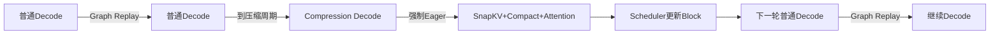
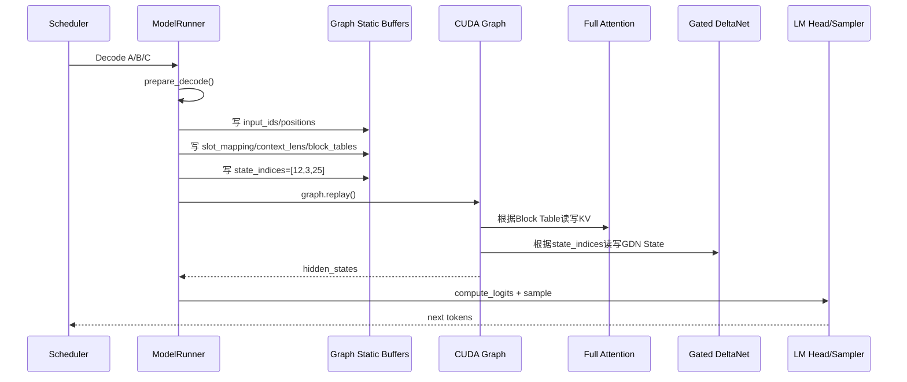
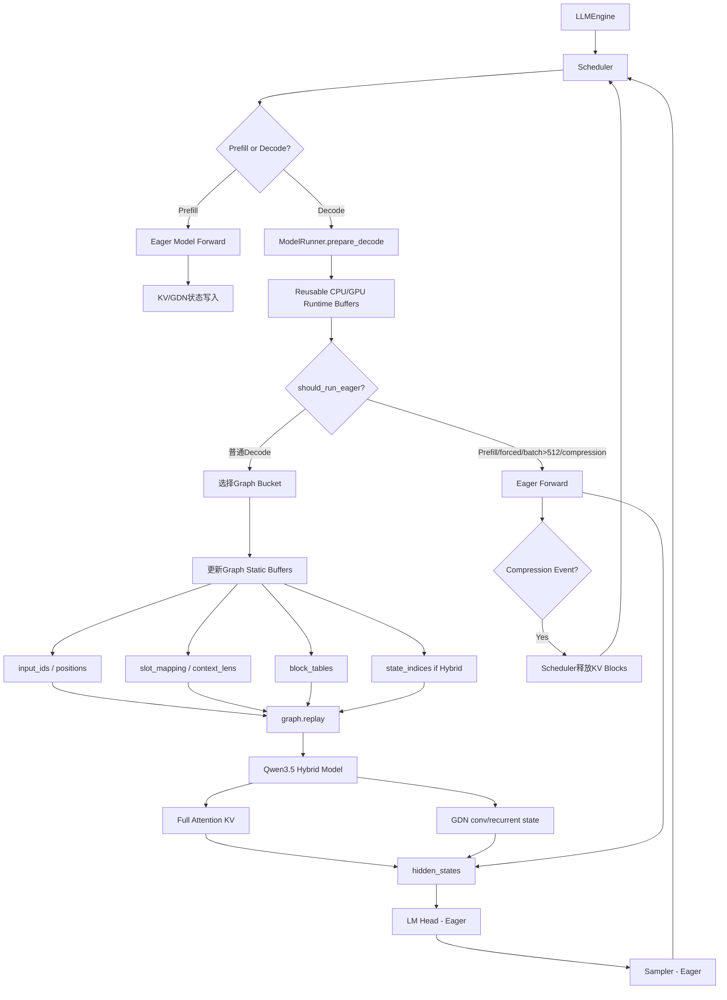

# CUDA Graph 从原理到 nano-vLLM / Qwen3.5 Hybrid 项目实现：完整初学者学习文档

> 本文基于你提供的三套仓库源码进行对照分析：
>
> - `nano-vllm/`：原版 nano-vLLM；
> - `nano-kvllm/`：早期加入 KV Cache 压缩机制的 Qwen3 版本；
> - `nano-vllm-qwen3.6/`：最终 Qwen3.5/Qwen3.6 Hybrid 适配与 KV Cache 压缩、MTP 扩展版本。
>
> 重点不是只解释“CUDA Graph 是什么”，而是把以下问题串成一条完整逻辑链：
>
> 1. 为什么普通 PyTorch Eager 推理会存在 CPU 发射开销；
> 2. CUDA Graph 到底记录了什么，Replay 时又发生了什么；
> 3. 为什么 Decode 特别适合 CUDA Graph，而 Prefill 通常不适合；
> 4. nano-vLLM 如何通过固定 Tensor 地址、Batch Bucket 和 Padding 实现 Graph Decode；
> 5. Qwen3.5 Hybrid 引入 Gated DeltaNet 后，为什么必须额外处理 `state_indices`、`conv_states` 和 `recurrent_states`；
> 6. KV Cache 压缩为什么必须在压缩 Step 回退 Eager，而压缩后的普通 Decode 又能重新进入 Graph；
> 7. MTP 为什么又额外维护 Verify CUDA Graph；
> 8. 当前代码哪些部分已经完成了 Graph 兼容，哪些地方仍值得真实 GPU 验证。
>
> **重要说明：**
>
> - “源码明确实现”的内容会直接给出对应文件和代码路径；
> - “CUDA Graph 通用原理”使用 CUDA/PyTorch 的标准语义解释；
> - “源码审查风险”会明确标注为推断，不把它说成已经实测出的 Bug。
>
> 如果你第一次接触 CUDA Graph，建议严格从前往后阅读，不要直接跳到代码部分。

---

# 1. 先用一句话理解 CUDA Graph

CUDA Graph 的核心思想可以先理解成：

> **普通 Eager 模式下，CPU 每一轮都要重新告诉 GPU“先执行 A，再执行 B，再执行 C……”；CUDA Graph 则是在第一次把这一整套 GPU 工作流程记录下来，以后只需要告诉 GPU“把刚才那整套流程再执行一次”。**

它真正优化的主要不是矩阵乘法本身，而是：

```text
CPU → CUDA Driver → GPU
```

这一侧重复发生的：

- Python 调用；
- PyTorch Dispatcher；
- CUDA Kernel Launch；
- 算子之间的 CPU 调度；
- 部分框架层控制开销。

所以最重要的一句话是：

> **CUDA Graph 不是让同一个 GEMM 算得更快，而是减少大量重复 Kernel 每轮都重新从 CPU 发射的成本。**

---

# 2. 为什么 GPU 很快，CPU 发射仍然可能成为瓶颈

## 2.1 一个模型 Forward 不是一个 CUDA Kernel

初学者很容易把：

```python
output = model(input)
```

想象成 GPU 一次完成一个“大任务”。

实际上一个 Transformer Decode Forward 会展开成很多 GPU 操作，例如：

```text
Embedding
↓
RMSNorm
↓
Q/K/V Linear
↓
RoPE
↓
写 KV Cache
↓
FlashAttention
↓
Output Projection
↓
All-Reduce
↓
RMSNorm
↓
MLP Gate/Up Projection
↓
激活
↓
Down Projection
↓
All-Reduce
↓
下一层
↓
……
```

几十层模型最终可能对应大量 CUDA Kernel 和通信操作。

CPU 必须不断发射：

```text
Kernel 1
Kernel 2
Kernel 3
……
Kernel N
```

---

## 2.2 CUDA 默认是异步执行

通常 CPU 发射 Kernel 后不会等待 GPU 真正算完，而是继续发射下一项工作：

```text
CPU：
launch A
launch B
launch C
launch D

GPU：
      执行 A
          执行 B
              执行 C
                  执行 D
```

理想情况是：

```text
CPU 发射速度 >= GPU 消费速度
```

这样 GPU 一直有活干。

但如果每个 GPU Kernel 本身很短：

```text
GPU 算一个 Kernel：几微秒～几十微秒
CPU 准备和发射下一个 Kernel：也需要时间
```

GPU 可能出现：

```text
执行 Kernel A
      ↓
等待 CPU
      ↓
执行 Kernel B
      ↓
等待 CPU
```

这种空洞在 Nsight Systems 时间线上通常表现为 Kernel 之间的 gap。

---

# 3. 为什么 LLM Decode 特别容易出现 CPU Launch Overhead

## 3.1 Prefill 和 Decode 的计算形态完全不同

假设一条请求：

```text
Prompt = 2048 tokens
```

Prefill 时模型一次处理：

```text
2048 个 token
```

大量 Linear/GEMM 的矩阵规模较大。

GPU 每次 Kernel 自身执行时间较长，因此：

```text
CPU 发射 5 微秒
GPU 计算 500 微秒
```

CPU 发射开销占比可能很低。

---

## 3.2 Decode 一次通常只处理每条请求一个 Token

Decode 阶段：

```text
请求 A：1 token
请求 B：1 token
请求 C：1 token
……
```

即使 Batch 有若干请求，矩阵的 token 维仍然明显小于 Prefill。

于是很多 Kernel 变短：

```text
CPU Launch：5 微秒
GPU Kernel：15 微秒
```

此时 5 微秒就不再可以忽略。

几十层、几百个 Kernel 累积后：

```text
CPU 调度/Launch
```

会成为 Decode 性能的重要组成部分。

所以 CUDA Graph 的典型适用场景正是：

> **计算拓扑高度重复、Tensor 形状较稳定、每轮会反复执行大量较小 Kernel 的 Decode 热路径。**

---

# 4. Eager 模式到底是什么

## 4.1 PyTorch Eager 的直观执行

假设有：

```python
y = layer_norm(x)
q = q_proj(y)
k = k_proj(y)
out = attention(q, k)
z = out_proj(out)
```

Eager 模式可以粗略理解为：

```text
Python 执行 layer_norm()
↓
PyTorch 决定执行哪个 Kernel
↓
向 CUDA Stream 发射 Kernel

Python 执行 q_proj()
↓
再次 Dispatch
↓
再次 Launch

Python 执行 k_proj()
……

每轮 Decode 全部重新来一遍
```

---

## 4.2 Eager 的优点

Eager 最大优势是灵活。

本轮可以：

```text
Batch Size = 3
```

下一轮：

```text
Batch Size = 17
```

甚至运行过程中：

```python
if need_compress:
    do_snapkv()
else:
    normal_attention()
```

都没有问题。

Tensor：

- 形状可以变化；
- 地址可以变化；
- 控制流可以变化；
- Python List 可以变化；
- 可以调用 `.item()` 把 GPU 值读回 CPU；
- 可以动态创建事件；
- 可以临时申请新 Tensor。

因此 Eager 非常适合：

```text
Prefill
动态调度
动态压缩
Debug
功能开发
复杂控制流
```

---

## 4.3 Eager 的缺点

每一轮都重新经历：

```text
Python
→ PyTorch Dispatcher
→ CUDA Runtime/Driver
→ Kernel Launch
```

大量重复发射。

对于 Decode 这类高度重复执行路径，这是明显浪费。

---

# 5. CUDA Graph 的基本工作流程

CUDA Graph 可以分成三个概念阶段。

---

## 5.1 第一阶段：准备固定资源

先准备固定地址的 GPU Tensor：

```python
static_input = torch.zeros(...)
static_output = torch.zeros(...)
```

这些 Tensor 后面不能随便换成新 Tensor。

为什么？

因为 Graph 捕获的 GPU 操作内部会引用：

```text
static_input 的 GPU 地址
static_output 的 GPU 地址
```

Replay 时仍然访问这些地址。

---

## 5.2 第二阶段：Capture

第一次执行：

```python
with torch.cuda.graph(graph):
    static_output[:] = model(static_input)
```

此时不是简单保存 Python 代码，而是记录 GPU 执行工作，例如：

```text
Kernel A
   ↓
Kernel B
   ↓
GEMM C
   ↓
NCCL AllReduce D
   ↓
FlashAttention E
   ↓
……
```

以及它们的依赖关系。

可以把它抽象成：

```text
Node 1 → Node 2 → Node 3 → Node 4
```

这就是一个 GPU 工作 DAG。

---

## 5.3 第三阶段：Replay

真正运行下一批数据时，不创建新的输入 Tensor 给 Graph，而是：

```python
static_input.copy_(new_input)
graph.replay()
```

Graph 还是访问原来的：

```text
static_input 地址
```

只是那个地址里的数据已经换成当前请求的数据。

于是 CPU 不需要重新逐算子发射：

```text
Kernel A
Kernel B
Kernel C
Kernel D
……
```

而只需要：

```text
graph.replay()
```

---

# 6. 最关键的理解：Graph 固定的是“结构和地址”，不是 Tensor 里的数值

这是 CUDA Graph 最容易理解错的地方。

假设捕获时：

```text
input_ids 地址 = 0xAAA
数据 = [10, 20, 30, 40]
```

下一轮不应该做：

```python
input_ids = torch.tensor([50, 60, 70, 80], device="cuda")
```

因为这可能产生：

```text
新地址 = 0xBBB
```

Graph 仍然读：

```text
0xAAA
```

正确方式是：

```python
graph_input_ids.copy_(
    torch.tensor([50, 60, 70, 80], device="cuda")
)
```

这样：

```text
地址仍然是 0xAAA
数据变成 [50,60,70,80]
```

所以可以记成：

```text
Graph Replay：
地址固定
形状固定
执行拓扑固定
数据可以变化
```

---

# 7. CUDA Graph 为什么不能随便处理动态形状

假设捕获的是：

```text
input shape = [4]
```

Graph 内部已经记录：

```text
Embedding 处理 4 行
Linear 处理 4 行
Attention 处理 4 行
……
```

下一轮直接给：

```text
shape = [7]
```

就不再是同一个执行实例。

因此最简单的 CUDA Graph 需要固定：

```text
Batch Size
Tensor Shape
Tensor Stride
关键内存地址
执行拓扑
```

这就是为什么 nano-vLLM 没有只捕获“一张万能 Graph”。

---

# 8. nano-vLLM 的核心办法：捕获多张 Batch Bucket Graph

原版源码：

```text
nano-vllm/nanovllm/engine/model_runner.py
```

`capture_cudagraph()` 中：

```python
self.graph_bs = [1, 2, 4, 8] + list(range(16, max_bs + 1, 16))
```

也就是说它提前捕获多种 Batch Size：

```text
1
2
4
8
16
32
48
64
……
直到最多 512
```

最终 Qwen3.5 版本进一步写成：

```python
self.graph_bs = [bs for bs in [1, 2, 4, 8] if bs <= max_bs]
self.graph_bs += list(range(16, max_bs + 1, 16))

if self.graph_bs[-1] != max_bs:
    self.graph_bs.append(max_bs)
```

确保真正的 `max_bs` 也包含在桶列表里。

---

# 9. 为什么要使用 Bucket

假设实际 Decode Batch：

```text
bs = 3
```

项目没有专门捕获 Batch=3 的 Graph。

于是：

```python
graph = self.graphs[
    next(x for x in self.graph_bs if x >= bs)
]
```

找到最小的：

```text
graph_bs >= 3
```

即：

```text
Batch 4 Graph
```

实际：

```text
真实请求：3
Graph 行数：4
```

剩余一行作为 Padding/Dummy。

这就是：

> **用少量预捕获的固定形状 Graph，覆盖大量实际动态 Batch Size。**

---

# 10. 用一个 Batch=3 的例子彻底理解 Graph Padding

假设当前有：

```text
请求 A
请求 B
请求 C
```

实际 Batch：

```text
bs = 3
```

系统选：

```text
Graph Bucket = 4
```

Graph 内部永远执行四行：

```text
row0 = A
row1 = B
row2 = C
row3 = Dummy
```

运行前，代码把真实数据写入前三行：

```python
graph_vars["input_ids"][:bs] = input_ids
graph_vars["positions"][:bs] = positions
```

然后：

```python
graph_vars["slot_mapping"].fill_(-1)
graph_vars["slot_mapping"][:bs] = context.slot_mapping
```

得到：

```text
slot_mapping:
[A_slot, B_slot, C_slot, -1]
```

`-1` 的意义是：

```text
Dummy 行不应该把 KV 写进任何真实物理 Slot
```

再执行：

```python
graph_vars["context_lens"].zero_()
graph_vars["context_lens"][:bs] = context.context_lens
```

得到：

```text
[A_context_len,
 B_context_len,
 C_context_len,
 0]
```

对于普通 Attention：

```text
Dummy context_len = 0
```

不会形成真实历史上下文。

最终 Graph 仍然计算四行，但只取：

```python
graph_vars["outputs"][:bs]
```

即：

```text
只使用 A、B、C
```

Dummy 输出直接丢弃。

---

# 11. 为什么不为 1～512 每个 Batch Size 都捕获一张 Graph

如果捕获：

```text
1
2
3
4
5
……
512
```

一共 512 张 Graph。

会增加：

- Capture 时间；
- Graph 元数据；
- Graph 内存开销；
- 初始化成本；
- 管理复杂度。

而用：

```text
1,2,4,8,16,32,48……
```

只需要几十个 Bucket。

代价是：

```text
实际 bs=17
可能用 bs=32 Graph
```

会多计算部分 Dummy 行。

这本质是：

```text
额外 GPU 计算
↔
减少 Graph 数量
```

之间的工程权衡。

---

# 12. nano-vLLM 到底捕获了模型的哪一部分

这是非常重要的源码结论。

最终 `run_model()`：

```python
graph.replay()

return self.model.compute_logits(
    graph_vars["outputs"][:bs]
)
```

说明 Graph 内捕获的是：

```python
self.model(input_ids, positions)
```

而不是整个：

```text
Forward
→ LM Head
→ Sampling
```

在 `capture_cudagraph()` 中也明确是：

```python
with torch.cuda.graph(graph, self.graph_pool):
    outputs[:bs] = self.model(
        input_ids[:bs],
        positions[:bs]
    )
```

所以主 Decode Graph 的边界是：

```text
Embedding
↓
Transformer / Qwen3.5 Hybrid Layers
↓
Final Norm
↓
hidden_states
==================== Graph 结束
↓
LM Head / compute_logits
↓
Sampler
==================== Eager
```

---

# 13. 为什么 LM Head 和 Sampler 没一起捕获

源码没有显式说明“为什么”，所以这里只能从结构推断。

当前设计选择让 Graph 聚焦最重、最重复的：

```text
Transformer 主体
```

然后：

```text
compute_logits()
sample()
```

仍然 Eager。

这样做的优点是：

- Graph 输入/输出边界更简单；
- Sampling 参数可动态变化；
- TP 下词表 Logits 和候选合并逻辑更容易处理；
- 不需要把 Temperature 等采样状态做成 Graph 静态输入；
- Graph 只负责最主要的 Decode 热路径。

缺点是：

> LM Head 和采样相关 Kernel 仍然需要每一步正常发射，所以并没有把 CPU Launch Overhead 完全消除。

这是后续进一步优化可能考虑的方向，但不是当前仓库已经实现的功能。

---

# 14. 原版 nano-vLLM 中 CUDA Graph 的完整初始化结构

源码：

```text
nano-vllm/nanovllm/engine/model_runner.py
```

最终版对应：

```text
nano-vllm-qwen3.6/nanovllm/engine/model_runner.py
```

`ModelRunner.__init__()` 的主要顺序是：

```text
初始化 NCCL / GPU
↓
创建模型
↓
加载权重
↓
创建 Sampler
↓
预分配运行时 Buffer
↓
Warmup Model
↓
分配 KV Cache
↓
若 Qwen3.5 Hybrid：
    分配 GDN State Pool
↓
若 enforce_eager=False：
    capture_cudagraph()
↓
ModelRunner Ready
```

最终源码：

```python
if not self.enforce_eager:
    self._log("capturing cuda graphs")
    self.capture_cudagraph()
```

所以：

```text
enforce_eager=True
```

意味着：

> 完全禁用主 Decode CUDA Graph Replay。

---

# 15. `enforce_eager` 是怎么控制运行模式的

配置中默认：

```python
enforce_eager: bool = False
```

因此默认倾向于：

```text
普通 Decode → CUDA Graph
```

如果用户运行时指定：

```python
enforce_eager=True
```

则：

```text
所有 Forward 都走 Eager
```

这非常适合：

- Debug；
- 验证数值；
- 开发新动态功能；
- 判断某个错误是否来自 CUDA Graph；
- 做 Eager vs Graph 性能对比。

---

# 16. Graph Capture 前为什么需要 Warmup

捕获前源码执行：

```python
outputs[:bs] = self.model(
    input_ids[:bs],
    positions[:bs]
)    # warmup
```

然后才：

```python
with torch.cuda.graph(graph, self.graph_pool):
    outputs[:bs] = self.model(...)
```

原因是模型第一次执行时可能包含一些只发生一次的工作，例如：

- Lazy 初始化；
- CUDA 内存分配；
- Kernel/JIT 编译；
- Triton 编译；
- cuBLAS/cuDNN 内部初始化；
- 缓存创建。

这些动态行为放进 Graph Capture 中容易失败，或者产生不希望捕获的行为。

因此通用模式是：

```text
先正常跑一次
↓
让环境稳定
↓
再 Capture
```

---

# 17. 为什么项目必须预先创建固定 Graph Tensor

`capture_cudagraph()` 中提前创建：

```python
input_ids = torch.zeros(max_bs, dtype=torch.int64)
positions = torch.zeros(max_bs, dtype=torch.int64)
slot_mapping = torch.zeros(max_bs, dtype=torch.int32)
context_lens = torch.zeros(max_bs, dtype=torch.int32)

block_tables = torch.zeros(
    max_bs,
    max_num_blocks,
    dtype=torch.int32
)

outputs = torch.zeros(
    max_bs,
    hidden_size
)
```

这些就是 CUDA Graph 的“固定内存容器”。

后面被保存在：

```python
self.graph_vars
```

中。

它们生命周期与 `ModelRunner` 基本一致，不能 Capture 完就销毁。

因为：

> Graph 内部记录的 Kernel 仍然依赖这些 GPU 地址。

---

# 18. `graph_vars` 的职责是什么

可以把：

```python
self.graph_vars
```

理解成：

> **Graph 专属静态显存工作区。**

里面保存：

```text
input_ids
positions
slot_mapping
context_lens
block_tables
outputs
Qwen3.5 时还有 state_indices
```

每次 Replay 前：

```text
把当前请求元数据写进去
↓
Replay
↓
从 outputs 前 bs 行取结果
```

所以每次 Decode 不是重新构建模型输入图，而只是“给固定工作台换数据”。

---

# 19. 为什么最终项目又增加一层 Runtime Buffer

最终 Qwen3.5 仓库还有：

```python
allocate_runtime_buffers()
```

源码预分配：

```text
decode_cpu_input_ids
decode_cpu_positions
decode_cpu_slot_mapping
decode_cpu_context_lens
decode_cpu_block_tables

decode_gpu_input_ids
decode_gpu_positions
decode_gpu_slot_mapping
decode_gpu_context_lens
decode_gpu_block_tables
```

Hybrid 额外：

```text
decode_cpu_state_indices
decode_gpu_state_indices
```

这里容易产生疑问：

> Graph 已经有 `graph_vars`，为什么还要一套 `decode_gpu_*`？

可以把两层理解为：

```text
Scheduler / Sequence
        ↓
Pinned CPU Runtime Buffer
        ↓ non_blocking copy
Decode GPU Staging Buffer
        ↓
run_model()
        ↓
Graph Static Buffer
        ↓
Graph Replay
```

它们职责不同。

### Runtime Buffer

服务于：

```text
每一轮 Decode 数据准备
```

避免每一步：

```python
torch.tensor(list).cuda()
```

反复申请小 Tensor。

### Graph Buffer

服务于：

```text
固定 GPU 地址的 Graph Replay
```

两层解耦使：

```text
CPU 调度数据结构
```

不需要直接成为 Graph 的静态地址。

---

# 20. 为什么 CPU Buffer 使用 `pin_memory=True`

例如：

```python
torch.empty(
    max_num_seqs,
    dtype=torch.int64,
    device="cpu",
    pin_memory=True,
)
```

随后：

```python
input_ids.copy_(
    self.decode_cpu_input_ids[:bs],
    non_blocking=True
)
```

Pinned Memory 是锁页内存。

相对于普通 Pageable CPU Memory：

- 更适合 DMA；
- CPU→GPU 传输更直接；
- 可以配合 `non_blocking=True`；
- 降低 Decode 每步小元数据搬运的额外开销。

这也是最终版本从“功能正确”走向“稳定热路径”的工程改进。

---

# 21. 原版 Decode 输入为什么天然适合 Graph

原版 `prepare_decode()` 对每条 Sequence 只准备一个：

```text
last_token
```

因此：

```text
input_ids.shape = [batch_size]
positions.shape = [batch_size]
slot_mapping.shape = [batch_size]
context_lens.shape = [batch_size]
block_tables.shape = [batch_size, blocks]
```

每条请求一行。

相比 Prefill：

```text
每个请求可能有几十、几千个新 Token
```

Decode 的结构明显更规律。

所以原版 `run_model()` 明确：

```python
if (
    is_prefill
    or self.enforce_eager
    or input_ids.size(0) > 512
):
    eager
else:
    graph
```

即：

```text
Prefill：
永远 Eager

Decode：
满足条件时 Graph
```

---

# 22. Prefill 为什么不使用主 CUDA Graph

这是理解项目设计的重点。

Prefill 具有大量动态因素：

```text
Prompt A = 87 tokens
Prompt B = 1923 tokens
Prompt C = 511 tokens
```

Continuous Batching 下本轮 Prefill Token 数会变化。

Chunked Prefill 后更明显：

```text
本轮 A 处理 300 Token
下一轮 A 再处理 300 Token
最后一轮处理 123 Token
```

同时 FlashAttention Prefill 会依赖：

```text
cu_seqlens_q
cu_seqlens_k
max_q_len
max_k_len
```

这些值和 Tensor 形状高度动态。

因此为了强行 Graph 化 Prefill，需要做复杂的：

```text
Token Bucket
Padding
静态最大长度
Mask
```

而 Prefill 本身又通常是较大的 GPU 计算，CPU Launch 占比没有 Decode 高。

所以当前项目做出的合理取舍是：

```text
Prefill → Eager
Decode → Graph
```

---

# 23. Qwen3.5 多模态为什么首轮也主要走 Eager

Qwen3.5 多模态 Prefill 还可能出现：

```text
pixel_values
image_grid_thw
image_token_mask
Vision Encoder
Interleaved MRoPE
```

不同图片：

```text
分辨率不同
视觉 Token 数不同
THW 不同
```

使首轮输入更加动态。

最终 `run_model()` 中：

```python
if should_run_eager(...):
    self.model(
        input_ids,
        positions,
        pixel_values=pixel_values,
        image_grid_thw=image_grid_thw,
        image_token_mask=image_token_mask,
    )
```

而 Graph Capture 调用：

```python
self.model(input_ids, positions)
```

没有捕获动态 Vision 输入。

但重要的是：

> **一条多模态请求完成 Prefill 后，后续普通文本 Decode 不再需要重新跑 Vision Encoder，因此仍然可以进入普通 Decode CUDA Graph。**

所以不能简单说：

```text
多模态模型 = 完全不能 CUDA Graph
```

更准确是：

```text
动态多模态 Prefill：
Eager

稳定 Decode：
仍可 Graph
```

---

# 24. Qwen3.5 为什么比 Qwen3 更难适配 CUDA Graph

Qwen3 的核心层基本都是标准 Full Attention：

```text
每条请求主要维护：
KV Cache
```

Qwen3.5 Hybrid 中同时存在：

```text
Full Attention
+
Gated DeltaNet
```

Gated DeltaNet 不依赖标准 KV Cache，而是持续维护：

```text
conv state
recurrent state
```

也就是说一条请求的 Decode 状态变成：

```text
KV Block Table
+
GDN State Slot
```

Graph 不仅要知道：

```text
当前请求去哪个 KV Slot
```

还必须知道：

```text
当前请求去哪个 GDN State Slot
```

---

# 25. Qwen3.5 的 GDN State Pool 是怎样组织的

最终：

```text
nano-vllm-qwen3.6/nanovllm/engine/model_runner.py
```

`allocate_gdn_state()` 为所有 GDN 层分配：

```python
layer.conv_states = torch.zeros(
    max_slots,
    ...
)

layer.recurrent_states = torch.zeros(
    max_slots,
    ...
)
```

可以理解成：

```text
State Slot 0 → 某条请求
State Slot 1 → 某条请求
State Slot 2 → 某条请求
……
```

请求本身保存：

```text
seq.state_slot_id
```

例如：

```text
请求 A → slot 12
请求 B → slot 3
请求 C → slot 25
```

这些 Slot 可以动态分配和回收。

---

# 26. `state_indices` 为什么是 Qwen3.5 CUDA Graph 适配的关键

GDN Decode：

```text
nano-vllm-qwen3.6/nanovllm/layers/gated_delta_net.py
```

核心代码：

```python
state_indices = context.state_indices
```

然后：

```python
conv_state = self.conv_states[state_indices]
```

计算后：

```python
self.conv_states[state_indices] = new_conv_state
```

Recurrent State 同理：

```python
rec_state = self.recurrent_states[state_indices]

out = recurrent_gated_delta_rule(
    ...,
    rec_state
)

self.recurrent_states[state_indices] = rec_state
```

所以 GDN 不把“请求 ID”写死到 Graph 里。

Graph 只固定：

```text
state_indices Tensor 的地址
```

而每一轮可以把它的数据改成：

```text
[12, 3, 25]
```

下一轮再变成：

```text
[8, 30, 2]
```

于是同一张 Graph 就可以访问不同请求的 State Slot。

这就是非常典型的：

> **固定地址 + 动态索引值实现 Graph 下的状态间接寻址。**

---

# 27. 用一个例子理解 `state_indices`

捕获 Graph 时：

```text
state_indices 地址 = 0xCCC
shape = [4]
```

第一次运行真实请求：

```text
A → State 7
B → State 2
C → State 15
```

Replay 前写：

```text
state_indices =
[7, 2, 15, dummy]
```

GDN Kernel 访问：

```text
conv_states[7]
conv_states[2]
conv_states[15]
```

下一轮：

```text
D → 4
E → 11
```

仍然不需要重新捕获 Graph。

只需要把：

```text
0xCCC 地址里的值
```

改成：

```text
[4,11,...]
```

Graph 仍然访问同一个 `state_indices` 地址。

---

# 28. 为什么 Graph Capture 后必须清空 GDN State

最终源码：

```python
if config.is_hybrid:
    self.reset_gdn_state_slots(
        list(range(max_bs))
    )
```

为什么？

因为 Capture 不是“只看不执行”。

代码先：

```text
Warmup
```

然后 Capture 时模型操作也会真正运行。

GDN Decode 会原地修改：

```text
conv_states
recurrent_states
```

如果 Capture 用：

```text
state_indices = [0,1,2,...]
```

那么 Capture 完后：

```text
State Slot 0、1、2……
```

已经被虚假的 Warmup Token 污染。

如果随后把 Slot 0 分配给一个真实新请求，它会从错误的历史 State 开始。

因此 Capture 完必须：

```text
reset_gdn_state_slots()
```

这正是 Hybrid CUDA Graph 比标准 KV Attention 更复杂的地方之一。

---

# 29. Full Attention 的 KV 状态在 Graph 中如何动态变化

Full Attention 不通过 GDN `state_indices`，而是使用：

```text
slot_mapping
context_lens
block_tables
```

其中：

### `slot_mapping`

当前 Token 的 K/V 应写到哪个物理 KV Slot。

### `context_lens`

本轮 Attention 应读取多少有效 KV。

### `block_tables`

逻辑 Block 到物理 Block 的映射。

这三个 Tensor 的：

```text
GPU 地址固定
```

但里面的数据每一轮都可以更新。

因此 CUDA Graph 不要求：

```text
每个请求永远占同一块 KV Cache
```

只要求：

> “描述 KV 布局的元数据 Tensor 本身地址不变”。

---

# 30. Paged KV Cache 为什么天然有利于 Graph

Paged KV Cache 本身已经做了一个重要抽象：

```text
模型不用假设请求 KV 在连续物理地址
```

而是通过：

```text
block_table
```

做间接寻址。

CUDA Graph 只需固定：

```text
block_tables Tensor 的地址
```

每一轮填入新的：

```text
Physical Block ID
```

即可。

所以：

```text
Paged KV：
动态物理 Block
+
静态 Block Table Buffer

CUDA Graph：
固定 Buffer 地址
+
动态 Buffer 内容
```

两者在工程上是高度契合的。

---

# 31. 最终代码为什么每轮先 `block_tables.fill_(-1)`

最终：

```python
graph_vars['block_tables'].fill_(-1)
```

然后：

```python
graph_vars["block_tables"][
    :bs,
    :context.block_tables.size(1)
] = context.block_tables
```

这是一个很重要的小改进。

假设上一轮：

```text
请求 A 有 10 个 Block
```

Graph Buffer 前 10 列写过：

```text
[1,4,7,9,11,15,20,21,30,31]
```

下一轮新请求只有 3 个 Block：

```text
[8,13,17]
```

如果只覆盖前三列：

```text
[8,13,17,9,11,15,20,21,30,31]
```

后面会残留上一轮数据。

虽然 `context_lens` 理论上会限制真正读取范围，但留下脏元数据会增加潜在错误风险。

最终版先：

```text
全部清为 -1
```

再写真实值，使 Graph Buffer 更安全。

原版 nano-vLLM 在这点上没有显式清整个 `block_tables`。

---

# 32. 最终代码如何决定某一步到底走 Eager 还是 Graph

最终把逻辑抽成：

```python
should_run_eager(...)
```

返回：

```python
return (
    is_prefill
    or enforce_eager
    or batch_size > 512
    or has_kv_compression
)
```

因此四类情况强制 Eager：

```text
① Prefill

② 用户显式 enforce_eager=True

③ Decode Batch > 512

④ 本轮包含 KV Compression
```

其余普通 Decode：

```text
CUDA Graph Replay
```

---

# 33. 为什么 Batch > 512 回退 Eager

Graph Bucket 最大只捕获：

```python
max_bs = min(
    config.max_num_seqs,
    512
)
```

所以不存在：

```text
Batch 513 Graph
Batch 600 Graph
```

若真实 Batch > 512：

```text
找不到对应 Graph
```

最简单、安全的处理就是：

```text
Eager
```

---

# 34. KV Cache 压缩为什么是 CUDA Graph 最难兼容的动态行为之一

你的压缩机制并不是简单地：

```text
context_len -= 100
```

压缩 Step 会执行：

```text
判断哪些请求需要压缩
↓
构造压缩窗口
↓
根据当前 Query 与历史 Key 打分
↓
Softmax / 平滑
↓
Top-K
↓
生成 keep_idx
↓
将 keep_idx 映射到 Paged KV Physical Slot
↓
Gather K/V
↓
Compact K/V
↓
改变有效 KV 长度
↓
生成 compression_event
↓
模型结束后由 Scheduler 回收 Blocks
```

这条路径具有很多 Graph 不喜欢的动态特征。

---

# 35. SnapKV Top-K 为什么难直接放进当前 Graph

压缩时：

```text
不同请求可能压缩
不同窗口可能有不同物理 Block
Top-K 结果每次不同
```

而工程代码中还会涉及：

- Python 级 Compression Progress；
- Python List；
- 事件对象；
- `.item()` / 元数据检查；
- 动态 Block Release；
- 不同层完成进度；
- Scheduler 控制面变化。

这些操作并不是纯粹的固定 GPU DAG。

如果强行捕获，就必须把整个压缩系统重写成：

```text
固定形状 Tensor Metadata
+
完全 GPU 化的选择和 Compact
+
固定 Event Buffer
+
Graph-safe 状态机
```

当前项目没有做这种生产级重构。

---

# 36. 当前项目采取的正确策略：压缩 Step Eager，普通 Decode Graph

最终文档和源码明确采用：

```text
Compression Step
→ Eager

后续普通 Decode
→ 重新进入 CUDA Graph
```

这是一个非常重要的设计。

可以表示为：



所以：

> CUDA Graph 并没有和 KV 压缩二选一，而是让“动态维护 Step”走 Eager，让“大量稳定普通 Step”继续享受 Graph 收益。

---

# 37. 为什么压缩后仍然可以重新使用原来的 Graph

压缩后变化的是：

```text
context_len
block_table 内容
slot_mapping
物理 KV 内容
```

但没有改变 Graph 自身要求固定的：

```text
Graph Tensor 地址
Transformer 拓扑
Kernel 结构
Batch Bucket 形状
```

例如压缩前：

```text
context_lens = [2048]
block_tables = [...]
```

压缩后：

```text
context_lens = [1537]
block_tables = [...]
```

下一轮只需把：

```text
1537
新的 block table
新的 slot
```

写进静态 Graph Buffer。

Graph 仍然可以 Replay。

这就是：

> **动态“值”可以变化，只要 Graph 结构和地址没有变化。**

---

# 38. 早期 nano-kvLLM 的 CUDA Graph 回退为什么不够稳健

早期版本：

```text
nano-kvllm/nanokvllm/engine/model_runner.py
```

在 `prepare_decode()` 中：

```python
ctx.compress_any = False
```

而 `run_model()` 使用：

```python
need_eager_decode = (
    not is_prefill
    and getattr(
        context,
        "compress_any",
        False
    )
)
```

然后：

```python
if ... or need_eager_decode:
    eager
else:
    graph
```

这里存在一个明显的时序风险：

```text
run_model() 决定 Eager/Graph
```

发生在：

```text
真正进入 Attention Forward
```

之前。

但 `compress_any` 如果要等到模型内部真正发生压缩时才被更新：

```text
路由决定已经做完了
```

就太晚了。

因此早期写法的意图是正确的：

```text
压缩 Step 走 Eager
```

但用于判定的状态在运行时机上不够可靠。

---

# 39. 最终 Qwen3.5 版本如何修复这个问题

最终版不再等模型 Forward 内部才判断。

在 `prepare_decode()` 之前/过程中，Scheduler 和压缩元数据已经知道：

```text
本轮哪些 Request 携带 compression progress
```

随后：

```python
set_context(
    ...,
    kv_compression_progress=compression_progress,
)
```

`Context` 可以直接给出：

```text
has_kv_compression = True / False
```

于是 `run_model()` 在模型真正执行之前就能够：

```python
should_run_eager(
    has_kv_compression=context.has_kv_compression
)
```

因此最终逻辑是：

```text
先知道本轮是否压缩
↓
再选择 Eager / Graph
↓
然后执行模型
```

而不是：

```text
先选择 Graph
↓
模型内部才发现要压缩
```

这是最终融合版本中非常关键的一处工程改进。

---

# 40. 项目测试对这一点验证到了什么程度

最终仓库：

```text
tests/test_kv_compression_model_runner.py
```

有测试：

```text
test_compression_step_forces_eager_execution
```

验证：

```text
带 Compression Progress
→ model.eager_calls == 1
→ graph.replays == 0
```

还有：

```text
test_normal_decode_can_return_to_cuda_graph_path
```

验证：

```text
没有压缩
→ graph.replays == 1
```

并验证 Block Table Buffer 会清理为：

```text
[[7, -1, -1, -1]]
```

所以：

> **“压缩 Step 强制 Eager、后续普通 Decode 可重新 Graph”的控制逻辑已有单元测试覆盖。**

---

# 41. 但仓库目前不能证明什么

项目自己的：

```text
docs/kv_compression_test_report.md
docs/kv_compression_known_limitations.md
docs/kv_compression_implementation_log.md
```

明确说明当前部分测试环境缺少真实 CUDA Runtime / 模型权重。

因此：

```text
真实 GPU 上：
Eager Compression Step
→ 下一轮真实 CUDA Graph Replay
```

这条完整链路在对应报告中被标为尚未实测。

所以严谨表述应是：

> 控制面路由逻辑通过 CPU/Mock 单元测试；真实 CUDA Kernel、真实 Graph Recovery、TP 和完整模型输出仍需要 GPU 环境验证。

不能把单元测试写成：

```text
CUDA Graph + 压缩已经完成全部 GPU 性能验证
```

---

# 42. Qwen3.5 Hybrid 的主 CUDA Graph 捕获结构

最终 Capture 时额外创建：

```python
state_indices = (
    torch.arange(
        max_bs,
        dtype=torch.int32
    )
    if config.is_hybrid
    else None
)
```

然后：

```python
set_context(
    False,
    slot_mapping=...,
    context_lens=...,
    block_tables=...,
    state_indices=...
)
```

所以 Qwen3.5 Graph 输入比 Qwen3 多了一条状态映射轴：

```text
Qwen3：
input_ids
positions
slot_mapping
context_lens
block_tables

Qwen3.5 Hybrid：
input_ids
positions
slot_mapping
context_lens
block_tables
state_indices
```

---

# 43. Qwen3.5 的一次 Graph Decode 完整过程

假设三个请求：

```text
A、B、C
```

当前：

```text
KV Blocks：
A → [...]
B → [...]
C → [...]

GDN State：
A → slot 12
B → slot 3
C → slot 25
```

执行链：



真正动态的请求状态全部通过：

```text
索引和元数据 Tensor 的内容
```

传入固定 Graph。

---

# 44. 当前 Hybrid Graph Padding 有一个值得重点验证的源码边界

下面属于：

> **源码审查推断，不是仓库已经实测确认的 Bug。**

假设：

```text
真实 bs = 9
```

系统选择：

```text
Graph Bucket = 16
```

对于 KV：

```python
slot_mapping.fill_(-1)
context_lens.zero_()
block_tables.fill_(-1)
```

因此 9～15 行可以被当作 Dummy。

但 Hybrid 状态处理只有：

```python
graph_vars["state_indices"][:bs] = (
    context.state_indices
)
```

并没有显式把：

```text
bs～bucket_bs-1
```

这些 Padding Row 的 `state_indices` 指向专用 Dummy State。

而 Capture 初始化：

```python
state_indices = torch.arange(max_bs)
```

所以尾部行可能残留：

```text
9,10,11,12,13,14,15
```

---

# 45. 为什么这个问题对 GDN 比 Full Attention 更敏感

GDN Decode 会无条件：

```python
conv_state = self.conv_states[state_indices]
...
self.conv_states[state_indices] = new_conv_state
```

以及：

```python
rec_state = self.recurrent_states[state_indices]
...
self.recurrent_states[state_indices] = rec_state
```

也就是说：

```text
Dummy Row
```

不像 Full Attention 那样有：

```text
slot_mapping=-1
```

作为明确的“不写 KV”保护。

如果 Dummy Row 的 State ID：

```text
恰好指向某个有效 State Slot
```

理论上可能对其产生额外更新。

特别是 State Slot 本来就是动态复用的，不保证：

```text
真实第 i 行请求
→ state slot i
```

真实请求完全可能：

```text
row0 → slot12
```

此时 Graph Bucket 尾部 Dummy Row 如果还残留：

```text
state_indices=12
```

就存在重复访问同一 Slot 的风险。

---

# 46. 完整解决 Hybrid Padding 的更稳妥方案

工程上更安全的办法可以是：

## 方案一：专门预留 Dummy State Slot

例如：

```text
最后若干 State Slots
永远不给真实请求
```

所有 Padding Row 都指向：

```text
dummy_state_slot
```

Dummy 计算只污染 Dummy State。

---

## 方案二：为 GDN 增加 Active Mask

Graph 输入再加入：

```text
active_mask
```

GDN 更新：

```text
只对真实 row 提交 state
```

---

## 方案三：捕获更细粒度 Batch Graph

减少：

```text
Bucket Size - Actual BS
```

但会增加 Graph 数量和 Capture 开销。

---

## 方案四：GDN Kernel 内支持无效 State Index

类似 KV 的：

```text
slot_mapping=-1
```

为 GDN 定义：

```text
state_index=-1
```

并在 Kernel 内真正 Mask。

从“完整适配 CUDA Graph”的角度看，这是当前 Hybrid 路径最值得增加真实 GPU 测试的一项。

---

# 47. 为什么主 Graph 使用共享 `graph_pool`

代码：

```python
self.graph_pool = None
```

第一张 Graph Capture 后：

```python
self.graph_pool = graph.pool()
```

后续：

```python
with torch.cuda.graph(
    graph,
    self.graph_pool
):
```

使用相同 Pool。

CUDA Graph 为了保证 Replay 时地址不变化，需要让 Capture 中使用的内存保持稳定。

如果每张 Batch Graph 都独立维护完全不同的 Private Memory Pool：

```text
显存开销会更大
```

共享 Graph Pool 可以减少不同 Graph 之间的显存重复占用。

可以把它理解为：

> 多张互斥 Replay 的 Batch Graph 尽可能共享一套 Graph 专用内存池。

---

# 48. CUDA Graph 为什么会增加一些常驻显存

Graph Replay 依赖固定地址。

因此 Capture 中使用的某些内存不能像普通临时 Tensor 一样轻易释放。

额外开销可能包括：

- Graph Static Inputs；
- Graph Static Outputs；
- Graph Private Memory Pool；
- 多个 Bucket 的 Graph 元数据；
- MTP Verify Graph Buffer。

所以 CUDA Graph 不是“零成本优化”。

通常是：

```text
少量额外常驻显存和初始化时间
换取
更低稳定态 Decode Launch Overhead
```

---

# 49. 多卡 Tensor Parallel 下 CUDA Graph 怎么工作

`LLMEngine` 会：

```python
for i in range(
    1,
    tensor_parallel_size
):
    process = ...
    ModelRunner(config, i, event)
```

即：

```text
每个 TP Rank 一个 ModelRunner 进程
每个 Rank 绑定一张 GPU
```

每个 Rank 都：

```text
创建自己的模型分片
分配自己的 KV Cache
分配自己的 GDN State
捕获自己的 CUDA Graph
```

所以不是：

```text
Rank0 捕获一张 Graph
然后4张卡共用
```

而是：

```text
GPU0 / Rank0 → Graph0
GPU1 / Rank1 → Graph1
GPU2 / Rank2 → Graph2
GPU3 / Rank3 → Graph3
```

---

# 50. TP 中的 All-Reduce 是否也可能在 Graph 里

模型主体：

```python
self.model(...)
```

内部包含张量并行通信。

由于它位于：

```python
with torch.cuda.graph(...):
    self.model(...)
```

所以能够被 Graph-safe 捕获的 NCCL Collective 也会成为 Graph 工作的一部分。

从 CUDA/NCCL 通用语义看，现代 NCCL 支持 CUDA Graph Capture，但要求各 Rank 以一致方式参与 Capture/Replay。

当前项目采用：

```text
每进程一 GPU
所有 Rank 执行相同 ModelRunner 路径
```

这与典型 NCCL Graph 使用方式一致。

但真实 TP Graph 的正确性和性能仍必须在多卡环境中验证，不能只靠单卡代码审查得出最终结论。

---

# 51. 为什么多卡 Graph 更要求所有 Rank 路由一致

假设：

```text
Rank0 选择 Graph Replay
Rank1 却选择 Eager
```

而模型里有：

```text
All-Reduce
```

那么两个 Rank 对 Collective 的执行顺序可能失配，最终：

```text
Hang
Deadlock
错误结果
```

因此像：

```text
Compression Step 是否 Eager
```

这种决策必须是所有 Rank 一致的。

最终压缩设计把不可变的 Compression Metadata 传到各 Rank，正是为了保证各 Rank 对同一批请求采用一致执行路径。

---

# 52. MTP 为什么还需要额外的 CUDA Graph

普通 Decode Graph 的形状是：

```text
Batch Size Bucket
```

但 MTP Verify 的维度不同。

例如 Draft：

```text
draft_len = 4
```

可能要 Verify：

```text
1
2
3
4
```

个 Token。

项目因此额外设置：

```python
self.verify_graph_lens = [
    1, 2, 3, 4
]
```

并为每个长度捕获：

```text
Verify Graph 1
Verify Graph 2
Verify Graph 3
Verify Graph 4
```

---

# 53. `capture_verify_cudagraph()` 实际捕获的不是并行 Verify

这是项目里一个非常容易说错的点。

代码：

```python
def run_verify_steps():
    for i in range(verify_len):
        set_context(...)
        outputs[i:i+1] = self.model(...)
```

然后把整个：

```python
run_verify_steps()
```

放进：

```python
with torch.cuda.graph(...)
```

所以 Verify Len=4 时，Graph 里面其实是：

```text
Decode Step 1
↓
Decode Step 2
↓
Decode Step 3
↓
Decode Step 4
```

四个顺序执行步骤。

CUDA Graph 优化的是：

```text
Python循环和大量Kernel重复Launch
```

而不是把四个 Token 真正变成：

```text
一个并行 GDN Verify Kernel
```

所以项目 README 也明确强调：

> Graph Verify 减少 Python / Launch Overhead，但不是 Fused Parallel GDN Verify Kernel。

---

# 54. MTP Verify Graph 的运行方式

运行前：

```text
根据 verify_len
选择精确 Graph
```

然后更新：

```text
input_ids
positions
slot_mapping
context_lens
block_tables
state_indices
```

固定 Buffer 中的值。

再：

```python
self.verify_graphs[
    verify_len
].replay()
```

Replay 后：

```python
logits = self.model.compute_logits(
    vars["outputs"][:verify_len]
)
```

Sampling 依然在 Graph 之外。

---

# 55. `capture_verify_chunk_cudagraph()` 又是什么

项目还实验性捕获：

```text
Chunk Verify Graph
```

它把：

```text
verify_len 个 Token
```

作为一个类似 Continuation-Prefill 的 Chunk 一次输入模型。

因此 Context 是：

```python
set_context(
    True,
    cu_seqlens_q,
    cu_seqlens_k,
    ...
)
```

而不是普通 Decode Context。

目的：

> 研究是否可以利用一个 Chunk Forward 减少顺序 Verify 的开销。

但仓库 README/源码明确把它视为实验路径，因为：

```text
Raw Chunk Logits
```

可能与可信的顺序 Decode Verify 不完全一致。

因此当前它不能被描述成已经完成的生产级 MTP 并行 Verify。

---

# 56. 为什么 MTP 与 KV Cache 压缩当前不能同时开启

最终 Config 明确：

```python
if (
    self.kv_compress_enabled
    and self.enable_mtp
):
    raise ValueError(...)
```

原因从状态管理上很好理解。

MTP 已经需要处理：

```text
Draft
Verify
Accept
Reject
KV Snapshot
GDN State Snapshot
Rollback
```

KV Cache 压缩又会：

```text
重新选择历史 KV
Compact
缩短 Physical KV
释放 Block
```

两套机制同时改写同一个 Decode 状态，会使：

- Snapshot 语义；
- Block 生命周期；
- Verify 回滚；
- Graph Replay；
- Compression Event；

复杂度急剧上升。

当前项目选择：

```text
先保证每个功能单独正确
```

而不是强行组合。

---

# 57. 一次普通 Qwen3.5 Decode 的完整 Graph 调用链

```text
LLMEngine.step()
│
├─ Scheduler.schedule()
│   └─ 选择本轮 Decode Sequences
│
├─ ModelRunner.call("run", ...)
│
└─ ModelRunner.run()
    │
    ├─ prepare_decode()
    │   ├─ input_ids
    │   ├─ logical positions
    │   ├─ slot_mapping
    │   ├─ context_lens
    │   ├─ block_tables
    │   └─ state_indices
    │
    ├─ set_context(...)
    │
    ├─ run_model()
    │   │
    │   ├─ should_run_eager(...)
    │   │
    │   └─ 普通Decode → False
    │
    ├─ 找最小 graph bucket >= bs
    │
    ├─ 更新 graph_vars
    │
    ├─ graph.replay()
    │   │
    │   └─ Qwen3_5ForCausalLM.forward
    │       └─ Qwen3_5Model.forward
    │           ├─ Embedding
    │           ├─ Hybrid Decoder Layers
    │           │   ├─ Full Attention
    │           │   │   ├─ Store KV
    │           │   │   └─ FlashAttention
    │           │   │
    │           │   └─ GatedDeltaNet
    │           │       ├─ state_indices
    │           │       ├─ Conv State Update
    │           │       └─ Recurrent State Update
    │           │
    │           └─ Final Norm
    │
    ├─ Graph返回 hidden_states
    │
    ├─ compute_logits()       ← Graph外
    │
    ├─ sampler()              ← Graph外
    │
    └─ 返回 token
```

---

# 58. 一次 KV 压缩 Decode 的完整路径

```text
Scheduler
↓
本轮生成 KVCompressionRequest
↓
ModelRunner.prepare_decode()
↓
Context.has_kv_compression = True
↓
run_model()
↓
should_run_eager() = True
↓
Eager self.model(...)
↓
逐个 Full Attention Layer：
    Store 当前 KV
    ↓
    SnapKV
    ↓
    Top-K
    ↓
    Compact
    ↓
    FlashAttention
↓
GDN 正常更新自己的 State
↓
最后一个 KV Layer 完成
↓
compression_event
↓
compute_logits / sample
↓
Scheduler.postprocess()
↓
释放多余 KV Blocks
↓
下一轮普通 Decode
↓
CUDA Graph Replay
```

---

# 59. 为什么“完整适配 CUDA Graph”不等于“所有东西都必须进 Graph”

这是非常重要的工程观念。

初学者可能认为：

> 如果项目支持 CUDA Graph，那所有路径都应该 Graph 化。

这其实不对。

成熟设计通常会：

```text
高频、稳定、收益大的路径
→ Graph

低频、动态、难捕获的路径
→ Eager
```

在你的项目中：

| 路径 | 当前策略 | 原因 |
|---|---|---|
| 普通 Decode | CUDA Graph | 高频、形状稳定 |
| Prefill | Eager | Token 数和形状动态 |
| Chunked Prefill | Eager | Chunk 大小和 `cu_seqlens` 动态 |
| 多模态首次 Prefill | Eager | Vision 输入动态 |
| KV Compression Step | Eager | Top-K、Compact、事件和状态动态 |
| 压缩后的普通 Decode | CUDA Graph | 元数据值变了，但结构仍稳定 |
| MTP 普通 Decode | CUDA Graph | 主 Decode 仍重复 |
| MTP Graph Verify | 专用 Graph | Verify Len 1～4 固定 Bucket |
| MTP Chunk Verify | 实验专用 Graph | 固定 Verify Len Chunk |

这才是真正合理的“Graph 兼容”。

---

# 60. CUDA Graph 在你的项目里到底发挥了什么作用

可以从四个层次回答。

---

## 60.1 第一层：降低普通 Decode 的 CPU Launch Overhead

这是核心目标。

每生成一个 Token 都要走几十层模型。

CUDA Graph 将这套固定 GPU 工作一次捕获，多轮 Replay。

因此理论上主要改善：

```text
TPOT
Decode latency
Decode throughput
ITL
CPU侧Launch gap
```

---

## 60.2 第二层：让 Continuous Batching 的动态 Batch 仍可利用 Graph

通过：

```text
Graph Bucket
+
Padding
+
Static Metadata Buffer
```

实际 Batch 可以动态变化。

例如：

```text
3 → Bucket4
7 → Bucket8
13 → Bucket16
23 → Bucket32
```

这使 CUDA Graph 不只是“固定 Batch 离线 Demo”，而能嵌入动态调度框架。

---

## 60.3 第三层：通过索引间接寻址兼容动态 KV / GDN 状态

Full Attention：

```text
block_tables
slot_mapping
context_lens
```

GDN：

```text
state_indices
```

都采用：

```text
固定 Tensor 地址
+
动态索引值
```

因此请求的真实物理状态可以变化，而 Graph 不需要重捕获。

---

## 60.4 第四层：动态优化机制只在必要 Step 退出 Graph

KV 压缩不是把 CUDA Graph 完全关掉，而是：

```text
1023 个普通 Step：
可能 Graph

第1024个压缩 Step：
Eager

之后：
重新 Graph
```

因此 CUDA Graph 和动态 KV 管理可以同时存在。

---

# 61. CUDA Graph 主要改善哪些性能指标

最直接：

```text
TPOT ↓
ITL ↓
Decode Step Time ↓
Decode Throughput ↑
```

也可能改善：

```text
CPU利用率
Kernel间空洞
```

但不一定明显改善：

```text
Prefill Time
长Prompt TTFT
模型权重显存
KV Cache容量
```

因为这些不是它的主要优化对象。

---

# 62. 为什么 CUDA Graph 对 TTFT 的帮助可能有限

TTFT 通常主要包括：

```text
排队
+
Prompt Prefill
+
首 Token
```

当前项目：

```text
Prefill = Eager
```

所以 Graph 主要从第二个以及后续 Token 开始发挥作用。

在长 Prompt 场景：

```text
Prompt = 32K
Output = 100
```

TTFT 的主成本可能完全是 Prefill。

此时 CUDA Graph 再快也主要改善：

```text
后续 Decode
```

而不是长 Prompt 首 Token。

---

# 63. 哪些场景 CUDA Graph 收益最大

典型：

### 场景一：短 Prompt + 长 Decode

例如：

```text
Prompt 512
Output 4096
```

Graph Replay 次数非常多。

---

### 场景二：在线聊天持续生成

每轮首个 Token 后都会进入大量 Decode。

---

### 场景三：小/中 Batch Decode

单个 Kernel 相对较短，CPU Launch 占比更高。

---

### 场景四：Tensor Parallel 中大量短 Compute + Collective

若 NCCL Capture 正确，重复通信调用也可以随着 Graph Replay 固化，降低 Host 调度。

---

# 64. 哪些场景 CUDA Graph 收益可能较小

### 超长 Prefill

主要时间不在 Decode。

### 超大 Batch

GPU Kernel 已很重：

```text
GPU计算时间 >> CPU Launch
```

Graph 节省占比变小。

### Decode 很短

只生成 5～10 Token。

Capture/Warmup 属于初始化成本，稳定态 Replay 次数太少。

### 高度动态执行

如果经常：

```text
Compression
特殊路径
大Batch>512
```

频繁回退 Eager，Graph 利用率下降。

---

# 65. 为什么 Debug 时经常要求 `enforce_eager=True`

因为 Eager：

- Python 调用栈更自然；
- 动态断点更容易；
- 错误位置更直接；
- 不受 Static Buffer 污染；
- 不受 Capture 状态影响；
- 更容易检查每一步 Tensor；
- 不涉及 Graph Replay 的异步复杂性。

开发顺序通常应当：

```text
先 Eager 保证正确
↓
再打开 CUDA Graph
↓
检查输出一致
↓
最后测性能
```

而不是一上来就在 Graph 模式里调功能 Bug。

---

# 66. CUDA Graph 与 `torch.compile` 不是一回事

项目 README 同时可能提到：

```text
Torch compilation
CUDA Graph
```

二者目标不同。

### `torch.compile`

更多是在：

```text
算子图优化
Fusion
生成更优 Kernel
减少 Python Framework Overhead
```

### CUDA Graph

重点是：

```text
把已确定的一串 GPU 工作捕获后重复 Replay
减少每轮 Launch
```

可以粗略记：

```text
torch.compile：
“让要执行的程序更高效”

CUDA Graph：
“别每次重新发同一串GPU命令”
```

二者可以互补。

---

# 67. CUDA Graph 与 FlashAttention 也不是同一层优化

### FlashAttention

优化的是：

```text
Attention 算法本身的显存读写与计算
```

### CUDA Graph

优化的是：

```text
CPU→GPU 工作发射
```

例如同一个：

```text
flash_attn_with_kvcache
```

Kernel 本体 30 微秒。

CUDA Graph 并不会把它变成 15 微秒。

但可能减少：

```text
FlashAttention 前后 Kernel 的 CPU Launch Gap
```

所以这两个优化方向同样互补。

---

# 68. CUDA Graph 与 KV Cache 压缩也解决不同问题

### CUDA Graph

主要解决：

```text
Decode 控制和 Kernel Launch Overhead
```

### KV Cache 压缩

主要解决：

```text
KV Cache容量
长期Attention读取长度
最大并发
```

所以你的项目实际上同时处理两种瓶颈：

```text
控制面/Launch瓶颈：
CUDA Graph

存储和带宽瓶颈：
KV Cache Compression
```

---

# 69. 一张总图理解项目中的 CUDA Graph 架构



---

# 70. 源码文件地图

## `nanovllm/config.py`

关键：

```text
enforce_eager
max_num_seqs
max_model_len
tensor_parallel_size
is_hybrid
enable_mtp
kv_compress_enabled
```

决定 Graph 是否启用以及功能组合。

---

## `nanovllm/engine/model_runner.py`

CUDA Graph 最核心文件。

主要函数：

```text
allocate_runtime_buffers()
prepare_decode()
run_model()
capture_cudagraph()

capture_verify_cudagraph()
capture_verify_chunk_cudagraph()
```

---

## `nanovllm/utils/context.py`

保存单次 Forward 的 GPU 元数据：

```text
slot_mapping
context_lens
block_tables
state_indices
kv_compression_progress
```

Graph 和 Eager 共用同一套 Context 语义。

---

## `nanovllm/layers/attention.py`

Full Attention 使用：

```text
slot_mapping
context_lens
block_tables
```

进行：

```text
KV写入
Paged KV读取
FlashAttention
```

压缩开启时这里还会进入动态 Compact 路径，因此压缩 Step 需要 Eager。

---

## `nanovllm/layers/gated_delta_net.py`

Qwen3.5 Hybrid CUDA Graph 的关键扩展。

通过：

```text
state_indices
```

访问：

```text
conv_states
recurrent_states
```

---

## `nanovllm/models/qwen3_5.py`

决定：

```text
这一层是 Full Attention
还是 GatedDeltaNet
```

Graph Capture 的：

```python
self.model(...)
```

会遍历整个 Hybrid Decoder。

---

## `nanovllm/engine/llm_engine.py`

负责 TP 多进程 ModelRunner。

每个 Rank 自己初始化、捕获和 Replay Graph。

---

## `tests/test_kv_compression_model_runner.py`

验证：

```text
Compression Step → Eager
普通Decode → Graph
Block Table Static Buffer清理
```

但这里是逻辑层测试，不等于真实 GPU Graph 性能验证。

---

# 71. 你可以怎样亲自验证 CUDA Graph 是否真的工作

## 71.1 最简单：对比 Eager 与 Graph

运行相同：

```text
模型
Prompt
输出长度
Batch/并发
TP
压缩开关
采样策略
```

只改变：

```text
enforce_eager=True
vs
enforce_eager=False
```

---

# 72. 最应该观察哪些指标

主要：

```text
TPOT
Decode tok/s
ITL P50/P95/P99
E2E
```

其次：

```text
CPU占用
GPU利用率
额外Graph显存
```

对于压缩版还需要分别统计：

```text
普通Decode Step
压缩Decode Step
```

因为压缩 Step 本身故意不走 Graph。

---

# 73. 为什么不能把 Graph Capture 时间算进稳定态 Decode

Graph 需要：

```text
Warmup
Capture
Instantiation
```

这些是启动成本。

如果服务运行几小时：

```text
Capture 2秒
之后Replay百万次
```

Capture 成本几乎可以摊薄。

所以正式 Benchmark 应至少区分：

```text
Engine Initialization / Capture Time
Stable Decode Time
```

否则会错误低估 Graph 的长期收益。

---

# 74. 用 Nsight Systems 应该看什么

Eager 时间线可能像：

```text
GPU:
Kernel ███
          gap
Kernel ███
          gap
Kernel ███
          gap
```

CPU 上看到大量：

```text
cudaLaunchKernel
cuBLAS launch
NCCL launch
```

Graph Replay 后希望看到：

```text
GPU:
Kernel ███ Kernel ███ Kernel ███ Kernel ███
```

Kernel 之间更紧密。

CPU 侧重复 Launch 调用明显减少，主要看到 Graph Launch / Replay。

因此 Nsight Systems 最适合证明：

> CUDA Graph 是不是真的减少了 CPU→GPU Launch Gap。

---

# 75. 一个公平的 Eager vs CUDA Graph Benchmark 方案

固定：

```text
GPU：同一张/同四张3090
模型：同一个Checkpoint
TP：相同
Prompt Token IDs：完全相同
Output：固定数量
Sampling：Greedy
Batch：1 / 8 / 32分别测试
KV Compression：关闭
MTP：关闭
Warmup：先完成
```

测试：

```text
Eager
Graph
```

输出：

| 模式 | BS | TTFT | TPOT | Decode tok/s | ITL P95 | GPU峰值显存 |
|---|---:|---:|---:|---:|---:|---:|
| Eager | 1 | ... | ... | ... | ... | ... |
| Graph | 1 | ... | ... | ... | ... | ... |
| Eager | 8 | ... | ... | ... | ... | ... |
| Graph | 8 | ... | ... | ... | ... | ... |

重点预期：

```text
Graph 对 TPOT / Decode Throughput 的影响
通常比 TTFT 更明显
```

---

# 76. KV Compression + CUDA Graph 应怎样测

建议分成四组：

```text
A：压缩关 + Eager
B：压缩关 + Graph

C：压缩开 + Eager
D：压缩开 + Graph
```

D 的真实含义是：

```text
普通Step：
Graph

Compression Step：
Eager
```

而不是：

```text
压缩本身Graph化
```

观察：

```text
普通Step TPOT
压缩Step P95/P99
总Decode Throughput
Block节省
最大并发
```

---

# 77. Qwen3.5 Hybrid Graph 还应增加哪些正确性测试

不仅测速度，还要测 State。

至少：

### 测试一：Eager vs Graph Token 一致性

Greedy 条件下：

```text
Token IDs 完全一致
```

---

### 测试二：不同 Batch Bucket

专门测试：

```text
bs=1
2
3
4
7
8
9
15
16
17
```

重点覆盖：

```text
exact bucket
non-exact bucket
```

---

### 测试三：State Slot 非顺序分配

构造：

```text
row0 → slot12
row1 → slot3
row2 → slot25
```

验证 Graph 与 Eager 输出和最终 State 一致。

---

### 测试四：Hybrid Padding Dummy Slot

专门验证：

```text
actual bs < graph bucket
```

Replay 后：

```text
未调度请求的State是否被修改
```

这是当前源码特别值得补充的测试。

---

### 测试五：State Slot 回收复用

请求 A 结束：

```text
释放 slot7
```

请求 B 再用：

```text
slot7
```

必须确保：

```text
B使用前State已清零
```

并且 Graph Replay 不读到 A 的残留状态。

---

# 78. 为“完整 CUDA Graph 适配”建立一张检查表

一个 Hybrid 推理框架真正适配 CUDA Graph，至少要确认以下内容。

## 静态结构

- [x] 模型执行拓扑可捕获；
- [x] Graph 输入 Tensor 固定地址；
- [x] Graph 输出固定地址；
- [x] Batch Bucket；
- [x] 最大 Batch 限制；
- [x] Graph Pool 生命周期稳定。

## KV Cache

- [x] `slot_mapping` 固定 Buffer；
- [x] `context_lens` 固定 Buffer；
- [x] `block_tables` 固定 Buffer；
- [x] Runtime 可更新物理 Block ID；
- [x] Dummy KV Row 使用无效 Slot；
- [x] Final 版本清空旧 Block Table。

## Qwen3.5 GDN

- [x] GDN State 独立 Pool；
- [x] `state_indices` 作为 Graph 输入；
- [x] Capture 后清空被污染的 GDN State；
- [ ] 非精确 Bucket Padding 的 Dummy State 隔离建议进一步验证。

## 动态路径

- [x] Prefill Eager；
- [x] Chunked Prefill Eager；
- [x] Compression Step Eager；
- [x] 压缩后普通 Decode 恢复 Graph 路由；
- [x] `enforce_eager` Debug 开关；
- [x] Batch > 512 回退 Eager。

## MTP

- [x] Main Decode Graph；
- [x] Verify Len 1～4 专用 Graph；
- [x] Chunk Verify 实验 Graph；
- [x] Hybrid State Index 进入 Verify Graph；
- [x] Capture 后 State Reset；
- [ ] 当前 Verify Graph 仍是顺序 Decode 节点，不等于融合并行 Verify。

## 验证

- [x] Compression/Eager 路由单元测试；
- [x] 普通 Decode Graph 路由 Mock 测试；
- [ ] 项目报告所述环境中真实 CUDA 压缩→Graph Recovery 尚待 GPU 验证；
- [ ] Hybrid 非精确 Bucket State Padding 建议补充专项测试；
- [ ] 多 Rank TP Graph 需要真实多卡回归。

---

# 79. 初学者最容易产生的十个误区

## 误区一：CUDA Graph 会让矩阵乘法计算量减少

不会。

它主要减少：

```text
Launch / Host Scheduling
```

---

## 误区二：CUDA Graph 等于 `torch.compile`

不是。

两者优化层次不同。

---

## 误区三：开启 Graph 后 Prefill 也一定加速

当前项目 Prefill 明确走 Eager。

---

## 误区四：Graph 里 Tensor 数值不能变化

错误。

```text
值可以变
地址和结构不能随便变
```

---

## 误区五：请求的 KV Block 变化后 Graph 就失效

错误。

动态 Block ID 通过固定：

```text
block_tables
```

传进去即可。

---

## 误区六：Qwen3.5 GDN State 地址必须和请求永久绑定

不需要。

通过：

```text
state_indices
```

实现动态映射。

---

## 误区七：KV 压缩开启就不能用 CUDA Graph

错误。

只有：

```text
Compression Step
```

强制 Eager。

后续普通 Decode 仍可以 Graph。

---

## 误区八：Graph Verify 就代表 MTP 已经并行 Verify

错误。

当前 `verify-mode=graph` 只是把多个顺序 Decode Step 捕获到一张 Graph。

---

## 误区九：Graph 越多越好

Graph 太多会增加：

```text
Capture时间
内存
管理成本
```

所以才需要 Bucket。

---

## 误区十：Graph 模式跑通就代表 Hybrid State 一定完全安全

不够。

还必须专门测试：

```text
动态State Slot
Padding Row
回收复用
多Rank一致性
```

---

# 80. 用一个类比彻底理解 CUDA Graph

假设 GPU 是工厂，CPU 是主管。

## Eager

每生产一件产品，主管都重新喊：

```text
第一步：切材料！
第二步：打孔！
第三步：焊接！
第四步：喷漆！
第五步：包装！
```

下一件产品又重新喊一遍。

当每一步工作很短时：

```text
工人经常等主管下一个指令
```

---

## CUDA Graph

主管第一次把流程编成固定流水线：

```text
切材料
→ 打孔
→ 焊接
→ 喷漆
→ 包装
```

以后只说：

```text
“再跑一遍流水线。”
```

新的原材料只要提前放到固定上料口。

这里：

```text
固定上料口
=
Graph Static Tensor Address

新的材料
=
新的 input_ids / positions / block table 数据

流水线
=
CUDA Graph

按启动键
=
graph.replay()
```

---

## Dynamic Batch Bucket

工厂只有：

```text
1工位线
2工位线
4工位线
8工位线
16工位线
```

来了 3 件产品：

```text
使用4工位线
3个真实产品
1个Dummy
```

---

## KV Cache

不同产品的零件可能存到不同货架：

```text
block_table
```

告诉流水线：

```text
这件产品去货架17
下一件去货架3
```

---

## Qwen3.5 GDN State

每个产品还有自己的“加工状态档案”。

```text
state_indices
```

告诉流水线：

```text
产品A读取档案12
产品B读取档案3
```

---

## KV Compression

偶尔需要对仓库进行一次：

```text
清点
筛选
搬家
释放货架
```

这种维护流程太动态，所以：

```text
临时退出固定流水线
→ Eager完成整理
→ 整理完继续使用流水线
```

这就是你的项目实际采用的架构。

---

# 81. 从一次请求生命周期看 CUDA Graph 在哪里开始发挥作用

假设：

```text
Prompt：
“请解释什么是PagedAttention”

输出：
500 Token
```

完整过程：

```text
Step 0：
Prompt进入Scheduler

↓
Prefill：
Eager
处理整个Prompt
写初始KV
Qwen3.5还建立GDN State

↓
采样第一个Token

↓
Decode Step 1：
Graph Replay

↓
Decode Step 2：
Graph Replay

↓
Decode Step 3：
Graph Replay

……
↓
普通Decode大量重复
Graph持续减少Launch开销

↓
若到KV压缩周期：
当前Step切Eager
SnapKV + Compact

↓
下一步：
新的context_len/block_table写进Graph Buffer

↓
Graph Replay继续

……
↓
EOS
释放KV Block和GDN State Slot
```

所以 CUDA Graph 主要覆盖的是整个生命周期中：

> **数量最多、最重复的那些普通 Decode Step。**

---

# 82. 如果面试官问“你项目里 CUDA Graph 是怎么做的”，可以这样回答

> 我的项目里 CUDA Graph 主要用于优化 Decode 热路径，而不是把整个推理流程都捕获。因为 Decode 每条请求每步通常只有一个 Token，模型结构高度重复，但会产生大量 Kernel Launch，CPU 发射开销占比比较明显，所以启动时我会针对多个固定 Batch Size 提前捕获模型主体的 CUDA Graph。运行时实际 Batch 会选择一个不小于它的最小 Graph Bucket，比如 Batch 3 使用 Batch 4 的 Graph，然后把当前 input id、位置、KV 的 slot mapping、context length 和 block table 写到固定地址的 Graph Buffer，再直接 replay。Qwen3.5 是 Hybrid 架构，所以我额外把 GDN 的 state index 也作为固定 Graph 输入，通过动态修改索引值访问每条请求自己的 recurrent state 和 convolution state。Prefill、KV Cache 压缩这种形状和控制流比较动态的步骤仍然走 Eager，尤其压缩 Step 会做 SnapKV Top-K、KV Compact 和事件更新，所以不适合当前 Graph 路径；压缩完成后的普通 Decode 只需要更新新的 context length 和 block table，就可以重新回到原来的 Graph Replay。MTP 里还额外为 1 到 4 个 Verify 长度捕获了专用 Graph，不过当前 Graph Verify 本质上还是把多个顺序 Decode Step 打包 replay，主要减少 Python 和 Kernel Launch 开销，并不是融合并行 Verify Kernel。

---

# 83. 如果面试官继续问“为什么 CUDA Graph 能加速”，可以这样回答

> 本质上它减少的不是 Transformer 的计算量，而是 CPU 重复发射 GPU Kernel 的开销。普通 Eager Decode 每生成一个 Token，Python 和 PyTorch 都要重新执行模型调用，再把大量 GEMM、Norm、Attention、通信 Kernel 一个个提交给 GPU。Decode 的 Kernel 通常比较短，所以 CPU 发射和 Kernel 之间的空隙会比较明显。CUDA Graph 首次把这套 GPU 执行拓扑和内存地址捕获下来，以后只把新数据拷进固定 Buffer，再调用一次 graph replay，GPU 就能按照提前记录好的依赖执行整套 Kernel，因此主要改善 TPOT、Decode 吞吐和 Kernel 间的空隙。

---

# 84. 如果面试官问“为什么 Prefill 不用”，可以这样回答

> Prefill 的 Token 数、不同请求长度、Chunked Prefill 的 Chunk 大小以及多模态输入都比较动态，如果强行 Graph 化需要大量形状 Bucket 和 Padding，而且 Prefill 本身是大矩阵计算，GPU Kernel 时间比较长，CPU Launch 开销占比没有 Decode 高。所以这个项目选择让 Prefill 保持 Eager，只捕获形状更稳定、执行次数更多的 Decode 路径，这是收益和复杂度之间的取舍。

---

# 85. 如果面试官问“KV 压缩和 CUDA Graph 冲突吗”，可以这样回答

> 不完全冲突。压缩本身是动态路径，因为要根据当前 Query 做 SnapKV 打分和 Top-K，随后还要根据结果 Compact Paged KV Cache，并产生事件让 Scheduler 回收 Block，这些 Python 和动态状态不适合当前静态 Graph。因此有压缩请求的那个 Decode Step 强制走 Eager。但压缩结束以后，模型结构没变，只是有效 KV 长度和 block table 的内容变了，而这些本来就是通过固定 Graph Buffer 动态传入的，所以后面的普通 Decode 可以继续 replay 原来的 CUDA Graph。也就是“动态维护步骤 Eager，大量稳定步骤 Graph”。

---

# 86. 最终总结

如果你只记住本篇最核心的十二句话：

1. **Eager 是每一轮都由 CPU 重新逐个发射 GPU 操作。**
2. **CUDA Graph 把重复 GPU 工作的执行拓扑提前捕获，之后用一次 Replay 重放。**
3. **它主要减少 CPU/PyTorch/CUDA Driver 的 Launch 和调度开销，而不是降低 Transformer 的 FLOPs。**
4. **Decode 比 Prefill 更适合 CUDA Graph，因为 Decode 形状稳定、执行次数多、Kernel 相对短。**
5. **Graph 要求关键 Tensor 地址、形状和执行拓扑稳定，但 Tensor 中的数据可以改变。**
6. **nano-vLLM 通过多种 Batch Bucket + Padding 解决 Continuous Batching 的动态 Batch Size。**
7. **`slot_mapping/context_lens/block_tables` 让动态 Paged KV Cache 可以通过固定 Buffer 进入 Graph。**
8. **Qwen3.5 又增加 `state_indices`，使同一张 Graph 能访问不同请求的 GDN recurrent/conv state slot。**
9. **Capture 会真实修改 GDN State，因此 Capture 完必须清空对应 State Slots。**
10. **KV Compression Step 因为 Top-K、Compact 和事件控制高度动态而走 Eager，但下一轮普通 Decode可以重新进入 Graph。**
11. **MTP 额外捕获 Verify Len 1～4 的 Graph；当前 Graph Verify 主要减少 Launch 开销，并不是融合并行 Verify。**
12. **当前 Hybrid 非精确 Batch Bucket 下 Dummy `state_indices` 的状态隔离，以及真实 CUDA 压缩→Graph Recovery，仍是最值得在真实 GPU 上补充验证的边界。**

从整个项目架构上看，最准确的理解是：

```text
CUDA Graph 不是取代 Eager，
而是和 Eager 分工。

动态、低频、控制复杂：
Eager

稳定、高频、重复执行：
CUDA Graph
```

而你的项目为了完整支持 Qwen3.5 Hybrid，又进一步建立了：

```text
固定 Graph 输入地址
+
动态 Paged KV 索引
+
动态 GDN State 索引
+
Batch Bucket
+
压缩 Step Eager 回退
+
普通 Decode Graph 恢复
+
MTP 专用 Verify Graph
```

这才是 CUDA Graph 在整个推理框架中真正发挥作用的完整结构。

---

# 附录 A：重点源码阅读顺序

推荐按照下面顺序自己再走一遍源码：

```text
1.
nano-vllm/nanovllm/engine/model_runner.py
    run_model()
    capture_cudagraph()

2.
nano-vllm-qwen3.6/nanovllm/config.py
    enforce_eager
    is_hybrid
    kv_compress_enabled
    enable_mtp

3.
nano-vllm-qwen3.6/nanovllm/engine/model_runner.py
    allocate_runtime_buffers()
    prepare_decode()
    run_model()
    capture_cudagraph()

4.
nano-vllm-qwen3.6/nanovllm/utils/context.py
    Context
    set_context()
    has_kv_compression

5.
nano-vllm-qwen3.6/nanovllm/layers/attention.py
    slot_mapping
    context_lens
    block_tables
    KV Cache写入和读取

6.
nano-vllm-qwen3.6/nanovllm/layers/gated_delta_net.py
    _forward_decode()
    state_indices
    conv_states
    recurrent_states

7.
nano-vllm-qwen3.6/nanovllm/models/qwen3_5.py
    Qwen3_5DecoderLayer
    Qwen3_5Model.forward()

8.
nano-vllm-qwen3.6/nanovllm/engine/model_runner.py
    capture_verify_cudagraph()
    capture_verify_chunk_cudagraph()

9.
nano-vllm-qwen3.6/tests/test_kv_compression_model_runner.py
    test_compression_step_forces_eager_execution()
    test_normal_decode_can_return_to_cuda_graph_path()

10.
nano-vllm-qwen3.6/docs/
    kv_compression_implementation_report.md
    kv_compression_known_limitations.md
    kv_compression_test_report.md
```

---

# 附录 B：源码版本演进总结

| 能力 | 原版 nano-vLLM | 早期 nano-kvLLM | 最终 Qwen3.5/Qwen3.6 |
|---|---|---|---|
| Decode CUDA Graph | 有 | 有 | 有 |
| Prefill Graph | 无 | 无 | 无 |
| Batch Bucket | 有 | 有 | 有并完善 max_bs |
| Graph Static KV Metadata | 有 | 有 | 有 |
| 运行时复用 CPU/GPU Buffer | 较简单 | 较简单 | 明确预分配 |
| `block_tables` Replay 前完整清理 | 未显式 | 未显式 | 有 |
| Qwen3.5 GDN State | 无 | 无 | 有 |
| `state_indices` Graph 输入 | 无 | 无 | 有 |
| Capture 后 GDN State Reset | 无需 | 无需 | 有 |
| KV Compression Step Eager | 无压缩 | 有设计但判定时序有风险 | 明确提前路由 |
| 压缩后恢复 Graph | 不涉及 | 目标存在 | 路由逻辑和测试明确 |
| MTP Verify Graph | 无 | 无 | 有 |
| Chunk Verify Graph | 无 | 无 | 实验性支持 |

---

# 附录 C：通用 CUDA Graph 官方语义与项目代码的对应关系

| CUDA Graph 通用要求 | 项目中的实现 |
|---|---|
| Replay 使用相同内存地址 | `graph_vars` 长期保存固定 GPU Tensor |
| 数据可以更新 | Replay 前覆盖 `input_ids/positions/...` |
| Shape 需要固定 | 多个 Batch Bucket |
| 动态 Batch 需要 Bucketing/Padding | 选择最小 `graph_bs >= bs` |
| 动态分支难捕获 | Prefill/Compression 回退 Eager |
| Capture 前先 Warmup | 每个 Bucket Capture 前执行一次 `self.model()` |
| Graph 内存需要保持有效 | `graph_pool` + `graph_vars` 生命周期保持 |
| Stateful Data 需要固定 Pool + 动态索引 | GDN `conv/recurrent_states` + `state_indices` |
| Collective 参与者必须一致 | TP Rank 执行一致 ModelRunner 路由 |


%% 项目关联导航：开始 %%
## 项目关联导航

- 所属模块：[[outputs/项目整理/模块-nanovllm项目面试准备|模块-nanovllm项目面试准备]]

%% 项目关联导航：结束 %%
