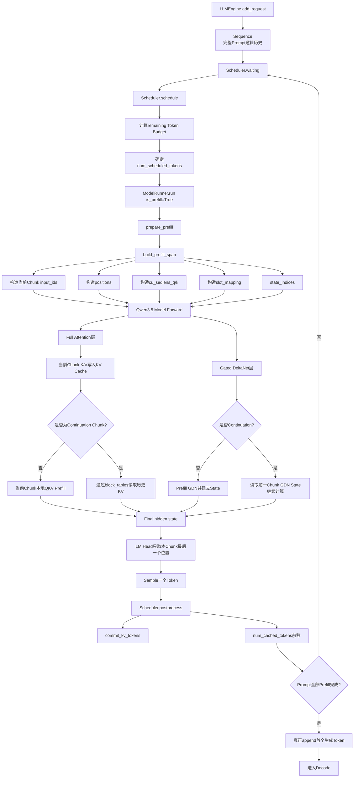
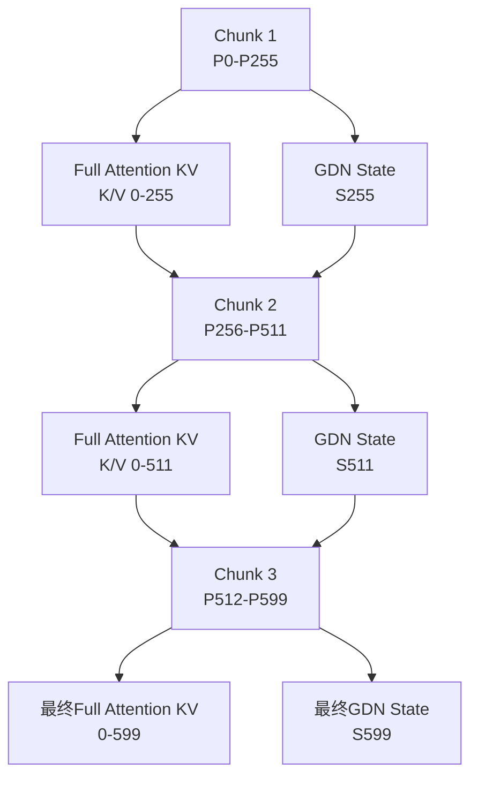
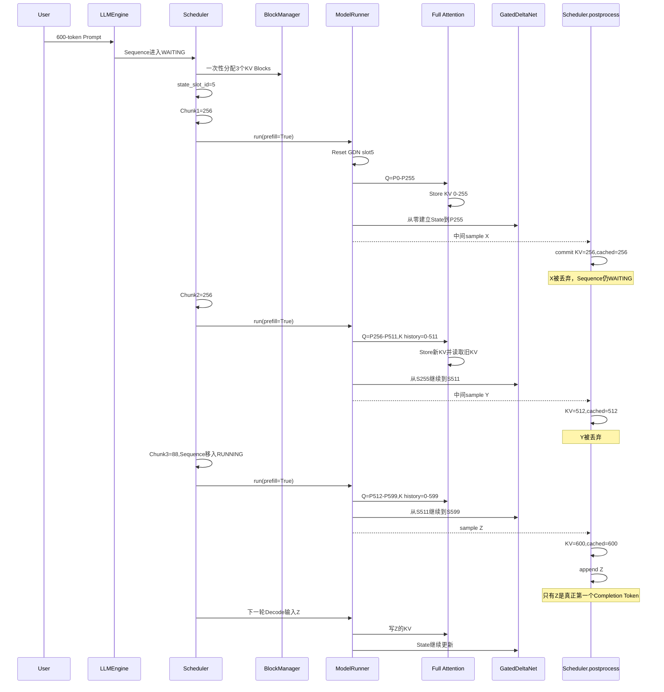

# Qwen3.5 适配版 nano-vLLM：Chunked Prefill 从原理到源码完整学习文档

> 本文严格以你提供的 `nano-vllm-qwen3.6`（Qwen3.5/Qwen3.6 适配版）源码为主要依据，并结合仓库中的测试与实现文档解释。
>
> 目标不是只记住“Chunked Prefill = 把 Prompt 切块”，而是真正理解：
>
> - 为什么要切；
> - 谁决定每一块多大；
> - 每个 Chunk 到底送进模型哪些 Token；
> - 前一块算出的 KV Cache 怎么给下一块使用；
> - Qwen3.5 的 Gated DeltaNet 没有普通 KV Cache，它的 recurrent/conv state 怎么跨 Chunk 延续；
> - `num_tokens`、`num_cached_tokens`、`num_scheduled_tokens`、`kv_num_tokens` 分别是什么；
> - 为什么中间 Chunk 虽然会算出 logits 和 sample token，但这个 token 会被丢弃；
> - 最后一块完成后为什么只采样一次真正的第一个输出 Token；
> - Chunked Prefill 与 Prefix Cache、CUDA Graph、KV Cache 压缩、抢占重算和多模态是什么关系；
> - 当前项目实现与“完整 vLLM Chunked Prefill”有什么差异和限制。
>
> 本文会明确区分：
>
> **源码明确实现**：直接来自当前仓库；
>
> **通用原理**：用于帮助理解 Chunked Prefill 的一般思想；
>
> **源码审查结论**：根据当前代码结构推导出的工程行为，不把它误说成仓库已经做过的性能实测结果。

---

# 1. 先回答最核心的问题：Chunked Prefill 到底是什么

## 1.1 普通 Prefill 是什么

假设用户输入：

```text
“请阅读下面这篇很长的论文，然后帮我总结……”
```

Tokenizer 得到：

```text
P0, P1, P2, ..., P599
```

一共 600 个 Prompt Token。

传统的一次性 Prefill 会把这 600 个 Token 一次送入模型：

```text
600 Token
   ↓
Embedding
   ↓
第 0 层
   ↓
第 1 层
   ↓
……
   ↓
最后一层
   ↓
生成这 600 个 Token 对应的历史状态
   ↓
根据最后一个 Prompt Token 的输出预测第一个生成 Token
```

对于 Full Attention 层：

```text
P0～P599
```

都会生成 K/V，并写进 KV Cache。

对于 Qwen3.5 的 Gated DeltaNet 层：

```text
P0～P599
```

会更新这一条请求对应的：

```text
conv state
+
recurrent state
```

所以 Prefill 的本质可以理解成：

> **把 Prompt 的完整历史“物化”成模型后续 Decode 可以直接继续使用的运行时状态。**

在普通 Transformer 中，这个状态主要是 KV Cache。

在 Qwen3.5 Hybrid 中，它同时包括：

```text
Full Attention 层：
KV Cache

Gated DeltaNet 层：
convolution state + recurrent state
```

---

# 2. 一次性 Prefill 有什么问题

假设：

```text
max_num_batched_tokens = 256
```

但用户 Prompt 有：

```text
600 Token
```

如果一次性送入：

```text
600 Token Forward
```

就已经超过当前一轮允许处理的 Token Budget。

更长的 Prompt，例如：

```text
8K
16K
32K
```

还会带来更大的：

- 单次 Prefill 激活量；
- Attention 临时工作量；
- GPU 单步运行时间；
- 单轮调度占用；
- 对其他请求的阻塞风险。

所以一个自然思路是：

```text
不要一次吃完 600 Token。

改成：

第 1 次：0～255
第 2 次：256～511
第 3 次：512～599
```

这就是 Chunked Prefill 最直观的思想。

---

# 3. Chunked Prefill 最本质的目标是什么

可以从三个层面理解。

## 3.1 控制单次模型调用的 Token 数

配置：

```python
max_num_batched_tokens
```

定义了一轮调度最多允许多少 Prefill Token。

长 Prompt 不必要求：

```text
Prompt长度 <= 每轮Token Budget
```

而可以：

```text
Prompt长度 > 每轮Token Budget
```

通过多轮完成。

---

## 3.2 限制单次 Prefill 的瞬时工作量

假设 8192 Token Prompt。

不分 Chunk：

```text
一次 Forward：8192 Token
```

分成：

```text
8 × 1024 Token
```

后，每次只处理一部分 Query Token。

这可以降低单次 Forward 的：

- 输入张量规模；
- 部分中间激活峰值；
- 单轮 GPU 执行时间。

但要特别注意：

> **Chunked Prefill 并没有让整个 Prompt 的理论注意力工作凭空消失。**

后面的 Chunk 仍然要关注前面已经计算的历史 Key。

因此它首先是：

```text
调度 / 执行粒度优化
```

而不是：

```text
把模型总计算量砍掉一半
```

---

## 3.3 为调度器提供更细的工作单位

普通 Prefill 的工作单位：

```text
一整个 Prompt
```

Chunked Prefill 后：

```text
一个 Prompt 可以被拆成多个可调度的 Chunk
```

这使调度器理论上可以更灵活地决定：

```text
这一轮先算多少 Prefill
下一轮再算多少
```

完整 vLLM 系统中，这种机制还能用于将：

```text
Decode
+
部分 Prefill Chunk
```

组合进同一调度周期，以改善在线服务的延迟和公平性。

但是：

> **你当前这个 nano-vLLM Qwen3.5 版本没有实现“同一轮 Decode + Prefill Chunk 混合 Batch”的完整版策略。**

后文会详细解释。

---

# 4. 当前项目中控制 Chunk 大小的核心配置

文件：

```text
nanovllm/config.py
```

默认：

```python
max_num_batched_tokens: int = 16384
max_num_seqs: int = 512
max_model_len: int = 4096
```

其中 Chunked Prefill 最直接相关的是：

```python
max_num_batched_tokens
```

它表示：

> **一次 Scheduler 调度的 Prefill Batch 最多允许包含多少个需要实际计算的 Token。**

例如：

```text
max_num_batched_tokens = 256
Prompt = 600 Token
```

则可能形成：

```text
Chunk 1 = 256
Chunk 2 = 256
Chunk 3 = 88
```

---

# 5. 不要把三个“Chunk”概念混在一起

这是阅读这个项目时非常容易混淆的地方。

仓库里至少有三种不同含义的 Chunk。

## 5.1 Scheduler Chunked Prefill

本文主要讲的：

```text
长 Prompt
→ 多轮 Model Forward
```

例如：

```text
600
→ 256 + 256 + 88
```

由：

```text
Scheduler
max_num_batched_tokens
num_scheduled_tokens
```

控制。

---

## 5.2 GatedDeltaNet 内部 `chunk_gated_delta_rule`

文件：

```text
nanovllm/layers/gated_delta_net.py
```

函数：

```python
chunk_gated_delta_rule(
    ...,
    chunk_size=64,
)
```

这里的 `chunk_size=64` 是：

> **GDN 数学算法内部为了实现 gated delta rule 而进行的计算分块。**

它不是 Scheduler Chunked Prefill。

例如 Scheduler 第一块：

```text
256 Token
```

进入某个 GDN 层后，内部可能进一步按：

```text
64 + 64 + 64 + 64
```

处理。

这是两层完全不同的 Chunk：

```text
Scheduler Chunk：
控制一次模型Forward处理多少Prompt Token

GDN Algorithm Chunk：
控制Gated Delta Rule内部怎样计算
```

---

## 5.3 MTP 的 Chunk Verify

项目里还有：

```text
verify-mode=chunk
```

这是 MTP 投机解码中的实验性 continuation-prefill verifier。

它与普通 Prompt Chunked Prefill 也不是一回事。

因此以后看到 `chunk` 这个词，必须先问：

> 是 Scheduler 的 Prompt Chunk，GDN 内部计算 Chunk，还是 MTP Verify Chunk？

---

# 6. 当前项目 Chunked Prefill 涉及哪些核心文件

完整调用链主要涉及：

```text
nanovllm/engine/llm_engine.py
nanovllm/engine/scheduler.py
nanovllm/engine/sequence.py
nanovllm/engine/block_manager.py

nanovllm/kv_compression/metadata.py

nanovllm/engine/model_runner.py
nanovllm/utils/context.py

nanovllm/layers/attention.py
nanovllm/layers/gated_delta_net.py
nanovllm/layers/embed_head.py

nanovllm/models/qwen3_5.py
```

测试中还专门覆盖：

```text
tests/test_kv_compression_scheduler_state.py
tests/test_kv_compression_sequence.py
tests/test_kv_compression_metadata.py
tests/test_kv_compression_block_manager.py
```

仓库文档中给出的真实 GPU 待执行命令还包括：

```text
run_kv_compression_smoke.py
docs/kv_compression_test_report.md
```

---

# 7. 先认识 Sequence 中和 Chunked Prefill 有关的五个长度

文件：

```text
nanovllm/engine/sequence.py
```

初始化：

```python
self.token_ids = copy(token_ids)
self.num_tokens = len(self.token_ids)
self.num_prompt_tokens = len(token_ids)

self.num_cached_tokens = 0
self.num_scheduled_tokens = 0

self.kv_num_tokens = 0
```

初学者最容易把这几个字段混成一个“长度”。

实际上它们职责不同。

---

## 7.1 `num_tokens`

表示当前完整逻辑 Token 历史长度。

刚创建 Prompt：

```text
Prompt = 600 Token

num_tokens = 600
```

Chunked Prefill 过程中：

```text
num_tokens 始终 = 600
```

不会因为“第一块只算了 256”就变成 256。

也就是说：

> `num_tokens` 表示这条请求逻辑上有多少 Token，而不是本轮算了多少。

---

## 7.2 `num_prompt_tokens`

固定记录原始 Prompt 长度。

例如：

```text
num_prompt_tokens = 600
```

以后模型生成 100 Token：

```text
num_tokens = 700
num_prompt_tokens = 600
```

---

## 7.3 `num_scheduled_tokens`

表示：

> **这一轮 Scheduler 真正安排给模型计算多少 Token。**

第一次：

```text
256
```

第二次：

```text
256
```

第三次：

```text
88
```

这个字段才是 Chunk 大小最直接的运行时表达。

---

## 7.4 `num_cached_tokens`

代码注释是：

```python
# tokens that don't need prefill
```

在当前 Qwen3.5 Hybrid 中，由于：

```python
self.prefix_cache_enabled = not (
    self.is_hybrid or self.kv_compress_enabled
)
```

Qwen3.5 是 Hybrid，所以：

```text
prefix_cache_enabled = False
```

也就是说这里的 `num_cached_tokens` 在 Qwen3.5 Chunked Prefill 中更应该理解为：

> **已经完成 Prefill、下一轮不需要重新计算的逻辑前缀长度。**

例如：

```text
开始：0

第一块完成：
256

第二块完成：
512

第三块完成：
600
```

它在 Chunked Prefill 中实际上承担了：

```text
“Prefill进度游标”
```

的角色。

---

## 7.5 `kv_num_tokens`

这个字段是最终融合 KV 压缩机制之后特别重要的。

它表示：

> **已经真正物化到 Full Attention KV Cache 中的物理 KV Token 数。**

普通初始 Prefill：

```text
第一块完成：
kv_num_tokens = 256

第二块：
512

第三块：
600
```

这和 `num_cached_tokens` 暂时相同。

但进入 Decode 后：

```text
模型刚采样出来的 Token
```

会先存在于逻辑历史里：

```text
num_tokens += 1
```

它的 KV 要到下一轮 Decode 才生成。

因此最终可能出现：

```text
num_tokens = 601
kv_num_tokens = 600
```

如果后续还进行 KV Cache 压缩：

```text
逻辑历史可能 3000
物理 KV 可能只有 1800
```

所以项目必须拆开这两条长度轴。

---

# 8. 五个字段放在一起看

对于 600 Token Prompt：

| 时刻 | `num_tokens` | `num_cached_tokens` | `num_scheduled_tokens` | `kv_num_tokens` |
|---|---:|---:|---:|---:|
| 请求刚创建 | 600 | 0 | 0 | 0 |
| 第1块调度中 | 600 | 0 | 256 | 0 |
| 第1块完成 | 600 | 256 | 0 | 256 |
| 第2块调度中 | 600 | 256 | 256 | 256 |
| 第2块完成 | 600 | 512 | 0 | 512 |
| 第3块调度中 | 600 | 512 | 88 | 512 |
| 第3块模型完成后 | 600 | 600 | 88→0 | 600 |
| 采样第1个输出Token后 | 601 | 601 | 0 | 600 |
| 第1次Decode完成 | 602 | 602 | 0 | 601 |

这一张表非常重要。

---

# 9. 完整调用链总览

一次长文本 Prompt 的 Chunked Prefill 调用链：



---

# 10. Chunked Prefill 的入口：`LLMEngine.step()`

文件：

```text
nanovllm/engine/llm_engine.py
```

每一步：

```python
seqs, is_prefill = self.scheduler.schedule()
```

如果：

```text
is_prefill = True
```

则：

```python
num_tokens = sum(
    seq.num_scheduled_tokens
    for seq in seqs
)
```

然后：

```python
token_ids = self.model_runner.call(
    "run",
    seqs,
    is_prefill,
)
```

最后：

```python
self.scheduler.postprocess(
    seqs,
    token_ids,
    is_prefill,
)
```

因此一块 Chunk 的完整生命周期就是：

```text
Scheduler决定本轮算多少
↓
ModelRunner真正算
↓
Scheduler提交本轮结果
```

---

# 11. Scheduler 是 Chunked Prefill 的真正控制中心

文件：

```text
nanovllm/engine/scheduler.py
```

核心：

```python
def schedule(self):
```

它首先处理：

```text
waiting 队列中的 Prefill
```

然后才处理：

```text
running 队列中的 Decode
```

这是理解当前项目调度行为的关键。

---

# 12. Token Budget 是怎么计算的

开始：

```python
scheduled_seqs = []
num_batched_tokens = 0
```

每看一个 waiting 请求：

```python
remaining = (
    self.max_num_batched_tokens
    - num_batched_tokens
)
```

假设：

```text
max_num_batched_tokens = 256
```

当前还没安排别的请求：

```text
remaining = 256
```

---

# 13. Scheduler 怎么知道 Prompt 还有多少没算

代码先得到：

```python
materialization_limit = prefill_materialization_limit(seq)
```

初始 Prompt 没开始生成时：

```text
materialization_limit = num_tokens
```

然后：

```python
cached_physical_tokens = min(
    seq.num_cached_tokens,
    materialization_limit,
)
```

剩余工作：

```python
num_tokens = max(
    materialization_limit
    - cached_physical_tokens,
    1,
)
```

例如：

```text
Prompt=600
num_cached_tokens=0

num_tokens=600
```

第一块完成后：

```text
num_cached_tokens=256

num_tokens=600-256=344
```

第二块完成：

```text
num_cached_tokens=512

num_tokens=88
```

---

# 14. 真正切 Chunk 的一行代码

核心：

```python
seq.num_scheduled_tokens = min(
    num_tokens,
    remaining,
)
```

第一次：

```text
min(600,256)=256
```

第二次：

```text
min(344,256)=256
```

第三次：

```text
min(88,256)=88
```

这就是当前项目 Chunked Prefill 最核心的“切块动作”。

---

# 15. 为什么代码写着“only allow chunked prefill for the first seq”

Scheduler 中：

```python
if remaining < num_tokens and scheduled_seqs:
    break
```

注释：

```python
# only allow chunked prefill for the first seq
```

含义是：

如果这一轮已经安排了别的 Prefill 请求：

```text
scheduled_seqs 非空
```

而下一个请求剩余 Prompt：

```text
大于当前剩余Token Budget
```

则：

```text
不把第二个请求再切一个Chunk塞进剩余空间
```

直接停止。

---

# 16. 用两个请求理解这一限制

假设：

```text
Token Budget = 256

Request A 剩余 = 100
Request B 剩余 = 300
```

先安排 A：

```text
scheduled = 100
remaining = 156
```

轮到 B：

```text
B还需要300
remaining只有156
scheduled_seqs已经非空
```

所以：

```text
break
```

不会安排：

```text
B的156-token Chunk
```

这一轮只运行 A。

---

## 16.1 如果超长请求本身就是队首

例如：

```text
Request B = 600
Budget = 256
scheduled_seqs = []
```

此时：

```text
remaining < num_tokens
```

虽然成立，但：

```text
scheduled_seqs为空
```

所以不会 break。

然后：

```text
B.num_scheduled_tokens = 256
```

因此：

> **当前实现只允许本轮第一个 Prefill 请求被截断成 Chunk。**

---

# 17. 当前项目不是完整版“Decode + Chunked Prefill 混合调度”

Scheduler 的逻辑顺序：

```text
先尝试Prefill
```

一旦：

```python
if scheduled_seqs:
    return scheduled_seqs, True
```

立刻返回。

只有：

```text
本轮没有任何Prefill
```

才进入后面的 Decode 调度。

因此当前实现是：

```text
Prefill轮
和
Decode轮
严格分开
```

而不是：

```text
一个Batch里：
若干Decode Token
+
若干Prefill Chunk Token
```

---

# 18. 这意味着什么

假设已经有一个请求 A 正在 Decode：

```text
A：RUNNING
```

这时又进入一个超长 Prompt B：

```text
B：WAITING
Prompt=4096
Token Budget=512
```

当前 Scheduler 会优先处理 waiting Prefill。

于是可能：

```text
Step 1：
B Prefill 0～511
A 不Decode

Step 2：
B Prefill 512～1023
A 不Decode

……

Step 8：
B最后Chunk
A仍然没Decode

之后：
才恢复Decode A/B
```

因此：

> **当前 Chunked Prefill 实现解决了“一次 Forward 放不下长 Prompt”的问题，但没有完整解决“长 Prefill 对已有 Decode 请求造成 Head-of-Line Blocking”的问题。**

这和生产版 vLLM 常说的 Chunked Prefill 要严格区分。

---

# 19. 通用 Chunked Prefill 与本项目实现对比

| 能力 | 通用/生产级 Chunked Prefill 常见目标 | 当前 Qwen3.5 项目 |
|---|---|---|
| 长 Prompt 分块 | 是 | 是 |
| 每轮限制 Prefill Token Budget | 是 | 是 |
| Prompt 可跨多轮完成 | 是 | 是 |
| 同一 Batch 混合 Decode + Prefill | 常见 | **没有** |
| 优先保护 Decode 延迟 | 常见目标 | 当前不完整 |
| 多个请求都可灵活切 Chunk | 可实现 | 仅本轮首个请求允许被截断 |
| 每块逐步申请 KV Block | 视实现而定 | **不是，初次先分配完整请求所需 Block** |
| Qwen3.5 GDN State 跨 Chunk | 模型相关 | **已处理** |

---

# 20. 一个特别重要的工程细节：Block 是一次性为完整 Prompt 分配的

这点很容易误解。

Scheduler 第一次看到请求时：

```python
if not seq.block_table:
    self.block_manager.allocate(seq)
```

`BlockManager.allocate()` 中：

```python
for i in range(seq.num_blocks):
    ...
    seq.block_table.append(block_id)
```

而：

```python
seq.num_blocks
=
ceil(seq.num_tokens / block_size)
```

它基于的是：

```text
完整逻辑 Prompt 长度
```

不是：

```text
当前Chunk长度
```

---

# 21. 600 Token 示例里的 Block 分配

默认：

```text
block_size=256
```

Prompt：

```text
600 Token
```

需要：

```text
ceil(600/256)=3 Blocks
```

即使第一轮只处理：

```text
256 Token
```

BlockManager 仍然会在第一轮预先给请求分配：

```text
3个Block
```

例如：

```text
block_table=[40,7,18]
```

但第一轮只往：

```text
B40
```

写 KV。

第二轮再写：

```text
B7
```

第三轮写：

```text
B18的一部分
```

---

# 22. 所以本项目 Chunked Prefill 节省的不是完整 Prompt 的 KV 预留

这是一个重要结论。

当前实现：

```text
完整Prompt所需Paged KV Block
第一轮就已预留
```

因此 Chunked Prefill 并没有把：

```text
KV Block容量需求
```

也拆成逐块增长。

它主要限制：

```text
每次模型Forward真正参与计算的Token数
+
每次真正写入的KV Token数
+
部分临时激活规模
```

而不是：

```text
一开始只占1个Block，下一Chunk再申请1个Block
```

---

# 23. 为什么这样实现更简单

如果 Blocks 也按 Chunk 动态增长，就需要 Prefill 阶段不断：

```text
检查容量
↓
增量分配Block
↓
处理中途分配失败
↓
考虑请求暂停
↓
考虑其他请求竞争
```

当前实现选择：

```text
先保证整个逻辑请求有足够KV Block容量
↓
再分块计算
```

简化了状态管理。

代价是：

> Chunked Prefill 对“单请求 KV 容量压力”的帮助有限。

---

# 24. 第一块 Chunk 进入 ModelRunner 后发生什么

Scheduler 得到：

```text
num_scheduled_tokens=256
```

`LLMEngine.step()`：

```text
is_prefill=True
```

进入：

```python
ModelRunner.run()
```

调用：

```python
prepare_prefill(seqs)
```

---

# 25. `prepare_prefill()` 是 Chunked Prefill 数据面的核心

文件：

```text
nanovllm/engine/model_runner.py
```

第一件事：

```python
self.reset_prefill_state_slots(seqs)
```

这对 Qwen3.5 Hybrid 非常重要。

后面会讲。

接着逐请求：

```python
span = build_prefill_span(seq)
```

得到本轮真正要处理的逻辑区间。

---

# 26. `build_prefill_span()` 到底做了什么

文件：

```text
nanovllm/kv_compression/metadata.py
```

返回：

```python
PrefillSequenceMetadata(
    start,
    end,
    query_length,
    key_length,
)
```

关键：

```python
start = min(
    seq.num_cached_tokens,
    materialization_limit - 1,
)

end = start + seq.num_scheduled_tokens

query_length = seq.num_scheduled_tokens

key_length = end
```

---

# 27. 第一块的 Span

初始：

```text
num_cached_tokens=0
num_scheduled_tokens=256
```

得到：

```text
start=0
end=256

query_length=256
key_length=256
```

含义：

```text
本轮新 Query Token：
P0～P255

本轮计算完成后历史Key长度：
256
```

---

# 28. 第二块的 Span

第一块完成：

```text
num_cached_tokens=256
```

第二块：

```text
num_scheduled_tokens=256
```

得到：

```text
start=256
end=512

query_length=256
key_length=512
```

注意：

```text
Query长度=256
Key历史长度=512
```

这就是 Continuation Prefill 的关键。

---

# 29. 第三块

```text
start=512
end=600

query_length=88
key_length=600
```

表示：

```text
只新算88个Query
但是这88个Query必须处在完整600-token因果历史中
```

---

# 30. 为什么必须同时维护 `query_length` 和 `key_length`

如果第二块错误地写成：

```text
Q长度=256
K长度=256
```

那第二块：

```text
P256～P511
```

只能看见自己这一块。

它无法注意：

```text
P0～P255
```

模型语义就断掉了。

正确情况必须是：

```text
Q：
P256～P511

K/V：
P0～P511
```

所以：

```text
seqlen_q = 当前Chunk长度
seqlen_k = 到当前Chunk末尾的完整已物化历史长度
```

---

# 31. `cu_seqlens_q` 和 `cu_seqlens_k` 是什么

`prepare_prefill()` 构造：

```python
cu_seqlens_q = [0]
cu_seqlens_k = [0]
```

每条请求累加：

```python
cu_seqlens_q.append(
    cu_seqlens_q[-1] + seqlen_q
)

cu_seqlens_k.append(
    cu_seqlens_k[-1] + seqlen_k
)
```

它们用于 FlashAttention VarLen 表达：

```text
Batch中每条Sequence的Q/K边界
```

---

# 32. 单请求第二块示例

第二块：

```text
Q Length=256
K Length=512
```

则：

```text
cu_seqlens_q=[0,256]
cu_seqlens_k=[0,512]
```

告诉 FlashAttention：

```text
这一条请求：
当前有256个Query
累计有512个Key
```

---

# 33. 多请求 Prefill 时怎么拼

例如一轮有：

```text
A：100个新Token，历史100
B：80个新Token，历史300
```

则可能：

```text
cu_seqlens_q =
[0,100,180]

cu_seqlens_k =
[0,100,400]
```

Flat Tensor 中：

```text
Q：
[A的100][B的80]

K历史：
通过各自block table解释为
[A到100][B到300]
```

不过要再次强调：

> 当前 Scheduler 对真正 Chunking 的多请求组合能力比较保守，只有一轮第一个请求允许在 Budget 不足时被切断。

---

# 34. `input_ids` 只包含当前 Chunk

核心：

```python
seq_token_ids = seq[start:end]
input_ids.extend(seq_token_ids)
```

第二块：

```text
input_ids =
P256～P511
```

并不会把：

```text
P0～P255
```

重新送进 Transformer。

为什么？

因为：

```text
Full Attention：
前一块的K/V已经在KV Cache

GDN：
前一块的状态已经在state slot
```

这正是 Chunked Prefill 能避免重复计算的根本。

---

# 35. Position 不能从 0 重新开始

文本路径：

```python
positions.extend(
    range(start, end)
)
```

第二块：

```text
positions =
256～511
```

第三块：

```text
512～599
```

绝对不能写成：

```text
第二块又是0～255
```

否则位置编码会把第二块误认为序列开头。

所以 Chunked Prefill 必须做到：

```text
物理计算分块
≠
逻辑位置重新编号
```

---

# 36. Slot Mapping 怎么保证每块 KV 写到正确位置

`prepare_prefill()` 根据：

```text
start
end
block_table
block_size
```

构造：

```text
slot_mapping
```

默认：

```text
block_size=256
block_table=[40,7,18]
```

---

## 36.1 第一块

逻辑：

```text
0～255
```

写到：

```text
B40 offset 0～255
```

绝对 Physical Slot：

```text
40×256 ～ 40×256+255
```

---

## 36.2 第二块

逻辑：

```text
256～511
```

写到：

```text
B7 offset 0～255
```

---

## 36.3 第三块

逻辑：

```text
512～599
```

写到：

```text
B18 offset 0～87
```

所以 Chunked Prefill 虽然分多次计算，但最终形成的物理 KV 布局仍等价于：

```text
一次完整Prefill后
逻辑位置0～599
```

对应的 Paged KV Cache。

---

# 37. Full Attention 层第一块怎么执行

文件：

```text
nanovllm/layers/attention.py
```

进入：

```python
Attention.forward(q,k,v)
```

先：

```python
store_kvcache(
    k,
    v,
    k_cache,
    v_cache,
    context.slot_mapping,
)
```

所以当前 Chunk 的 K/V 会先写入全局 KV Cache。

第一块时：

```text
context.block_tables = None
```

然后：

```python
flash_attn_varlen_func(
    q,
    k,
    v,
    ...
    causal=True,
    block_table=None,
)
```

此时：

```text
q/k/v
```

都是当前第一块本地算出的：

```text
P0～P255
```

---

# 38. 为什么第一块不需要读 KV Cache

因为这是：

```text
序列开头
```

不存在更早历史。

所以直接使用当前 Chunk 的：

```text
Q/K/V
```

完成 Prefill Attention 即可。

同时它们已经通过：

```text
store_kvcache
```

保存起来供下一 Chunk 使用。

---

# 39. 第二块为什么 `block_tables` 不再是 None

`prepare_prefill()` 有：

```python
if cu_seqlens_k[-1] > cu_seqlens_q[-1]:
    block_tables = self.prepare_block_tables(seqs)
```

第一块：

```text
K总长度=256
Q总长度=256
```

所以：

```text
block_tables=None
```

第二块：

```text
K总长度=512
Q总长度=256
```

所以：

```text
block_tables != None
```

---

# 40. 这里代码注释写的是 `# prefix cache`，但在 Qwen3.5 Chunked Prefill 中含义更广

源码：

```python
if cu_seqlens_k[-1] > cu_seqlens_q[-1]:
    block_tables = self.prepare_block_tables(seqs)
```

注释是：

```text
# prefix cache
```

但 Qwen3.5：

```text
prefix_cache_enabled=False
```

第二块仍然会满足：

```text
K length > Q length
```

因此这里的 `block_tables` 实际上也承担：

> **Continuation Chunk 访问前一 Chunk 历史 KV 的 Paged Table。**

所以阅读代码时不要被这个注释误导成：

```text
只有Prefix Cache才会使用block_tables
```

在当前 Chunked Prefill 中，它同样关键。

---

# 41. Full Attention 第二块到底怎么计算

进入 Attention：

```python
store_kvcache(k,v,...)
```

先把：

```text
P256～P511
```

写进 KV Cache。

然后：

```python
if context.block_tables is not None:
    k, v = k_cache, v_cache
```

于是 FlashAttention 输入变为：

```text
Q：
当前Chunk P256～P511

K/V：
全局Paged KV Cache
```

并通过：

```text
block_table
cu_seqlens_k=[0,512]
```

只读取这一请求到：

```text
P511
```

为止的有效历史。

---

# 42. 第二块的注意力关系

概念上：

```text
Q(P256)
    ↓
可以看 P0～P256

Q(P257)
    ↓
可以看 P0～P257

……

Q(P511)
    ↓
可以看 P0～P511
```

而不是：

```text
P256只看P256
P257只看P256～P257
```

所以不同 Chunk 之间没有语义断裂。

---

# 43. 第三块同理

第三块：

```text
Q：
P512～P599

K/V：
P0～P599
```

其中：

```text
P0～P511
```

来自前两个 Chunk 已存好的 KV Cache；

```text
P512～P599
```

来自当前 Chunk 刚刚写入。

---

# 44. Full Attention 的状态连续性一句话总结

Chunk 之间传递的不是：

```text
旧 hidden_states
```

而是：

```text
前面Token已经物化好的K/V Cache
```

因此下一 Chunk 可以只输入新 Token。

---

# 45. Qwen3.5 真正复杂的地方：Gated DeltaNet 没有标准 KV Cache

Qwen3.5 Decoder Layer：

```python
if layer_type == "full_attention":
    self.self_attn = Qwen3_5Attention(...)
else:
    self.linear_attn = GatedDeltaNet(...)
```

所以层结构是混合的：

```text
某些层：
Full Attention

某些层：
GatedDeltaNet
```

Full Attention 跨 Chunk：

```text
靠历史KV
```

GDN 跨 Chunk：

```text
靠recurrent state + conv state
```

这就是 Qwen3.5 Chunked Prefill 适配比纯 Qwen3 更难的关键原因。

---

# 46. GDN State 在哪里存

`ModelRunner.allocate_gdn_state()` 为每个 GDN Layer 创建：

```python
layer.conv_states = torch.zeros(
    max_slots,
    ...
)

layer.recurrent_states = torch.zeros(
    max_slots,
    ...
)
```

可以理解成：

```text
整个GPU上建立一个State Pool

slot 0
slot 1
slot 2
...
```

Scheduler 给每条 Hybrid 请求分配：

```python
seq.state_slot_id
```

例如：

```text
当前长Prompt：
state_slot_id=7
```

---

# 47. 第一次 Prefill 前为什么要 Reset State Slot

Scheduler 第一次给请求分配：

```python
seq.state_slot_id = ...
seq.state_slot_needs_reset = True
```

进入：

```python
prepare_prefill()
```

第一行：

```python
self.reset_prefill_state_slots(seqs)
```

将：

```text
slot7 对应的所有GDN Layer状态
```

清零。

然后：

```python
seq.state_slot_needs_reset=False
```

这保证：

```text
新的请求不会继承上一个曾经使用slot7的请求留下的状态
```

---

# 48. 第一块 GDN Prefill 如何建立状态

`GatedDeltaNet._forward_prefill()`：

```python
state_indices = context.state_indices
```

当前：

```text
state_indices=[7]
```

判断：

```python
warmup = (
    state_indices is None
    or self.conv_states.numel()==0
)
```

正常运行时：

```text
warmup=False
```

然后：

```python
continuation = (
    not warmup
    and context.block_tables is not None
)
```

第一块：

```text
block_tables=None
```

所以：

```text
continuation=False
```

---

# 49. 第一块的 Conv State

代码取：

```python
conv_state = self.conv_states[
    si:si+1
]
```

刚才已经 Reset，所以是全零。

然后：

```python
causal_conv1d_prefill(
    mixed_qkv,
    conv_weight,
    conv_state,
)
```

内部：

```python
x_padded = torch.cat(
    [conv_state, x],
    dim=-1,
)

conv_state.copy_(
    最后K-1个输入
)
```

所以处理完第一块后：

```text
conv_state
```

保存：

> 第一块末尾继续下一 Token 因果卷积所需要的最近历史。

---

# 50. 第一块的 Recurrent State

GDN 又执行：

```python
rec_state = self.recurrent_states[
    si:si+1
]
```

初始也是零。

然后：

```python
out, new_state = chunk_gated_delta_rule(
    q,k,v,g,beta,
    initial_state=rec_state,
)
```

最后：

```python
self.recurrent_states[si] = new_state[0]
```

所以第一块处理完成后：

```text
state slot 7
```

已经包含：

```text
P0～P255
```

压缩进 GDN Recurrent State 后的历史信息。

---

# 51. 再次强调：这里的 `chunk_gated_delta_rule` 不是 Scheduler Chunk

假设 Scheduler 当前 Chunk：

```text
256 Token
```

GDN：

```python
chunk_size=64
```

内部会进一步形成：

```text
4个算法块
```

但这些 64-token 内部块不会：

- 回到 Scheduler；
- 更新 `num_cached_tokens`；
- 单独采样；
- 单独占一个 LLMEngine Step。

它们只是：

```text
一个GDN Layer Forward内部的数学实现
```

---

# 52. 第二个 Scheduler Chunk 如何继续 GDN State

第二块时 Full Attention 需要历史：

```text
cu_seqlens_k > cu_seqlens_q
```

因此：

```text
context.block_tables != None
```

GDN 看到：

```python
continuation = True
```

如果：

```text
num_seqs==1
```

直接：

```python
_forward_prefill_recurrent_indexed(...)
```

---

# 53. Continuation GDN 为什么改用 Recurrent 路径

`_forward_prefill_recurrent_indexed()`：

```python
for t in range(x.size(1)):
```

逐 Token：

```text
Token 256
Token 257
Token 258
...
```

每个 Token 都：

```text
读取当前conv state
↓
causal_conv1d_decode
↓
更新conv state

读取当前recurrent state
↓
recurrent_gated_delta_rule
↓
更新recurrent state
```

所以第二块不是重新从零算 GDN。

而是：

```text
沿着第一块最终State继续向前走
```

---

# 54. 用“接力棒”理解 GDN 跨 Chunk

第一块：

```text
P0 → P1 → ... → P255
                      ↓
                最终GDN State S255
```

第二块从：

```text
S255
```

开始：

```text
P256
↓
P257
↓
...
↓
P511
↓
State S511
```

第三块：

```text
S511
↓
P512
...
P599
↓
State S599
```

最终得到的状态语义等价于：

```text
从P0连续处理到P599
```

而不是三个互相独立的状态。

---

# 55. Qwen3.5 Chunked Prefill 必须同时保证两类连续性

这是本项目最核心的理解。



Full Attention 的接力棒：

```text
KV Cache
```

GDN 的接力棒：

```text
conv state
+
recurrent state
```

两套都必须正确，Qwen3.5 才能真正支持 Chunked Prefill。

---

# 56. 为什么第二块 GDN 不直接再用 `chunk_gated_delta_rule`

从当前源码可以看到作者选择：

```text
首块：
chunk_gated_delta_rule

Continuation：
recurrent_gated_delta_rule逐Token
```

这是实现层面的取舍。

优点：

```text
语义更直接
```

因为已有一个明确的持续状态，只要按 Decode 风格继续递归即可。

缺点：

```text
Continuation Chunk内部出现Python逐Token循环
```

例如第二块 256 Token：

```python
for t in range(256):
```

会连续执行 256 次 recurrent 路径。

因此：

> **当前实现的 Chunked Prefill 主要强调功能正确性和状态连续性，并不代表 GDN Continuation Prefill 已经是最高性能的融合实现。**

仓库本身也定位为研究/学习实现，而不是生产 Serving Stack。

---

# 57. 当前 Chunk 最后为什么会计算 Logits

模型跑完后：

```python
compute_logits()
```

文件：

```text
nanovllm/layers/embed_head.py
```

Prefill 时：

```python
last_indices = (
    context.cu_seqlens_q[1:] - 1
)

x = x[last_indices]
```

也就是说：

> 对每条 Prefill Sequence，只拿“当前这一块的最后一个 Query Token”的 hidden state 去算 Logits。

---

# 58. 第一块会不会真的采样一个 Token

会。

`ModelRunner.run()` 不区分：

```text
中间Chunk
最后Chunk
```

都执行：

```python
logits = self.run_model(...)
token_ids = self.sample(...)
```

所以第一块：

```text
P0～P255
```

结束时，也会根据：

```text
P255
```

采样一个“候选输出 Token”。

---

# 59. 但中间 Chunk 的采样结果会被 Scheduler 丢弃

这是非常重要的源码细节。

`Scheduler.postprocess()` Prefill 部分：

先提交：

```python
seq.commit_kv_tokens(...)
```

再前移：

```python
seq.num_cached_tokens +=
    seq.num_scheduled_tokens
```

如果：

```python
seq.num_cached_tokens < seq.num_tokens
```

说明：

```text
还有Prompt没Prefill完
```

于是：

```python
seq.num_scheduled_tokens = 0
continue
```

根本不会：

```python
seq.append_token(token_id)
```

---

# 60. 600 Token 示例中实际发生什么

### Chunk 1

模型：

```text
P0-P255
→ logits(P255)
→ sample = X
```

Scheduler：

```text
Prompt还没结束
→ 丢弃X
```

### Chunk 2

```text
P256-P511
→ logits(P511)
→ sample = Y
```

Scheduler：

```text
仍没结束
→ 丢弃Y
```

### Chunk 3

```text
P512-P599
→ logits(P599)
→ sample = Z
```

Scheduler：

```text
Prompt全部物化完成
→ append Z
```

只有：

```text
Z
```

才是真正第一个 Completion Token。

---

# 61. 为什么中间 Chunk 采样没有意义

因为语言模型预测：

```text
P255 后面应该是什么
```

是在假设：

```text
Prompt到P255就结束
```

但真实 Prompt 还有：

```text
P256～P599
```

所以这个预测不能作为用户输出。

真正应该预测的是：

```text
完整Prompt P0～P599
```

之后的 Token。

因此只有最后一个 Chunk 的 Logits 才有生成意义。

---

# 62. 当前实现为什么还每块都 Sample

从架构上说，这是为了复用统一的：

```text
ModelRunner.run()
```

流程：

```text
prepare
→ forward
→ logits
→ sample
```

Scheduler 最后负责：

```text
是否提交这个Sample
```

这是简洁实现。

但也意味着：

> 中间 Chunk 的 LM Head / Sampling 存在一定无效工作。

生产级优化可以考虑：

```text
非最后Chunk：
只Forward，不做最终Sampling
```

但当前源码没有这样做。

---

# 63. 最后一块什么时候从 WAITING 变 RUNNING

Scheduler 中：

```python
if seq.num_scheduled_tokens == num_tokens:
    seq.status = RUNNING
    waiting.popleft()
    running.append(seq)
```

这里发生在：

```text
最终Chunk被调度时
```

而不是：

```text
最终ChunkForward完成之后
```

---

# 64. 600 Token 的状态变化

## 初始

```text
status=WAITING
cached=0
```

## Chunk1 调度

```text
scheduled=256
scheduled != remaining_work(600)

status仍WAITING
```

## Chunk1完成

```text
cached=256
status=WAITING
```

## Chunk2

```text
scheduled=256
remaining_work=344
status=WAITING
```

## Chunk2完成

```text
cached=512
```

## Chunk3调度

```text
remaining_work=88
scheduled=88
```

满足：

```text
scheduled == num_tokens
```

于是调度器提前把请求移到：

```text
RUNNING
```

然后本轮才真正执行最终 Prefill。

---

# 65. 如果最终 Chunk Forward 失败怎么办

当前代码整体并没有实现复杂事务级 GPU Forward 回滚。

正常假设是：

```text
ModelRunner调用成功
```

再进入：

```text
Scheduler.postprocess()
```

这也是轻量研究实现的特点。

状态提前标 RUNNING 简化了正常路径，但生产级系统通常需要更复杂的失败恢复语义。

---

# 66. 最后一个 Chunk 完成后的精确状态

最终 Chunk：

```text
P512～P599
```

成功计算后：

```text
kv_num_tokens=600
num_cached_tokens=600
num_tokens=600
```

然后 Scheduler：

```python
seq.append_token(token_id)
```

得到：

```text
num_tokens=601
```

同时：

```python
seq.num_cached_tokens += 1
```

得到：

```text
num_cached_tokens=601
```

但：

```text
kv_num_tokens仍然=600
```

为什么？

因为新采样的 Token：

```text
Z
```

只是逻辑上已经知道了。

它还没有经过模型作为输入，所以：

```text
没有属于Z的KV
```

---

# 67. 这就是“采样 Token 和 KV 物化相差一拍”

完整顺序：

```text
Prefill完整Prompt
↓
采样Z
↓
Z进入token_ids
↓
下一轮Decode输入Z
↓
计算Z的K/V
↓
再采样下一个Token
```

因此：

```text
逻辑历史：
600 Prompt + Z
= 601

物理KV：
只有600 Prompt
```

下一轮 Decode 才补齐：

```text
Z的KV
```

---

# 68. Chunked Prefill 的完整状态表：600 Token 示例

配置：

```text
max_num_batched_tokens=256
block_size=256
Prompt=600
```

假设：

```text
block_table=[40,7,18]
state_slot_id=5
```

| 时间 | status | cached | scheduled | KV Tokens | 逻辑Tokens | Full Attention | GDN State |
|---|---|---:|---:|---:|---:|---|---|
| 创建 | WAITING | 0 | 0 | 0 | 600 | 空 | 未分配/未建立 |
| 首次调度后 | WAITING | 0 | 256 | 0 | 600 | 3个Block已预留 | slot5已分配待Reset |
| Chunk1执行后 | WAITING | 256 | 0 | 256 | 600 | KV 0-255 | S255 |
| Chunk2调度 | WAITING | 256 | 256 | 256 | 600 | 前256有效 | 读取S255 |
| Chunk2执行后 | WAITING | 512 | 0 | 512 | 600 | KV 0-511 | S511 |
| Chunk3调度 | RUNNING | 512 | 88 | 512 | 600 | 前512有效 | 读取S511 |
| Chunk3 Forward后 | RUNNING | 600 | 88→0 | 600 | 600 | KV 0-599 | S599 |
| Sample Z提交 | RUNNING | 601 | 0 | 600 | 601 | Z还无KV | State仍对应P0-P599 |
| 第1次Decode后 | RUNNING | 602 | 0 | 601 | 602 | Z的KV已写 | State已包含Z |

---

# 69. 用物理 Block 图理解三个 Chunk

```text
完整Prompt 600 Token
block_size=256

逻辑Block0：
P0-P255
→ Physical B40

逻辑Block1：
P256-P511
→ Physical B7

逻辑Block2：
P512-P599
→ Physical B18
```

第一次调度时三块就已经预留：

```text
[B40][B7][B18]
```

但内容状态：

### 初始

```text
B40：未物化
B7 ：未物化
B18：未物化
```

### Chunk1

```text
B40：[P0......P255]
B7 ：未物化
B18：未物化
```

### Chunk2

```text
B40：[P0......P255]
B7 ：[P256....P511]
B18：未物化
```

### Chunk3

```text
B40：[P0......P255]
B7 ：[P256....P511]
B18：[P512....P599][空......]
```

---

# 70. 为什么 Prefix Cache 和 Chunked Prefill 容易混淆

两个机制都会产生：

```text
Q长度 < K历史长度
```

但原因不同。

## Prefix Cache

以前别的请求已经算过：

```text
P0～P255
```

当前请求直接复用。

本轮只算：

```text
P256～P511
```

---

## Chunked Prefill

同一个请求上一轮已经算过：

```text
P0～P255
```

这一轮继续：

```text
P256～P511
```

---

## 数据路径很像

都可以表示：

```text
Q：
新Token

K：
旧历史 + 新Token
```

因此代码共享：

```text
block_tables
cu_seqlens_q
cu_seqlens_k
```

这种机制。

---

# 71. 但 Qwen3.5 当前实际关闭 Prefix Sharing

配置：

```python
self.prefix_cache_enabled = not (
    self.is_hybrid
    or self.kv_compress_enabled
)
```

Qwen3.5：

```text
is_hybrid=True
```

所以：

```text
prefix_cache_enabled=False
```

原因与 GDN 状态共享和压缩安全相关。

因此当前 Qwen3.5 Chunked Prefill：

```text
不是在做跨请求Prefix Cache
```

而是：

```text
同一请求内部跨Chunk连续Prefill
```

---

# 72. `hash_computed_blocks()` 为什么仍然值得理解

Scheduler 每个 Prefill Chunk 完成后：

```python
self.block_manager.hash_computed_blocks(
    seq,
    physical_end,
)
```

如果 Prefix Cache 开启，它只会 Hash：

```text
真正已经计算完成的完整Block
```

不会提前把尚未计算的未来 Block 发布为缓存。

测试：

```text
test_chunked_prefill_does_not_publish_uncomputed_future_blocks
```

专门验证：

```text
第1个Block已计算
第2个Block虽然已分配，但没计算
```

第二个请求只能命中：

```text
第1个Block
```

不能错误命中第2个未来 Block。

虽然 Hybrid 当前关闭 Prefix Sharing，但这个测试体现了 Chunked Prefill 正确性原则：

> **“分配了”不等于“已经计算了”。**

---

# 73. Chunked Prefill 与 `kv_num_tokens` 的关系非常重要

测试：

```text
test_two_chunked_prefills_commit_only_computed_tokens
```

使用：

```text
Prompt=6
Budget=3
```

第一轮：

```text
kv_num_tokens=3
num_cached_tokens=3
num_tokens=6
```

第二轮完成：

```text
kv_num_tokens=6
```

测试明确要求：

> 每次 `commit_kv_tokens()` 只能提交这一轮真正计算的数量。

否则第一块跑完就把：

```text
kv_num_tokens
```

错误设置成完整 Prompt 长度，会让后续 Decode/压缩误以为 KV 已经存在。

---

# 74. 为什么这个项目在融合 KV Cache 压缩后特别需要这条规则

没有压缩时，很多轻量实现会近似：

```text
逻辑Token数 ≈ KV长度
```

但加入：

```text
Chunked Prefill
+
KV压缩
+
采样Token一拍延迟
```

之后，这个假设彻底失效。

例如中间 Chunk：

```text
逻辑Prompt=600
实际KV=256
```

压缩后：

```text
逻辑历史=3000
实际KV=1800
```

所以项目最终引入：

```python
kv_num_tokens
```

明确区分：

```text
逻辑时间线
与
物理KV时间线
```

---

# 75. Chunked Prefill 与 KV Cache 压缩是什么关系

当前压缩机制明确：

```text
decode-only
```

`Context.set_context()` 会拒绝：

```text
is_prefill=True
并且
kv_compression_progress非空
```

Scheduler 也会拒绝：

```text
Prefill期间出现compression event
```

因此：

```text
Chunked Prefill：
只是把原始历史完整物化

KV Compression：
之后在Decode阶段再选择性压缩
```

---

# 76. 为什么 Prefill 不顺便压缩

因为当前设计需要先建立：

```text
完整原始Prompt状态
```

然后 Decode 阶段才基于：

```text
最新Query
```

执行 SnapKV 风格筛选。

这也保持了功能边界：

```text
Prefill：
重建/建立真实历史

Decode：
运行时维护和压缩历史
```

---

# 77. 抢占之后为什么又会出现 Chunked Re-Prefill

Scheduler：

```python
preempt(seq)
```

会：

```text
释放KV Blocks
释放GDN State Slot
seq回到WAITING
```

逻辑 Token：

```text
token_ids
```

仍然保留。

因此以后重新调度：

```text
必须根据完整逻辑历史重新Prefill
```

如果历史很长：

```text
仍然可能按max_num_batched_tokens分Chunk
```

这就是：

```text
Chunked Re-Prefill
```

---

# 78. Re-Prefill 为什么不能把最后一个已经采样但未计算的 Token 一起 Prefill

这是当前项目一个非常细但重要的正确性设计。

假设：

```text
Prompt P0-P99
已经生成 G1-G50
```

当前最后的：

```text
G50
```

已经被上一步 sample 出来，但还没有作为 Decode 输入真正产生 KV。

这时请求被 Preempt。

逻辑历史：

```text
P0...P99,G1...G50
```

但是需要重建的已物化历史只能到：

```text
G49
```

---

# 79. `prefill_materialization_limit()` 就是解决这个问题

函数：

```python
limit = (
    logical_num_tokens
    - int(seq.num_completion_tokens > 0)
)
```

只要已经开始生成：

```text
num_completion_tokens > 0
```

就：

```text
Prefill Limit = 逻辑长度 - 1
```

即：

```text
排除最后一个pending token
```

---

# 80. 为什么必须这样

如果 Re-Prefill 把 G50 也计算了：

```text
G50 KV已经重建
```

但下一轮 Decode 仍然会把：

```text
last_token=G50
```

当输入再计算一次。

于是：

```text
G50被处理两遍
```

状态就错了。

所以正确流程是：

```text
Re-Prefill：
重建到G49

下一轮Decode：
处理G50
```

---

# 81. Re-Prefill 时 GDN State 怎么处理

Preempt：

```text
释放state_slot
```

重新 Prefill 时：

```text
分配新的state_slot_id
state_slot_needs_reset=True
```

进入第一块：

```text
Reset整个State Slot
```

然后：

```text
Chunk1
→ 建状态

Chunk2
→ 延续状态

Chunk3
→ 延续状态
```

最终重建出完整历史对应的 GDN State。

---

# 82. KV 压缩请求被抢占后的特殊限制

仓库 README / known limitations 明确说明：

> 压缩过的请求被抢占后，需要按照完整逻辑历史重新 Prefill。

并且：

```text
Prefill阶段不会重新压缩
```

因此如果逻辑历史已经：

```text
大于原始未压缩KV Pool能容纳的长度
```

即使这条请求在压缩状态下能继续运行：

```text
重新Prefill也可能无法分配足够Block
```

---

# 83. 为什么 Chunked Prefill 不能解决这个容量问题

因为前面已经分析过：

> 当前 BlockManager 在第一次 Prefill 调度时就按照完整逻辑长度分配全部所需 Blocks。

所以即使：

```text
一次只计算128 Token
```

仍然要求：

```text
完整逻辑历史的所有KV Blocks都能先分配成功
```

因此：

```text
Chunking计算粒度
```

不能绕过：

```text
完整原始KV容量约束
```

---

# 84. Chunked Prefill 与 CUDA Graph 的关系

最终：

```python
should_run_eager(
    is_prefill=is_prefill,
    ...
)
```

只要：

```text
is_prefill=True
```

就：

```text
Eager
```

因此：

```text
所有Chunked Prefill Chunk
全部走Eager
```

---

# 85. 为什么 Prefill 不进主 CUDA Graph

Chunked Prefill 每块可能不同：

```text
Chunk 1=256
Chunk 2=256
Chunk 3=88
```

不同请求：

```text
Query Length不同
Key Length不同
cu_seqlens不同
```

而 CUDA Graph 需要更稳定：

```text
形状
内存地址
执行拓扑
```

同时 Prefill Kernel 通常较大，CPU Launch Overhead 占比不像 Decode 那么高。

所以当前项目采用：

```text
Prefill/Chunked Prefill：
Eager

普通Decode：
CUDA Graph
```

---

# 86. 最后一块结束后何时进入 CUDA Graph

完整 Prompt 结束：

```text
final Chunk → Eager
```

采样：

```text
第一个Completion Token
```

下一轮：

```text
is_prefill=False
```

如果：

```text
enforce_eager=False
没有KV compression event
batch<=512
```

则：

```text
普通Decode
→ CUDA Graph Replay
```

所以：

```text
Chunked Prefill本身不Graph
但不会阻止后续Decode Graph
```

---

# 87. Chunked Prefill 与 Qwen3.5 MRoPE

文本输入路径：

```python
positions.extend(
    range(start,end)
)
```

简单可靠。

但 Qwen3.5 还支持多模态：

```text
Interleaved MRoPE
```

图像 Token 的位置不只是普通 1D 递增位置。

---

# 88. 多模态第一块的处理

如果：

```python
seq.pixel_values is not None
and start == 0
```

会：

```python
_compute_mrope_positions(
    seq.token_ids[:end],
    seq.image_grid_thw,
)
```

得到 3D MRoPE Position。

并收集：

```text
pixel_values
image_grid_thw
image_token_mask
```

然后运行 Vision Encoder。

---

# 89. 为什么仓库明确说“Split Vision-Token Chunked Prefill unsupported”

第一块 Prefill 后：

```python
seq.pixel_values = None
seq.image_grid_thw = None
```

也就是说视觉输入只计划在第一次 Prefill 消费。

如果一个连续 Vision Token Span 被：

```text
Chunk边界
```

切成两半，后面的 Chunk 不再拥有完整 Vision Input 处理上下文。

仓库 README 明确写：

```text
Split vision-token Chunked Prefill is unsupported.
```

Smoke Test 也检查：

```python
if image is not None
and len(seq) > max_batched_tokens:
    raise ValueError(...)
```

要求多模态处理后的 Prompt：

```text
必须完整放进一个Prefill Batch
```

---

# 90. 所以当前项目真正明确支持的是“Text Chunked Prefill”

仓库测试文档给出：

```bash
LONG_PROMPT=...
--disable-vision
--max-model-len 2048
--max-batched-tokens 128
```

验收标准：

```text
Prompt Token > 128
多个Prefill Step完成
之后Decode正常完成
逻辑长度/物理KV长度不漂移
```

因此当前最稳妥的说法是：

> **本项目明确覆盖的是 Text-only Chunked Prefill；单个视觉 Token Span 跨 Prefill Chunk 的多模态路径不声称支持。**

---

# 91. 600 Token 的完整执行时序图



---

# 92. 一个更小的手算例子

为了完全理解测试代码，使用：

```text
Prompt=[1,2,3,4,5,6]
max_num_batched_tokens=3
```

---

## 92.1 初始

```text
token_ids=[1,2,3,4,5,6]

num_tokens=6
num_cached_tokens=0
kv_num_tokens=0
status=WAITING
```

---

## 92.2 第一次 `schedule()`

剩余：

```text
6
```

Budget：

```text
3
```

所以：

```text
num_scheduled_tokens=3
```

Span：

```text
start=0
end=3
query_length=3
key_length=3
```

输入：

```text
[1,2,3]
```

---

## 92.3 模型运行

计算：

```text
1,2,3
```

并产生：

```text
KV 1～3
GDN State S3
```

模型甚至 sample：

```text
90
```

---

## 92.4 Postprocess

提交：

```text
kv_num_tokens=3
num_cached_tokens=3
```

因为：

```text
3 < 6
```

所以：

```text
90不append
```

最终：

```text
token_ids仍然=[1,2,3,4,5,6]
```

---

## 92.5 第二轮

Span：

```text
start=3
end=6
query_length=3
key_length=6
```

输入：

```text
[4,5,6]
```

Full Attention：

```text
Q=4,5,6
K/V=1～6
```

GDN：

```text
从S3继续到S6
```

sample：

```text
91
```

---

## 92.6 第二轮 Postprocess

提交：

```text
kv_num_tokens=6
num_cached_tokens=6
```

Prompt 已完成，因此：

```python
append_token(91)
```

得到：

```text
token_ids=[
1,2,3,4,5,6,91
]

num_tokens=7
kv_num_tokens=6
num_cached_tokens=7
status=RUNNING
```

仓库单元测试正是验证了这一行为。

---

# 93. 为什么 `num_cached_tokens` 最后会变成 7，但 KV 只有 6

这是命名容易造成的迷惑。

最后：

```text
91
```

已经采样并作为“下一步不需要Prefill的逻辑Token”存在。

因此：

```text
num_cached_tokens=7
```

但它还没有真正 Forward：

```text
kv_num_tokens=6
```

所以在最终融合版本中：

```text
判断物理KV
必须看kv_num_tokens

不能只看num_cached_tokens
```

---

# 94. Chunked Prefill 对 TTFT 的影响

先区分两种场景。

## 对当前这个长 Prompt 自己

一次性 Prefill：

```text
1个大Forward
```

Chunked：

```text
多个Forward
+
多次Scheduler/ModelRunner调用
+
中间LM Head/Sample
+
GDN Continuation循环
```

所以在当前轻量实现里：

> **Chunked Prefill 不保证降低这条长请求自己的 TTFT。**

甚至可能因为额外边界开销而变高。

---

## 对其他在线请求

完整版 vLLM Chunked Prefill 可以通过：

```text
Decode优先
+
剩余Token Budget填Prefill Chunk
```

避免一个长 Prompt 长时间堵住 Decode。

但当前项目：

```text
Prefill优先
并且Prefill一旦被调度就整轮返回
```

所以这个在线公平性收益没有完整实现。

---

# 95. 当前实现主要解决的实际问题

最准确地说，当前 Text Chunked Prefill 主要解决：

### ① Prompt 可以超过 `max_num_batched_tokens`

例如：

```text
Prompt=1600
max_num_batched_tokens=128
```

仍可以多步完成。

---

### ② 限制每个 Prefill Forward 的 Query Token 数

避免每次必须：

```text
一次吃完整Prompt
```

---

### ③ 为 Chunked Re-Prefill 提供正确状态提交

抢占重算时可以：

```text
分多轮恢复KV/GDN State
```

---

### ④ 保证 Qwen3.5 Hybrid 两类历史状态跨 Chunk 连续

这是模型适配最重要的工程价值。

---

# 96. 它当前没有完全解决的问题

### ① Decode 与 Prefill 同轮混合

没有。

### ② 长 Prefill 对已有 Decode 的完全公平调度

没有。

### ③ Prompt KV Blocks 逐 Chunk 动态申请

没有。

### ④ Vision Token Span 跨 Chunk

明确不支持。

### ⑤ GDN Continuation 高性能融合 Kernel

当前是 recurrent 逐 Token 路径。

---

# 97. 为什么这个实现仍然很有学习价值

因为它清楚展示了 Chunked Prefill 真正落地时必须处理的系统问题：

```text
Scheduler预算
↓
逻辑进度
↓
物理KV提交
↓
Paged KV地址
↓
Attention历史长度
↓
GDN状态延续
↓
最终Sample提交
↓
抢占重建
```

它让你看到：

> Chunked Prefill 绝不是在 Token List 上做一个 Python 切片就结束了。

---

# 98. 一个“错误实现”会怎样

假设你只是：

```python
for chunk in prompt_chunks:
    model(chunk)
```

没有其他状态设计。

可能出现：

### 错误一

第二块看不到第一块：

```text
Attention历史断裂
```

### 错误二

Position 从 0 开始：

```text
RoPE位置错乱
```

### 错误三

GDN State 每块清零：

```text
Hybrid历史断裂
```

### 错误四

中间 Chunk sample 被 append：

```text
Prompt中间凭空插入模型生成Token
```

### 错误五

第一块就把完整 Prompt 标记为 KV 已完成：

```text
后续Decode读到未初始化KV
```

### 错误六

Prefix Cache 提前发布未来 Block：

```text
其他请求复用未计算KV
```

所以当前代码的每个字段都有实际意义。

---

# 99. Chunked Prefill 与普通 Decode 的根本区别

## Prefill Chunk

一次输入：

```text
多个Token
```

例如：

```text
256
```

作用：

```text
建立一段历史状态
```

---

## Decode

每请求一次输入：

```text
1个last_token
```

作用：

```text
让刚采样的Token真正进入模型状态
并预测下一个Token
```

因此：

```text
Chunked Prefill
不是“多Token Decode”
```

它仍然属于：

```text
Prefill路径
```

---

# 100. `is_prefill` 是整个系统的重要分界线

Context：

```python
is_prefill=True
```

会影响：

### Attention

选择：

```text
flash_attn_varlen_func
```

而不是：

```text
flash_attn_with_kvcache
```

### GDN

选择：

```text
_forward_prefill
```

而不是：

```text
_forward_decode
```

### LM Head

只提取：

```text
每条Prefill Sequence当前Chunk最后位置
```

### CUDA Graph

强制：

```text
Eager
```

### KV Compression

禁止：

```text
compression progress
```

所以 `is_prefill` 不只是一个 Scheduler 标签。

它贯穿整个模型执行栈。

---

# 101. Chunked Prefill 的完整文件职责图

```mermaid
flowchart TB
    A[sequence.py] --> A1[保存完整逻辑Token]
    A --> A2[num_cached_tokens]
    A --> A3[num_scheduled_tokens]
    A --> A4[kv_num_tokens]
    A --> A5[state_slot_id]

    B[scheduler.py] --> B1[Token Budget]
    B --> B2[决定Chunk大小]
    B --> B3[状态WAITING/RUNNING]
    B --> B4[提交Chunk结果]

    C[block_manager.py] --> C1[预分配Prompt KV Blocks]
    C --> C2[Hash真正已计算Block]

    D[metadata.py] --> D1[build_prefill_span]
    D --> D2[start/end]
    D --> D3[Q长度/K长度]

    E[model_runner.py] --> E1[prepare_prefill]
    E --> E2[positions]
    E --> E3[cu_seqlens]
    E --> E4[slot_mapping]
    E --> E5[state_indices]

    F[context.py] --> F1[把Prefill元数据送入所有Layer]

    G[attention.py] --> G1[当前Chunk KV写入]
    G --> G2[Continuation读取Paged历史KV]

    H[gated_delta_net.py] --> H1[首Chunk建立State]
    H --> H2[后续Chunk延续State]

    I[embed_head.py] --> I1[每Chunk只取最后Query位置做Logits]

    B4 --> A2
    B4 --> A4
```



---

# 102. Chunked Prefill 与多卡 Tensor Parallel

Qwen3.5 模型层本身采用 Tensor Parallel：

```text
Attention Heads分片
MLP分片
GDN Heads分片
```

Chunked Prefill 的逻辑：

```text
start/end
positions
Chunk Token数
```

在各 Rank 必须保持一致。

每个 Rank：

```text
处理同一个Chunk
```

但只计算自己持有的权重/Head 分片。

因此 Chunked Prefill 本身并不是：

```text
Chunk1给GPU0
Chunk2给GPU1
```

它仍然是：

```text
每个Chunk都由所有TP Rank协同执行
```

---

# 103. 多模态 TP 的额外情况

第一次包含图片时：

```text
Rank0拥有Sequence上的pixel_values
```

`ModelRunner.run()`：

```python
_broadcast_image_data(...)
```

将视觉数据广播到其他 TP Rank。

但由于 Split Vision Chunk 不支持：

```text
多模态Prompt必须一次Prefill完成
```

所以当前多模态场景不应该把视觉 Token 真的拆成多个 Scheduler Chunk 来运行。

---

# 104. 测试仓库是怎样验证 Text Chunked Prefill 的

`docs/kv_compression_test_report.md` 给出：

```bash
LONG_PROMPT=$(python -c 'print(chr(120) * 1600)')

CUDA_VISIBLE_DEVICES=0 python run_kv_compression_smoke.py \
  --model ~/huggingface/Qwen3.5-9B \
  --devices 0 \
  --tp 1 \
  --disable-vision \
  --prompt $LONG_PROMPT \
  --max-model-len 2048 \
  --max-batched-tokens 128 \
  --max-tokens 64
```

验收标准明确是：

```text
Prompt Token Count > 128
↓
多个Prefill Step完成
↓
进入Decode
↓
最终正常完成
↓
逻辑/物理长度不漂移
```

这正好说明项目把 Chunked Prefill 视为：

```text
长文本Prefill正确性能力
```

而不是只停留在理论描述。

---

# 105. 但测试报告也明确区分了“已覆盖”和“未验证”

仓库当时测试环境说明：

```text
CPU-only PyTorch
没有真实CUDA/FlashAttention/模型权重
```

因此相关 CPU 状态测试验证了：

- Scheduler Chunk 状态；
- KV commit 数量；
- Metadata；
- Block Hash 边界。

真实 GPU 文档给出了可执行命令，但报告中也明确保留真实 CUDA/TP 回归项。

所以面试时最好表述为：

> 代码和 CPU 状态测试覆盖了 Chunked Prefill 的逻辑/物理长度提交；仓库还提供了 Qwen3.5-9B 真实 GPU Text Chunked Prefill smoke 命令，真实硬件结果应以实际实验产物为准。

不要把“提供了命令”说成“所有 GPU 性能结果已经验证”。

---

# 106. Chunked Prefill 应该测哪些指标

如果要评价它，至少分三类。

## 正确性

```text
最终Greedy输出
KV长度
GDN State连续
Position连续
Chunk边界正确
是否能完成长Prompt
```

---

## 性能

```text
TTFT
总Prefill时间
每个Chunk Step时间
Prefill tok/s
GPU峰值显存/临时激活
```

---

## 调度

```text
运行中的Decode是否被Prefill阻塞
每轮Prefill Token数
waiting time
P95/P99 TTFT
```

对于当前项目，第 3 类尤其值得后续扩展测试。

---

# 107. 怎么公平比较 Chunked Prefill On/Off

当前项目没有一个显式：

```text
chunked_prefill_enabled
```

开关。

Chunking 是否发生由：

```text
Prompt Length
vs
max_num_batched_tokens
```

决定。

所以可以做：

### No Chunk

```text
Prompt=2048
max_num_batched_tokens=2048
```

一次完成。

### Chunk

```text
同一个Prompt=2048
max_num_batched_tokens=256
```

8 次完成。

必须保持：

- 同模型；
- 同 Prompt Token IDs；
- 同输出长度；
- 同 TP；
- 同 Eager/Graph 设置；
- 同采样；
- 同 GPU。

---

# 108. 你应该预期什么结果

不能预设一定“更快”。

更合理预期是：

### Chunked

```text
单Step Prefill更小
单轮峰值工作量下降
可以支持Prompt > batch token budget
```

但可能：

```text
总Prefill时间增加
TTFT增加
```

因为多了：

- 多次 Python/Scheduler 边界；
- 多次模型调用；
- 多次 LM Head/Sample；
- GDN continuation recurrent 循环。

所以 Chunked Prefill 的价值不能简单等同于：

```text
Prefill加速
```

---

# 109. 什么时候最有意义

## 场景一：超长文本 Prompt

例如：

```text
Prompt=16K
单轮Token Budget=2K
```

如果没有 Chunked Prefill：

```text
无法满足当前Scheduler Budget
```

有 Chunked：

```text
8轮完成
```

---

## 场景二：希望限制单轮 Prefill 大小

避免一个极长 Prompt 单次 Forward 过大。

---

## 场景三：抢占后的长历史重建

可以分块重建 Full Attention KV + GDN State。

---

## 场景四：未来扩展真实在线混合调度

当前代码已有：

```text
num_scheduled_tokens
Prefill Span
Continuation State
```

这些是未来进一步实现：

```text
Decode优先 + Prefill填剩余Budget
```

的重要基础。

---

# 110. 什么时候不一定有收益

### 很短 Prompt

例如：

```text
Prompt=128
Budget=16384
```

根本不会 Chunk。

---

### 单请求且 Prompt 本来就能一次跑完

强行降低：

```text
max_num_batched_tokens
```

可能只增加额外调度开销。

---

### GDN Continuation 很长

当前 continuation 使用逐 Token recurrent 路径，性能未必比一次完整 Prefill 理想。

---

# 111. 如果以后要把当前实现升级成更完整的 vLLM 风格，可以怎么改

这是基于源码的工程扩展分析，不代表当前仓库已实现。

---

## 111.1 Decode First

当前：

```text
waiting prefill优先
```

可改成：

```text
先放Decode
↓
统计剩余Token Budget
↓
用剩余Budget装Prefill Chunk
```

这样能更好保护 TPOT。

---

## 111.2 混合 Batch

目前 `is_prefill`：

```text
整批只有一个bool
```

要实现真正混合：

```text
同一批既Prefill又Decode
```

就需要重构 Context，使每行拥有不同执行元数据，Attention/GDN 也要支持混合路径。

这并不是简单改 Scheduler 一行代码。

---

## 111.3 增量 KV Block 分配

当前：

```text
首次Prefill就为完整Prompt预留Blocks
```

可以进一步改成：

```text
Chunk到哪里
Block分配到哪里
```

这样才能让 Chunking 同时改善单请求初始 KV 预留压力。

但需要更复杂的中途容量失败处理。

---

## 111.4 GDN Continuation Fused Kernel

当前：

```python
for t in range(chunk_len):
    recurrent...
```

可以研究：

```text
支持Initial State的高性能Chunk GDN Kernel
```

让后续 Chunk 不必退化成 Python 逐 Token 循环。

---

## 111.5 多模态 Vision Span 安全切分

需要解决：

- Vision Embedding 如何跨 Chunk 保留；
- 3D MRoPE 如何连续；
- image token mask 如何切；
- Vision Encoder 是否重复执行；
- 图像特征怎样缓存。

当前仓库没有实现。

---

# 112. 面试时如果问“什么是 Chunked Prefill”，可以这样回答

> Chunked Prefill 的核心是把一个很长的 Prompt 拆成多个较小的 Prefill 片段分多轮执行，而不是要求一次 Forward 处理完整 Prompt。它主要解决单轮 Token Budget 和长 Prompt 单步工作量过大的问题。关键是后一个 Chunk 不能当成一个新序列重新算，而要延续前面已经建立的历史状态。对于标准 Full Attention，前一 Chunk 的 K/V 已经写进 KV Cache，后一 Chunk 只计算自己的新 Query/K/V，然后通过 block table 读取完整历史 Key/Value；位置编码也继续使用原始绝对位置。我的 Qwen3.5 是 Hybrid 架构，所以除了 KV 之外，还必须让 Gated DeltaNet 的 convolution state 和 recurrent state 在不同 Chunk 之间连续，否则即使 Attention 正确，GDN 层的历史也会断掉。

---

# 113. 如果面试官问“你的项目里具体怎么实现”，可以这样回答

> 我项目里 Scheduler 用 `max_num_batched_tokens` 控制单轮 Prefill Budget，用 `num_scheduled_tokens` 记录这一轮真正计算多少 Token。每次 ModelRunner 会通过 `build_prefill_span` 根据 `num_cached_tokens` 得到当前 Chunk 的 start/end，并分别构造 query length 和累计 key length。第一块 Q 和 K 一样长，直接走普通 varlen FlashAttention；从第二块开始 key length 大于 query length，于是通过 Paged KV 的 block table 读取前面 Chunk 已经写好的 K/V，实现 continuation prefill。Qwen3.5 的 GDN 层则通过请求的 `state_slot_id` 保存 recurrent 和 conv state，第一块先清零并建立状态，后续 Chunk 从前一块状态继续递归。每块算完 Scheduler 只提交本轮真正计算的 KV Token，只有最后一块的 sample 才真正 append 成第一个生成 Token，中间 Chunk 的 sample 会丢掉。

---

# 114. 如果追问“它和生产版 vLLM 有什么区别”，建议如实回答

> 当前这个轻量实现主要完成的是长文本 Prompt 的多轮 Prefill 和 Qwen3.5 Hybrid 状态连续性，并不是完整生产版 vLLM 的混合 Chunked Prefill。Scheduler 仍然优先处理 waiting Prefill，只要本轮有 Prefill 就直接返回，不会在同一个 Batch 里同时混合已有请求的 Decode 和新的 Prefill Chunk；而且首次调度时仍会按照完整 Prompt 长度一次性预留 KV Blocks。所以它解决了单轮 Prefill Token Budget 和状态正确性，但在线公平调度、增量 Block 分配和多模态 Vision Span 切分还有继续完善空间。

---

# 115. 初学者最容易犯的 12 个错误

## 错误 1

```text
Chunked Prefill就是把Prompt字符串切成几段。
```

错误。

真正还要维护：

```text
位置
KV历史
GDN State
Scheduler进度
物理Slot
```

---

## 错误 2

```text
第二Chunk可以从Position 0重新开始。
```

错误。

必须继续：

```text
start～end-1
```

---

## 错误 3

```text
第二Chunk只需要自己的K/V。
```

错误。

Full Attention 需要累计历史：

```text
K Length=end
```

---

## 错误 4

```text
Qwen3.5只要KV连续就够了。
```

错误。

GDN 还必须保持：

```text
conv/recurrent state
```

---

## 错误 5

```text
GDN里的chunk_size=64就是Scheduler Chunk大小。
```

完全不是。

---

## 错误 6

```text
每个Chunk采样出的Token都会加入输出。
```

错误。

中间 Chunk sample 被丢弃。

---

## 错误 7

```text
Chunk1完成后逻辑序列长度会从600变256。
```

错误。

```text
num_tokens始终600
```

只改变物化进度。

---

## 错误 8

```text
第一Chunk只分配一个KV Block。
```

当前源码不是。

它首次就按照完整 Prompt 分配全部逻辑 Blocks。

---

## 错误 9

```text
Chunked Prefill一定降低TTFT。
```

不一定。

当前实现甚至可能增加单请求 TTFT。

---

## 错误 10

```text
当前实现会自动把Decode和Prefill Chunk混在同一Batch。
```

不会。

---

## 错误 11

```text
多模态Prompt也能任意切。
```

仓库明确不支持 Split Vision-Token Chunked Prefill。

---

## 错误 12

```text
Chunked Prefill期间也会做KV Cache压缩。
```

不会。

压缩是 Decode-only。

---

# 116. 最终把一次 Chunked Prefill 压缩成一条主线

```text
完整Prompt进入Sequence
        ↓
Scheduler保留完整逻辑长度
        ↓
按照max_num_batched_tokens决定本轮Chunk
        ↓
num_scheduled_tokens记录本轮工作量
        ↓
build_prefill_span得到start/end
        ↓
只把[start:end]的新Token送进模型
        ↓
Position继续使用真实逻辑位置
        ↓
当前Chunk K/V写进预分配的Paged KV Slot
        ↓
如果不是第一Chunk：
Full Attention通过block_table读取旧KV
        ↓
GDN通过state_slot继续旧conv/recurrent state
        ↓
当前Chunk完成
        ↓
kv_num_tokens只增加实际计算数量
num_cached_tokens向前推进
        ↓
如果Prompt没结束：
丢弃当前sample
请求继续WAITING
        ↓
如果是最后Chunk：
提交sample为第一个Completion Token
请求进入正常Decode
        ↓
下一轮Decode才给这个sample生成KV并更新GDN State
```

---

# 117. 最终总结

如果只记住以下 10 点，就算真正掌握了这个项目的 Chunked Prefill：

1. **Chunked Prefill 是把长 Prompt 的“计算”拆成多轮，不是把它变成多个独立上下文。**
2. **当前项目由 `max_num_batched_tokens` 和 `num_scheduled_tokens` 决定每轮 Chunk 大小。**
3. **`num_tokens` 始终保存完整逻辑历史；`num_cached_tokens` 表示 Prefill 进度；`kv_num_tokens` 表示真正已物化的 Full Attention KV 长度。**
4. **后一 Chunk 只输入新 Token，但 Query 的逻辑 Position 继续增长。**
5. **Full Attention 通过历史 Paged KV Cache + `block_tables` 让新 Query 看到以前 Chunk。**
6. **Qwen3.5 Gated DeltaNet 没有普通 KV Cache，所以必须通过同一个 `state_slot_id` 延续 convolution/recurrent state。**
7. **第一块建立 GDN State，后续块使用 recurrent continuation 路径接着算。**
8. **每个中间 Chunk 都会产生 logits/sample，但 Scheduler 会丢弃；只有最后 Chunk 的 sample 才是真正第一个输出 Token。**
9. **当前实现是“文本长 Prompt 多轮 Prefill”，不是完整版 Decode+Prefill 混合调度；Blocks 也仍然按完整 Prompt 预先分配。**
10. **Chunked Prefill 与 KV Compression、CUDA Graph、MTP 是不同层面的机制：Prefill Chunk 走 Eager、KV 压缩只在 Decode、普通 Decode 完成后才进入 CUDA Graph。**

最值得你从这个项目学到的并不是“把 600 切成 256+256+88”，而是：

> **任何状态化模型的 Chunked Prefill，都必须让“分块执行”对模型来说看起来仍然像一条连续的完整时间线。**

对 Qwen3.5 来说，这条连续时间线同时存在两套状态：

```text
Full Attention：
KV Cache连续

Gated DeltaNet：
Conv/Recurrent State连续
```

只有这两条都连续，Chunked Prefill 才真正成立。

---

# 附录 A：推荐源码阅读顺序

建议按照下面顺序重新亲自看一遍：

```text
1. nanovllm/config.py
   max_num_batched_tokens
   max_model_len
   is_hybrid
   prefix_cache_enabled

2. nanovllm/engine/sequence.py
   num_tokens
   num_cached_tokens
   num_scheduled_tokens
   kv_num_tokens
   state_slot_id
   commit_kv_tokens()

3. nanovllm/engine/scheduler.py
   schedule()
   prefill分支
   postprocess()

4. nanovllm/kv_compression/metadata.py
   prefill_materialization_limit()
   build_prefill_span()

5. nanovllm/engine/block_manager.py
   allocate()
   hash_computed_blocks()

6. nanovllm/engine/model_runner.py
   reset_prefill_state_slots()
   prepare_prefill()
   run_model()
   run()

7. nanovllm/utils/context.py
   Context
   set_context()

8. nanovllm/layers/attention.py
   store_kvcache()
   Attention.forward()

9. nanovllm/layers/gated_delta_net.py
   causal_conv1d_prefill()
   chunk_gated_delta_rule()
   _forward_prefill()
   _forward_prefill_recurrent_indexed()

10. nanovllm/layers/embed_head.py
    Prefill只取每条Sequence当前最后Query

11. nanovllm/models/qwen3_5.py
    Full Attention/GDN Hybrid Layer选择

12. tests/
    test_kv_compression_scheduler_state.py
    test_kv_compression_sequence.py
    test_kv_compression_metadata.py
    test_kv_compression_block_manager.py
```

---

# 附录 B：关键字段速查表

| 字段 | 含义 | Chunked Prefill 中如何变化 |
|---|---|---|
| `token_ids` | 完整逻辑 Token 历史 | 中间 Chunk 不变 |
| `num_tokens` | 完整逻辑长度 | 中间 Chunk 不变 |
| `num_prompt_tokens` | 原始 Prompt 长度 | 永远不变 |
| `num_scheduled_tokens` | 本轮实际计算 Token 数 | 每 Chunk 改变 |
| `num_cached_tokens` | 已不需 Prefill 的逻辑前缀进度 | 每块完成后前移 |
| `kv_num_tokens` | 已真正物化 Full Attention KV 数 | 每块完成后增加实际 Chunk 大小 |
| `block_table` | Paged KV 物理 Blocks | 当前实现首次即为完整 Prompt 分配 |
| `state_slot_id` | Qwen3.5 GDN State Slot | 跨 Chunk 保持相同 |
| `state_slot_needs_reset` | 新/重算请求是否需清空旧 State | 第一块前清零一次 |
| `cu_seqlens_q` | 当前新 Query Token 边界 | 只描述当前 Chunk |
| `cu_seqlens_k` | 累计有效 Key 历史边界 | 随 Chunk 增长 |
| `slot_mapping` | 当前 Chunk K/V 写入物理 Slot | 每 Chunk 对应不同位置 |
| `block_tables` | Paged历史映射 | Continuation Chunk 用于读取旧 KV |

---

# 附录 C：当前项目能力边界

## 已有源码/测试明确支持

```text
Text-only长Prompt分多轮Prefill
每Chunk精确KV提交
逻辑/物理长度分离
Full Attention跨Chunk历史KV
Qwen3.5 GDN State跨Chunk连续
Prefill状态Slot Reset
Re-Prefill pending token边界
已计算Prefix Block才允许Hash
Prefill完成后进入正常Decode
```

## 当前没有完整实现或明确限制

```text
同一Batch混合Decode + Prefill Chunk
所有请求都可灵活切Chunk
逐Chunk动态分配完整Prompt KV Blocks
Split Vision-Token Chunked Prefill
GDN Continuation的高性能融合Chunk Kernel
Prefill阶段KV压缩
```


%% 项目关联导航：开始 %%
## 项目关联导航

- 所属模块：[[outputs/项目整理/模块-nanovllm项目面试准备|模块-nanovllm项目面试准备]]

%% 项目关联导航：结束 %%
